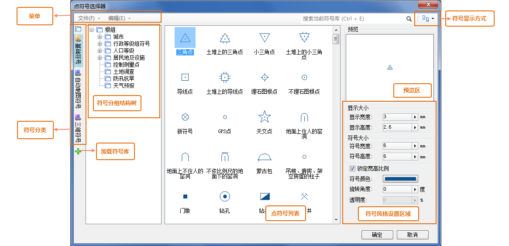

下图展示了点符号选择器的界面布局：

* 菜单：菜单中组织了管理点符号库的相关功能，包含符号文件的导入、导出、新建/删除分组等。
* 搜索：搜索符号可以在当前整个符号库中搜索满足特定条件的符号，搜索也是基于符号的名称和符号的编号，搜索将根据用户输入的文字或者数字，以这些文字和数字为匹配关键字，搜索出符号名称和符号编号与用户输入关键字相匹配的符号，并且搜索的范围为整个符号库，搜索完成后，符号列表中将显示符号库中所有符合搜索条件的符号。 
* 查找符号：通过 Ctrl + F 的组合键，可以在当前符号列表查找指定的符号。查找将基于符号的名称和符号的编号，将根据用户输入的文字或者数字，以这些文字和数字为匹配关键字，找出符号名称和符号编号与用户输入关键字相匹配的符号（查找范围为当前符号分组），使当前符号列表中只显示当前符号分组中满足条件的这些符号，而滤去其他符号不显示。 

查找功能将根据所输入值实时进行查找并显示，即当查找框中的内容发生变化，就会执行一次查找操作。查找后，如果要使符号列表中重新显示当前符号分组中的所有符号，只需将查找框中的文字内容清空或者关闭查找框即可。

* 定制显示方式：显示方式的按钮，用来设置符号列表以哪种方式显示其中的符号，包括：以大图标显示符号，以详细信息方式显示符号。
* 符号分组结构树：通过“分组结构”按钮，可以显示或隐藏符号分组结构树。在符号分组结构树中，选择某个符号分组，可以使符号列表中显示该符号分组下的符号内容；符号分组结构树，也是管理符号库的分组结构的场所。有关符号分组的管理，请参见：[符号库分组结构管理](SymMarkerManager3.html)。
* 点符号列表：点符号列表用来显示当前符号分组中的所有点符号。
* 符号风格设置区：对点符号进行风格设置的区域，包括点符号大小、颜色、角度以及其他效果。具体设置内容和方法，请参见：[设置点符号风格](SymMarkerSelector3.html)。
* 预览区：预览当前对符号所做的风格设置。
  

