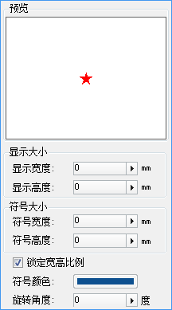
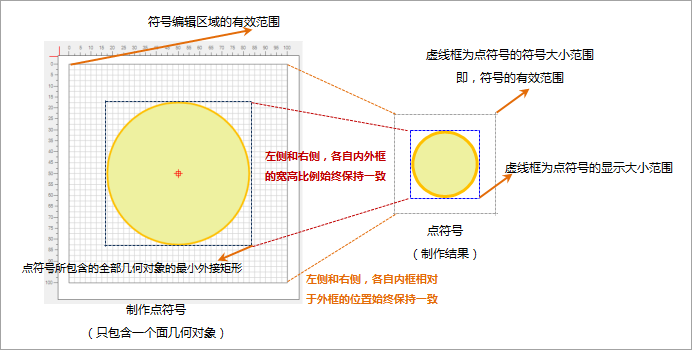
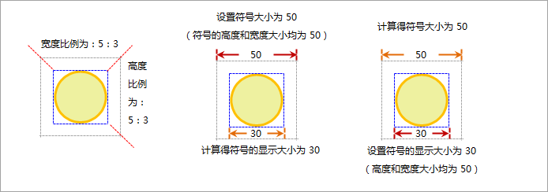

通过点符号选择器中的符号风格设置区，可以对点符号进行风格设置，包括点符号大小、颜色、角度以及其他效果。

首先，在符号列表中选中一个点符号，符号风格设置区所设置的风格将应用于该选中的点符号。

  

下面具体介绍符号风格设置区域可以设置哪些风格，以及设置的方式。

## 点符号大小

### 符号大小与显示大小

在点符号制作时，符号编辑区域的有效范围对应着制作后该点符号的有效范围，如下图所示。在实际应用中，通过设置点符号大小来确定该点符号在地图中所显示的大小，其中点符号的大小分为符号大小和显示大小两种：

* 符号的显示大小，是指点符号所包含的全部几何对象的最小外接矩形的尺寸。
* 符号大小，是指符号的有效范围的尺寸。
* 在符号编辑区域中制作点符号时，所绘制的全部几何对象（在符号编辑区域的有效范围内部分）的最小外接矩形与符号编辑区域的有效范围的宽高比例和制做后，该点符号所包含的全部几何对象的最小外接矩形与符号的有效范围的宽高比例始终保持一致。这样，设置了符号大小的值，就可以根据比例，推算出符号的显示大小的值；反之亦然。
* 在符号编辑区域中制作点符号时，所绘制的全部几何对象（在符号编辑区域的有效范围内部分）的最小外接矩形与符号编辑区域的有效范围的相对位置和制做后，该点符号所包含的全部几何对象的最小外接矩形与符号的有效范围的相对位置始终保持一致。这样，无论点符号的大小如何变化，点符号的对象内容相对于符号的有效范围的位置不变。

如果点符号所包含的全部几何对象的最小外接矩形范围与点符号的有效范围重合，则点符号的符号大小等于显示大小。通常情况下，符号的制作者和符号的使用者不是一个人，那么，使用者并不清楚符号制作者在制作符号时，符号所包含的全部几何对象的最小外接矩形与符号有效范围间的宽高比例关系，此时，符号的显示大小的设置为使用者提供了便利，可以直接控制点符号内容的显示尺寸。

  

如果在进行符号风格设置时，设置上图所示的点符号的符号大小为
50，又知符号的有效范围与该点符号所包含的全部几何对象的最小外接矩形的宽高比例都为：5：3，那么，可以计算得出符号的显示大小为：30；若设置符号的显示大小为
60，则可以计算得出符号大小为 100。

  

* **符号大小：**

符号宽度和符号高度两个数值框，分别用来设置符号大小的高度和宽度的尺寸，单位为：0.1
毫米。既可以通过输入数值设置；也可以单击右侧的箭头弹出滑块，通过调节滑块的位置，或者单击放大或缩小按钮的方式，设置数值。

在使用点符号选择器设置地图图层上点对象的符号化风格时，如果需要隐藏点符号，即被符号化的地图图层上的点对象将没有任何显示风格，即不可见，则可将“符号大小”或“显示大小”的值设置为-1即可。

* **显示大小：**

显示宽度和显示高度两个数值框，分别用来设置符号显示大小的高度和宽度的尺寸，单位为：0.1
毫米。既可以通过输入数值设置；也可以单击右侧的箭头弹出滑块，通过调节滑块的位置，或者单击放大或缩小按钮的方式，设置数值。

* **锁定宽高比例：**

勾选“锁定宽高比例”复选框，在设置符号大小和显示大小时，设置宽度值时，高度值会依符号的比例自动调节其数值大小，以保证符号宽高比例不变；反之，设置高度值，宽度值也会自动调整。如果“锁定宽高比例”复选框没有被勾选，可以分别设置符号的高度值和宽度值，而不受符号宽高比例的限制。

## 点符号旋转

**旋转角度：**
用来设置符号的旋转角度，数值的单位为：度。既可以通过输入数值设置；也可以单击右侧的箭头弹出滑块，通过调节滑块的位置，或者单击放大或缩小按钮的方式，设置数值。

## 点符号颜色

**符号颜色**：用来设置符号的显示颜色，单击右侧的下拉按钮，弹出颜色面板，选择或指定符号的颜色。如果选中的符号为栅格符号，不能设置该符号的颜色；如果选择的符号为矢量符号，但是该符号在制作时，该符号的部分笔划被设置为固定颜色，那么，设置点符号的颜色后，颜色只对没有设置为固定颜色的笔划有效；那些固定颜色的符号笔划，仍保持原来的颜色。

## 点符号效果

**透明度：** 用来设置符号的透明效果。只能对栅格符号设置符号的透明度，透明度的数值范围为 0 至 100，其中，0表示完全不透明，100
表示完全透明。既可以通过输入数值设置；也可以单击右侧的箭头弹出滑块，通过调节滑块的位置，或者单击放大或缩小按钮的方式，设置数值。
