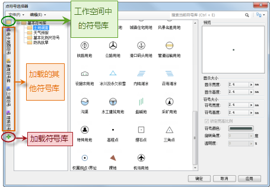
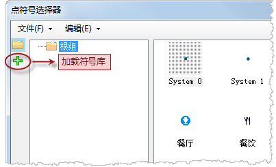
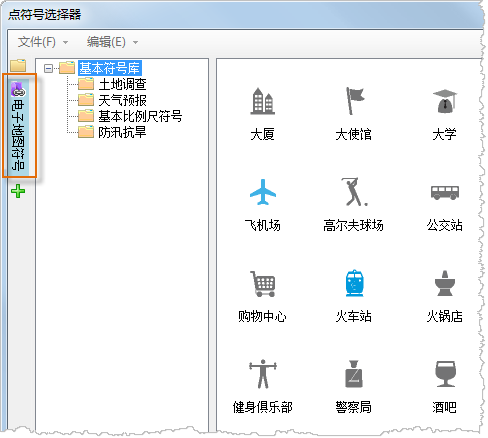
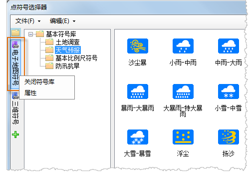
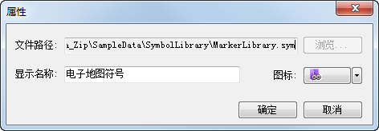
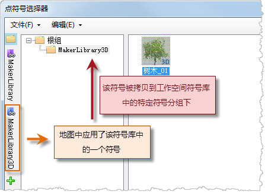
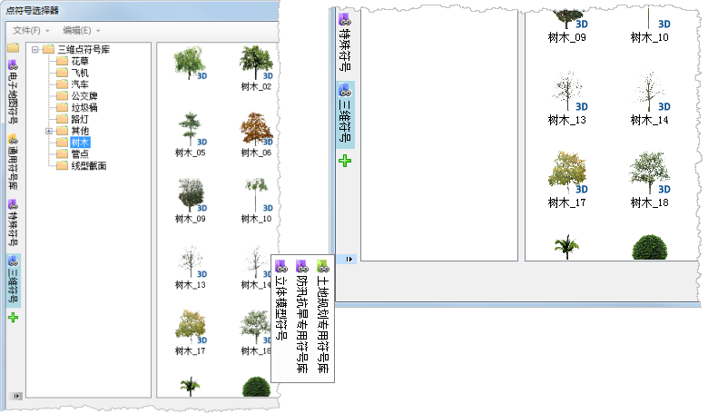
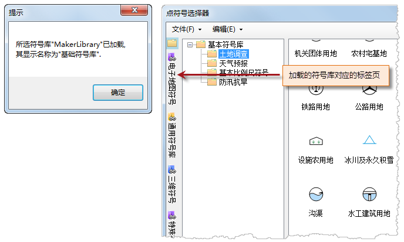

当对图层进行符号化风格设置时，打开符号选择器后，符号选择器默认加载的是保存在工作空间中的符号库，而当需要选择保存在其他符号库文件中的符号时，可以通过符号选择器中的“文件”菜单下的“打开点符号库文件”来切换符号选择器默认加载的符号库，即关闭当前符号库，然后打开所选择的新的符号库，这种方式，在某种程度上增加了操作的复杂度。

符号选择器提供了“加载更多符号库”的功能，可以简化上述的使用场景，即在符号选择器中可以不用关闭符号选择器默认加载的保存在工作空间中的符号库，而同时打开一个或多个其他符号库，方便用户对符号的广泛选择。

  

## 如何加载更多符号库

下面以在点符号选择中加载其他点符号库为例，来描述加载更多符号库的操作方式，线型符号选择器、填充符号选择器中加载更多符号库的操作方式与此相同。

1. 单击如下图所示的“加载符号库”按钮； 

2. 打开“打开”对话框，选择需要加载的符号库文件并打开； 

点符号库文件的扩展名为*.sym；线型符号库文件的扩展名为*.lsl；填充符号库文件的扩展名为*.bru。

3. 如下图所示，单击所加载的符号库，符号选择器右侧区域将显示加载的符号库中的内容。 

接下来，就可以选择和使用加载的外部符号库中的符号资源了。

如下图所示，右键单击所加载的符号库，打开右键菜单，其中：

* **关闭符号库** ：用来“卸载”所加载的符号库，即将加载的符号库从符号选择器中移除。
* **属性** ：打开“属性”对话框，用来对加载的符号库进行设置，如更改所加载的符号库文件，更改加载的符号库的显示名称；更改加载的符号库的显示图标。 

## 备注说明：

* 在符号选择其中，只有工作空间的符号库可以在符号选择器中进行进一步编辑，所加载的符号库中的符号只能进行符号浏览和应用，其中的符号不能进行编辑操作。
* 在符号选择器中加载的更多符号库没有保存在工作空间中，因此，用户在符号选择器中加载符号库的操作，与是否保存工作空间无关。
* 符号对地图进行符号化时，选择了加载的更多符号库中的符号，而非工作空间中的符号，则该符号会自动复制到工作空间的符号库中，表现为在工作空间中的符号库的根组下建立一个名称与加载的符号库显示名称相同的符号分组，然后将使用的符号拷贝到该符号分组下。 

* 当符号选择器中加载了许多符号库后，符号选择器左侧区域（如下图所示）将无法完全显示所有加载的符号库的显示名称标签页，可以通过如下图所示的箭头，显示其他加载的符号库的标签页，选择其中的符号库标签页后，该符号库标签页将被显示到所有标签页的最前面。 

* 同一个符号库文件只能被加载一次，如果再次加载已加载的符号库文件，将显示如下所示的提示框，关闭该提示框后，这个已加载的符号库标签页将显示到所有标签页的最前面。 

