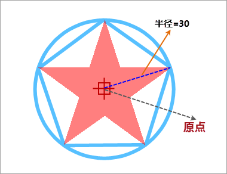

## 点符号描述

本操作演示为制作下图所示的点符号，下图标注了点符号的规格尺寸，该点符号由一个正五边形及其外接圆的线条以及一个五角星面对象构成。

  

  
## 制作方案

根据上面的点符号设计图，简单梳理下该点符号制作的基本思路，可以便于理解下面的演示录像。

1. 绘制正五边形及其外接圆，点符号编辑器中提供了绘制正多边形及其外接圆的功能，可以方便地实现这种对象的绘制。
2. 绘制五角星面对象。
3. 设置点符号中各个笔划的风格，其中对于线笔划的风格，这里采用预设的方式预先进行设置。

操作演示

