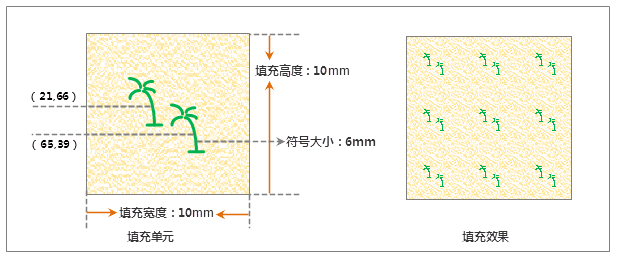

## 填充符号描述

本操作演示为制作下图所示的填充符号，下图标注了填充符号的规格尺寸，该填充符号由两个子填充构成，分别是一个图像填充和一个符号填充。制作此符号的演示录像重点演示不同类型子填充的叠加使用，以及创建符号分布样式时的编辑功能。

  

  
## 制作方案

根据上面的填充符号设计图，简单梳理下该填充符号制作的基本思路，可以便于理解下面的演示录像。

1. 首先将新建填充符号后系统默认添加的子填充类型修改为图像填充，并选择相应的图像。
2. 添加一个符号填充类型的子填充，选择相应的符号。
3. 选中符号填充，使用符号分布样式工具栏的工具及坐标列表，在符号分布样式编辑区域绘制符号的分布样式；有关符号分布样式设置的相关功能的使用，请参见：[子填充风格设置](SymFillEditor4.htm) 中关于 **"符号分布样式"** 内容的介绍。

操作演示

  
