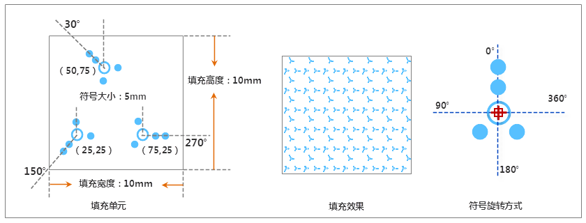

## 填充符号描述

本操作演示为制作下图所示的填充符号，下图标注了填充符号的规格尺寸，该填充符号由三个符号填充类型的子填充构成。制作此符号的演示录像着重描述如何通过多层符号填充和旋转符号，构造如下图所示的填充效果。

  

## 制作方案

根据上面的填充符号设计图，简单梳理下该填充符号制作的基本思路，可以便于理解下面的演示录像。

    1. 新建填充符号后，为系统默认添加的符号填充，选择相应的符号，设置其大小和旋转角度。
    2. 添加一个符号填充类型的子填充，选择与第一个子填充所使用的相同的符号，设置其大小和旋转角度。
    3. 再添加一个符号填充，选择与前两次相同的符号，设置其大小和旋转角度。

操作演示

