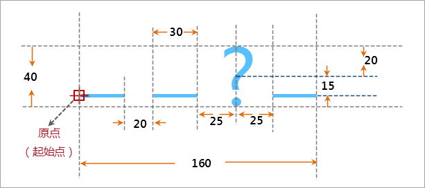

## 线型符号描述

本操作演示为制作下图所示的线型符号，下图标注了线型符号的规格尺寸，该线型符号主要是由短横线和“？”符号两部分组成。

  

  
## 制作方案

根据上面的线型符号设计图，简单梳理下该线型符号制作的基本思路，可以便于理解下面的演示录像。

1. 该线型符号需要添加两个子线，一个子线的类型为短横线，一个子线的类型为符号类型的子线，有关虚实模式的设置原理，请参见：[二维线型符号构成](SymLineEditor0.htm) 中关于 **“子线虚实模式”** 内容的介绍，可以了解短横线虚实模式的设置。
2. 按照设计图要求，设置短横线的虚实模式，以满足设计要求的尺寸。
3. 设置符号类型的子线所使用的点符号，即“？”，假设线型符号库中已经存在了该点符号，同时通过调整该符号类型的子线的虚实模式达到设计的要求，有关虚实模式的设置原理，请参见：[二维线型符号构成](SymLineEditor0.htm) 中关于 **“子线虚实模式”** 内容的介绍，可以了解符号类型的子线虚实模式的设置。

操作演示
