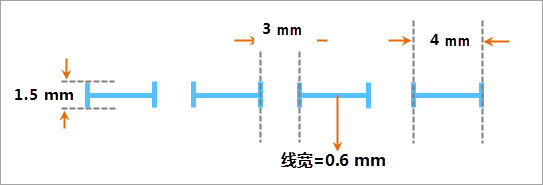

## 线型符号描述

本操作演示为制作下图所示的线型符号，下图标注了线型符号的规格尺寸，该线型符号主要是由短横线和短竖线两中子线构成。

  

  
## 制作方案

根据上面的线型符号设计图，简单梳理下该线型符号制作的基本思路，可以便于理解下面的演示录像。

1. 添加一个短横线类型的子线，并设置其虚实模式以及线宽。
2. 添加一个短竖线类型的子线，并设置其虚实模式以及短竖线的高度。

操作演示

  
