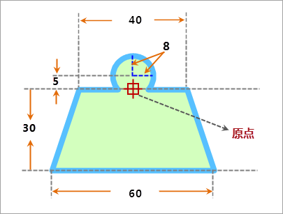

## 点符号描述

本操作演示为制作下图所示的点符号，下图标注了点符号的规格尺寸，该点符号是由面对象组成。

  
 
  
## 制作方案

根据上面的点符号设计图，简单梳理下该点符号制作的基本思路，可以便于理解下面的演示录像。

1. 绘制一个等腰梯形，由于点符号编辑器中没有提供直接绘制梯形的功能，可以通过其他方式达到绘制的目的，这里通过绘制矩形，然后通过裁剪功能裁出一个等腰梯形。
2. 绘制一个半径为8的圆，圆的位置与设计图上的要求一致。
3. 将梯形和圆面进行合并处理，使其成为一个面笔划，然后设置该面笔划的边框和填充风格。

操作演示

  

