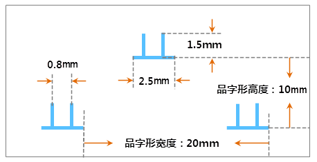

## 填充符号描述

本操作演示为制作下图所示的填充符号，下图标注了填充符号的规格尺寸，该填充符号包含一个符号填充类型的子填充。

  

  
## 制作方案

根据上面的填充符号设计图，简单梳理下该填充符号制作的基本思路，可以便于理解下面的演示录像。

1. 新建填充符号，系统自动添加一个空的符号填充，如果没有，新建一个子填充，设置子填充为符号填充类型。
2. 为符号填充选择相应的符号，并设置符号大小。
3. 使用快速样式生成，构建品字形填充效果，有关符号填充的符号分布样式的详细信息，请参见：[填充符号的构成](SymFillEditor0) 中关于 **“符号分布样式”** 内容的介绍。

操作演示

