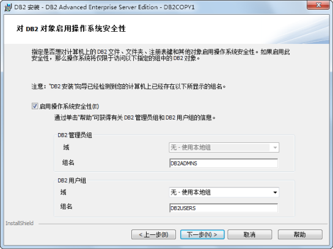

本部分内容将介绍 DB2 程序的安装。对于 DB2 所支持的平台请参见其帮助文档。本文档主要介绍 DB2 在 Windows 平台下的安装过程。基于
SuperMap SDX+ for DB2 对 DB2 数据库的性能最优化考虑，建议安装 DB2 9.7 版本。

  1. 双击“setup.exe”程序，出现“DB2 安装启动板”窗口，如下图所示。    
    
 
  2. 在该窗口左侧单击“安装产品”链接，进入如下图所示的“安装产品”页面，该页面列出了所有可安装的 DB2 产品。选取 DB2 Advanced Enterprise Server Edition V9.7 修订包 4，在该产品处单击“安装新产品”按钮，进入 DB2 数据库的安装。   
     
 
  3. 进入 DB2 安装后，出现如下图所示的"欢迎使用"对话框，单击“下一步”按钮。  
      

  4. 弹出“软件许可协议”对话框，请认真阅读最终用户许可协议。如果接受此协议，请选择“我接受许可证协议中的全部条款”，单击“下一步”按钮继续安装；如果不接受许可协议的条款，请单击"取消"按钮退出安装。   
    

  5. 继续安装，弹出“选择安装类型”对话框。   
     
  
安装类型选择“典型安装”，通过单击该对话框的“查看功能部件”按钮，可以查看所要安装的功能部件，其中用 * 标记的部件为系统为典型安装所配置的功能部件，如下图所示。

  

  6. 继续安装，弹出“选择安装和/或响应文件创建”对话框，单击“下一步”按钮。   
     

  
响应文件是一个包含设置和配置值的文本文件。DB2安装程序可读取该文件，并根据已指定的值来执行安装。通过响应文件安装也称为“静默安装”，它能提供对那些“DB2”安装向导设置的参数的访问。

  7. 继续安装，弹出“选择安装文件夹”对话框。如果系统缺省进行安装，直接单击“下一步”按钮；如果需要改变安装文件夹的路径，则单击“更改”按钮，指定安装路径，然后单击“下一步”按钮。  
      

  
如果用户选择的是“定制安装”模式，则弹出“选择要安装的功能部件”对话框，用户可以根据需要选择安装功能部件，同样也需要指定安装文件夹，如下图所示。

  

  8. 继续安装，弹出“DB2管理服务器”设置用户信息的对话框，此时你需要为DB2管理服务器设置密码，单击“下一步”按钮。   
     

  
“DB2管理服务器”（DAS）是一种特殊的 DB2 管理服务，用来支持 GUI 工具和帮助管理本地和远程 DB2 服务器上的任务。DAS
具有一个指定的用户账户，当启动 DAS 服务时，使用该用户账户来将 DAS 服务登陆到计算机上。

DAS 用户对您的环境中的每个 DB2 系统都具有 SYSADM 权限，以便它可以在需要时启动或停止其他实例。

  9. 继续安装，弹出“配置DB2实例”对话框，如果使用缺省配置，直接单击“下一步”按钮；如果要更改“DB2”实例的配置，单击“配置”按钮。 

实例（instance）又称为数据库管理程序，是管理数据的 DB2 代码，它可以控制对数据执行的操作，并管理分配给它的系统资源。每一个实例都有以下特征：

  * 每一个实例都是一个完整的环境，它包含一个给定的并行数据库系统定义的所有数据库分区。
  * 每一个实例都有它自己的数据库（其他实例不能存取），并且它的全部数据库分区共享相同的系统母库。
  * 具有独立的安全性，不受同一系统上其他实例的影响。
  

  
在弹出的“DB2实例配置”对话框中，可对DB2实例的服务名称和端口号等信息进行配置，也可以选择不配置，在安装完成后再进行配置，如下图所示。

  

  10. 继续安装，弹出“配置缺省 DB2 实例”对话框，设置缺省 DB2 实例的相关用户信息。    

  11. 继续安装，弹出“准备DB2工具目录”对话框。单击“下一步”按钮。 

只有创建 DB2 工具目录才能使用任务中心和调度程序，同时准备的 DB2 工具目录所创建的数据库存储在 DB2 数据库中。

  

  12. 继续安装，弹出“设置通知”对话框，为 DB2 服务器配置 SMTP 服务器，可将运行状况警报发送给 SMTP 服务器。若取消“设置 DB2 服务器以发送通知”前的勾选框，则 DB2 服务器的运行状况将记录在管理通知日志中，如下图所示。单击“下一步”按钮。  
      

  13. 继续安装，弹出“对 DB2 对象启动操作系统安全性”对话框，单击“下一步”按钮。    

  14. 继续安装，弹出“开始复制文件并创建响应文件”对话框。单击“完成”按钮，即可完成对 DB2 程序的安装。    
    

  15. 安装完成后，弹出“安装已完成”对话框，单击“下一步”按钮，可安装其他产品。    

  16. 弹出“安装附加产品”对话框。如果不想安装附加产品，单击“完成”按钮，结束安装；如果想安装附加产品，在附加产品单击“安装”按钮，进入附加产品的安装。   
     

 相关主题

 [DB2 的编目](DB2Catalog)

 [DB2 的导入和导出](DataImportExport)

