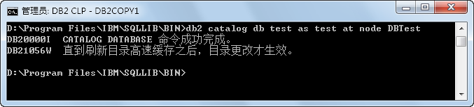
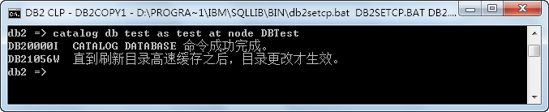
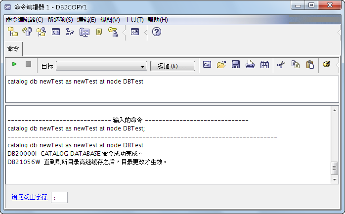
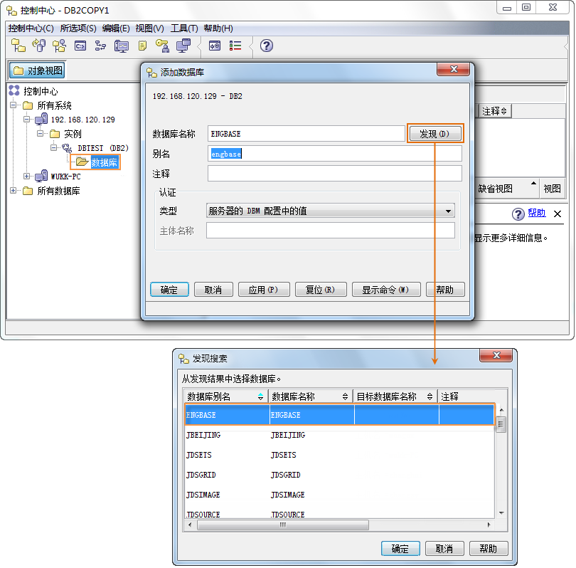
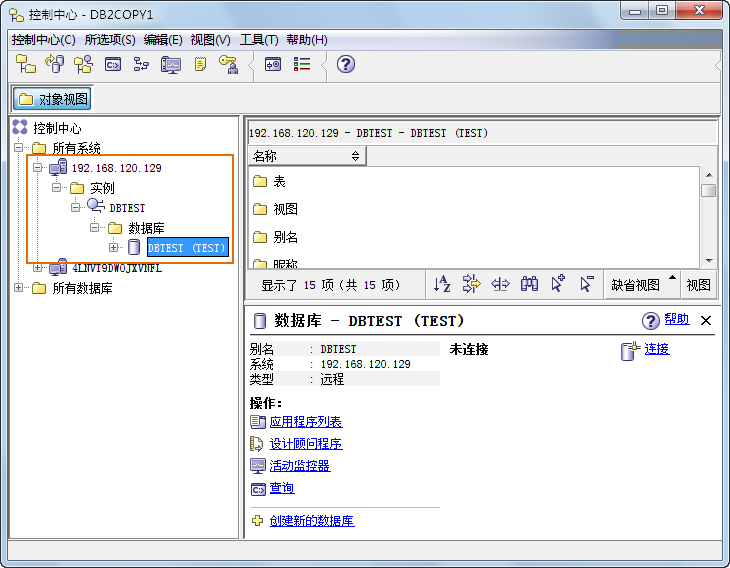

完成节点编目后，方可以进行数据库编目。将服务器实例下的数据库以别名的方式映射到客户端。可以通过命令行执行或界面操作这两种方式进行节点编目。

### 操作方式

### 方法一：命令执行方法

同节点编目的方法一样，可以通过三种命令模式进行数据库的编目。

  * 模式一：非交互模式“命令窗口” 

在“运行”处输入“db2cmd”，通过命令行进入 DB2 的命令窗口；也可以通过“程序 -> IBM DB2 -> DB2COPY1 -> 命令行工具 ->
命令窗口”进入命令窗口。

在命令窗口下输入数据库编目命令：

```db2 catalog db db_name as db_alias at node node_name```

* **db_name** ：输入所要编目的数据库的名称。可输入纯字母或字母与数字的组合，字母不区分大小写，且不支持特殊字符。
* **db_alias** ：输入数据库编目到客户端所用的别名。
* **node_name** ：输入所要编目的服数据库所在的节点名。

若节点编目成功，命令窗口中显示如下图所示内容。

  

  * 模式二：交互模式“命令行处理器” 

同模式一，通过“程序 -> IBM DB2 -> DB2COPY1 -> 命令行工具 -> 命令行处理器”进入命令行处理器。在该处理器中输入数据库编目命令：

```catalog db db_name as db_alias at node node_name```  


  * **db_name** ：输入所要编目的数据库的名称。可输入纯字母或字母与数字的组合，字母不区分大小写，且不支持特殊字符。
  * **db_alias** ：输入数据库编目到客户端所用的别名。
  * **node_name** ：输入所要编目的服数据库所在的节点名。

在“命令行处理器”输入的命令，与“命令窗口”输入的命令相比仅少了 db2 关键字。

若数据库编目成功，命令行处理器中显示如下图所示内容。

  

  * 模式三：可视化及交互模式“命令编辑器” 

同模式一，通过“程序 -> IBM DB2 -> DB2COPY1 -> 命令行工具 ->
命令行处理器”进入“命令编辑器”窗口；该窗口也可以通过“控制中心”打开，“控制中心”的打开方式是：程序 -> IBM DB2 -> DB2COPY1 ->
一般管理工具 -> 控制中心。

在命令编辑器窗口中输入节点编目命令，命令格式与模式二相同，然后点击窗口上的按钮，执行命令；或者在菜单栏中选择“所选项->执行”。窗口的下方显示命令执行结果，如果出错，会给出出错信息。若结果编目成功，命令编辑器中显示如下图所示内容。

  


### 界面执行方法

右键点击服务器实例下的数据库，选择“添加”选项，在弹出的“添加数据库”对话框中设置数据库名称、别名等，其中，数据库名称可以通过“发现”按钮来搜索，如下图所示。点击“确定”后完成数据库在客户端的映射。

  
 
  

通过以上方式建立服务器实例下的数据库与客户端之间的数据库编目后，编目结果可以在“控制中心”中查看，右键单击目录树的“控制中心”节点，选择“刷新”项即可，结果如下图所示。可以看到服务器已经与客户端相连接。

  
 
  
 相关主题

 [数据库反编目](DatabaseunCatalog)


