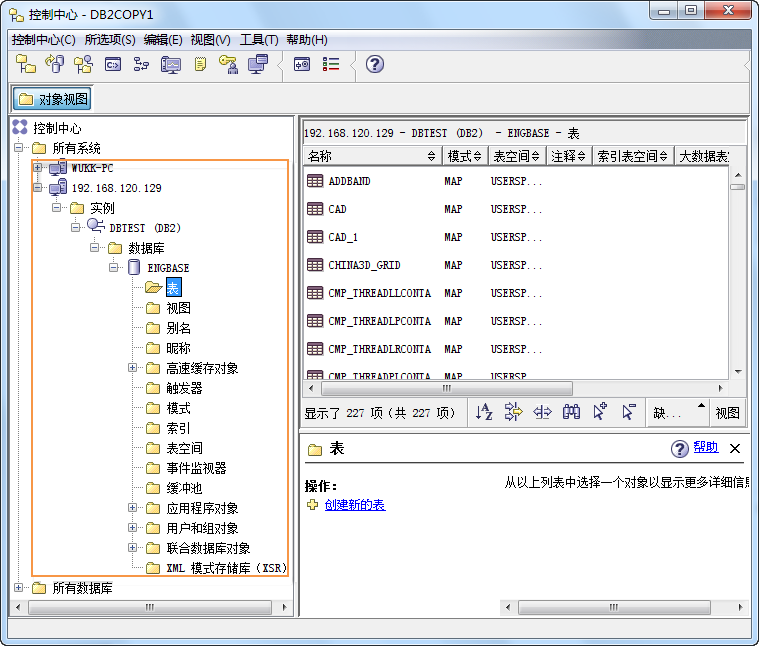

当完成了节点编目与数据库编目后，要将客户端与服务器的数据库相连接。

### 命令执行方法

* 在“命令窗口”中的命令如下：   

```db2 connect to db_alias user user_name using user_password```


* **db_alias** ：输入数据库编目到客户端所用的别名。
* **user_name** ：输入所要编目的服务器的用户名。
* **user_password** ：输入所要编目的服务器密码。
* 在“命令行处理器”和“命令编辑器”中的命令如下： 

```connect to db_alias user user_name using user_password```


若数据库连接成功，命令窗口中显示如下图所示内容。

  


### 界面执行方法

在“控制中心”的目录树中右键点击要连接的数据库，选择“连接”，在弹出的“连接”对话框中输入服务器的用户名和密码，点击“确定”后完成客户端与数据库的连接。


连接后可在“控制中心”中查看映射的服务器的连接情况，如下图所示：

  

相关主题

 [节点编目](NodeCatalogIntro)

 [数据库编目](DatabaseCatalogIntro)


