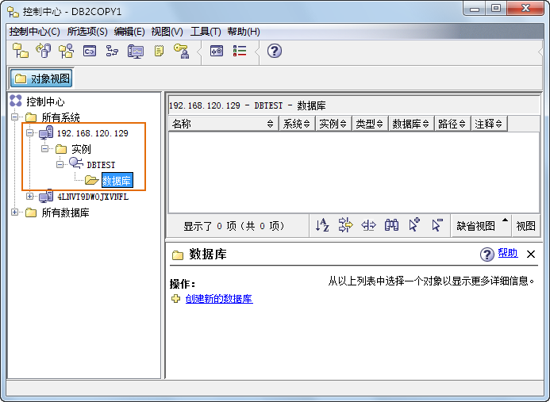

通过进行节点编目可以将服务器上的系统，以及系统上的实例都映射到客户端。可以通过命令行执行或界面操作这两种方式进行节点编目。

### 操作方式

### 方法一：命令执行方法

  * 模式一：非交互模式“命令窗口” 

在“运行”处输入“db2cmd”，通过命令行进入 DB2 的命令窗口；也可以通过“程序 -> IBM DB2 -> DB2COPY1 -> 命令行工具 ->
命令窗口”进入命令窗口。

在命令窗口下输入节点编目命令：

         
`    	db2 catalog tcpip node node_name remote server_ip server server_port`

  * **node_name** ：输入所要编目的节点名，即服务器内的实例名。实例名在一台机器上必须是惟一的，可输入纯字母或字母与数字的组合，字母不区分大小写。注意实例名不能命名为"DB2"，且不支持特殊字符。
  * **server_ip** ：输入所要编目的服务器的IP地址。
  * **server_port** ：输入所要编目的服务器的端口号，默认为50000。

若节点编目成功，命令窗口中显示如下图所示内容。

  
 
  * 模式二：交互模式“命令行处理器” 

同模式一，通过“程序 -> IBM DB2 -> DB2COPY1 -> 命令行工具 -> 命令行处理器”进入命令行处理器。在该处理器中输入节点编目命令：
             
`    	catalog tcpip node node_name remote server_ip server server_port`

  * **node_name** ：输入所要编目的节点名，即服务器内的实例名。实例名在一台机器上必须是惟一的，可输入纯字母或字母与数字的组合，字母不区分大小写。注意实例名不能命名为"DB2"，且不支持特殊字符。
  * **server_ip** ：输入所要编目的服务器的IP地址。
  * **server_port** ：输入所要编目的服务器的端口号，默认为50000。

在“命令行处理器”输入的命令，与“命令窗口”输入的命令相比仅少了 db2 关键字。

若节点编目成功，命令行处理器中显示如下图所示内容。

  
---  
  * 模式三：可视化及交互模式“命令编辑器” 

同模式一，通过“程序 -> IBM DB2 -> DB2COPY1 -> 命令行工具 ->
命令行处理器”进入“命令编辑器”窗口；该窗口也可以通过“控制中心”打开，“控制中心”的打开方式是：程序 -> IBM DB2 -> DB2COPY1 ->
一般管理工具 -> 控制中心。

在命令编辑器窗口中输入节点编目命令，命令格式与模式二相同，然后点击窗口上的执行按钮，执行命令；或者在菜单栏中选择"所选项->执行"。窗口的下方显示命令执行结果，如果出错，会给出出错信息。若结果编目成功，命令编辑器中显示如下图所示内容。

  
 

### 方法二：界面执行方法

我们也可以在“控制中心”通过界面方式的人机交互对 DB2
进行节点的编目。需要两个过程：服务器节点编目与服务器下实例的节点编目。“控制中心”的打开方式是：程序 -> IBM DB2 -> DB2COPY1 ->
一般管理工具 -> 控制中心。

  1. 服务器节点编目。 

右键单击控制中心左侧目录树中的“所有系统”节点，选择“添加”项。在弹出的“添加系统”对话框内，对所要连接服务器的系统类型、系统名称、主机名、节点名，操作系统、连接协议及注释进行设置，如下图所示。点击“确定”后完成服务器在客户端的映射。

  

  
此外，在对服务器系统名称及主机名进行设置时也可以通过单击系统名称右侧的“发现”按钮进行系统搜索，选择需要连接的服务器系统，如下图所示。此时，其他选项内容将会自动生成。

  

  2. 服务器下实例的编目。 

右键点击服务器下的“实例”节点，选择“添加”项，在弹出的“添加实例”对话框中对目标数据库所在的实例名称、实例节点名、操作系统、连接协议、主机名及端口号进行设置，如下图所示。点击“确定”后完成服务器下实例在客户端的映射。

  

  
在对实例名进行设置时也可以通过“发现”按钮进行搜索，选择需要连接的实例名，如下图所示。

  
 

通过以上方式完成服务器与客户端的节点编目后，编目结果可以在“控制中心”中查看，右键单击目录树的“控制中心”节点，选择“刷新”项即可，结果如下图所示。可以看到服务器已经与客户端相连接。

  

  
 相关主题

 [节点反编目](NodeunCatalog)

