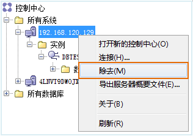

如果取消服务器在客户端的映射，需要进行节点的反编目。可以通过命令行执行的方式或界面操作的方式完成反编目节点。

### 操作方式

### 命令执行方法

* 模式一：非交互模式“命令窗口” 

在“命令窗口”中，节点反编目的命令如下：
          
  `db2 uncatalog node node_name`

  * **node_name** ：需要进行节点反编目的服务器名称。
* 模式二：交互模式“命令行处理器” 

在“命令行处理器”和“命令编辑器”中，节点反编目的命令如下：
       
`    uncatalog node node_name`

### 界面执行方法

在“控制中心”左侧的目录树中，右键单击需要进行节点反编目的服务器系统，选择“除去”项即可。

  

相关主题

 [节点编目](NodeCatalog)

