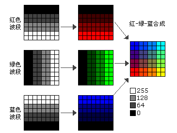
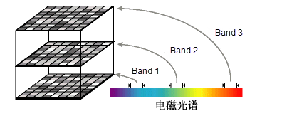
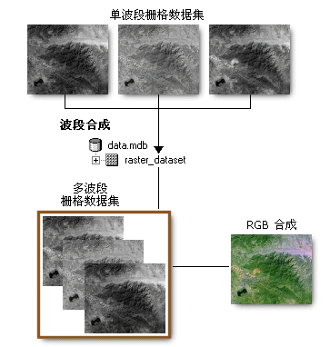

波段又称为波谱段或波谱带，在遥感技术中，通常把电磁波谱划分为大大小小的段落，大的成为波段区，如可见区、红外区等；中等的如近红外、远红外等；小的称为波段。影像数据根据波段的多少可以分为单波段影像和多波段影像两种，单波段影像一般用黑白色的灰度图来描述，多波段常用
RGB 合成象素值的彩色图来描述，就是将三个波段的数据分别通过红、绿、蓝三个通道加载，从而渲染出。

将多波段影像数据添加到地图中之后，可使用多波段栅格数据集中的任意三个可用波段的组合来创建 RGB 合成图。与仅处理一个波段相比，通过将多个波段共同显示为
RGB 合成图通常可从数据集收集到更多信息。

  
---  
  
在具有多个波段的情况下，每个波段分别表示有传感器采集到的电磁光谱的一部分。波段可以表示电磁光谱的任何部分，其中包括非可见光谱范围，如红外区或紫外区。

  
---  
  
例如，卫星影像通常包含表示不同波长的多个波段，即从电磁光谱的紫外区到可见光区和红外区。例如，美国陆地资源卫星影像的数据采集自电磁光谱的七个不同波段。波段
1-7（包括波段 6 在内）表示来自可见光区、近红外区和中红外区的数据。波段 6
从热红外区采集数据。另一个多波段图像的示例是真彩色正射影像，该影像包含分别表示红光、绿光和蓝光的三个波段。

  
---  
  
SuperMap
不支持将单个波段数据合成为多波段数据，支持加载已组合的多波段数据，同时可设置R、G、B通道分别对应的波段。不同的波段组合突出的地物特征不同，以 TM
影像的7个波段数据为例，说明常用的波段组合：

  * **321 波段** ：即真彩色合成，3、2、1波段分别赋予红、绿、蓝色，获得自然彩色合成图像，图像的色彩与源地区或景物的实际色彩一致。适宜于浅海探测作图，同时，适用于非遥感应用专业人员使用。
  * **432 波段** ：即标准假彩色合成，4、3、2波段分别赋予红、绿、蓝色，标准假彩色图像中的植被显示为红色，可突出体现植被特征，常应用于提取植被信息。在植被、农作物、土地利用和湿地分析方面，是最常用的波段组合。
  * **453 波段** ：信息量最丰富的组合，在TM数据的7个波段光谱图像中，一般第5个波段包含的地物信息最丰富.采用4、5、3波段分别赋予红、绿、蓝色合成的图像，色彩反差明显，层次丰富，且图上各类地物的色彩显示规律与常规合成片相似，常用于目视解译，同时也应用于确定陆地和水体的边界。
  * **741 波段** ：该波段组合图像具有兼容中红外、近红外、及可见光波段信息的优势，图像色彩丰富，层次感好，具有极为丰富的地质信息和地表环境信息，且干扰信息少，地址可解译程度高，各种构造形迹（褶皱及断裂）显示清楚，不同类型的岩石区边界清晰。

