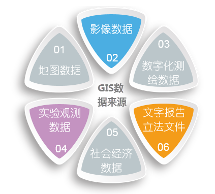

GIS的数据来源，是指建立的地理数据库所需的各种数据的来源，主要包括地图、遥感图像、文本资料、统计资料、实测数据、多媒体数据、已有系统的数据等。GIS中的数据来源和数据类型繁多，概括起来主要有以下几种来源：

  1. **地图数据**

地图是地理数据的传统描述形式，是具有共同参考坐标系统的点、线、面的二维平面形式的表示，内容丰富，图上实体间的空间关系直观，而且实体的类别或属性可以用各种不同的符号加以识别和表示。地图是GIS重要的数据源。来源于各种类型的普通地图和专题地图，这些地图的内容丰富，图上实体间的空间关系直观，实体的类别或属性清晰，实测地形图还具有很高的精度，是地理信息的主要载体，同时也是地理信息系统最重要的信息源。我国大多数的GIS系统其图形数据大部分都来自地图。

  2. **影像数据**

主要来源于卫星遥感和航空遥感，包括多平台、多层面、多种传感器、多时相、多光谱、多角度和多种分辨率的遥感影像数据。卫星遥感资料可以及时地提供广大地区的同一时相、同一波段、同一比例尺、同一精度的空间信息，航空遥感可以快速获取小范围地区的详细资料。遥感作为获取和更新空间数据的有力手段，能为地理信息系统及时、正确、综合和大范围的提供各种资源和环境数据。遥感所具有的动态特点对地理信息系统数据库多时相更新极为有利。在解决大范围的以统计为主的地理信息系统中，获取遥感信息显得尤为重要。

  3. **数字化测绘数据**

随着测绘仪器的吏新和测绘技术、计算机技术的发展，传统的测绘技术方法逐渐被数字测绘技术方法所取代。各种测绘新技术可直接获得矢量数据，主要有GPS的定位数据、全站仪外业实测数据、全数字摄影测量数据等。这些数据可以形成高精度的地形、地籍和其他专题电子地图，是GIS的一个很准确和很现势的资料。

  4. **实验观测数据**

随着各种专题图件的制作和各种GIS系统的建立，直接获取数字图形数据和属性数据的可能性越来越大。数字数据也成为GIS信息源不可缺少的一部分。但对数字数据的采用需注意数据格式的转换和数据梢度、可信度的问题。

  5. **社会经济数据**

将用户查询的结果或是数据分析的结果以合适的形式输出是GIS问题求解过程的最后一道工序。输出形式通常有两种：在计算机屏幕上显示或通过绘图仪输出。这方面的技术主要包括：编辑、图形整饰、符号制作、图景图例生成、出版印刷等。

  6. **各种文字报告和立法文件**

各种文字报告和立法文件在一些管理类的GIS系统中有很大的应用。如在城市规划管理信息系统中，各种城市管理法规及规划报告在规划管理工作中起着很大的作用。

  

