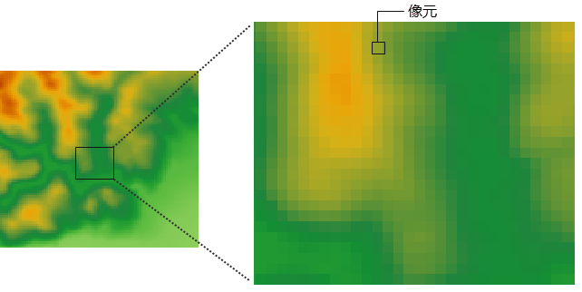
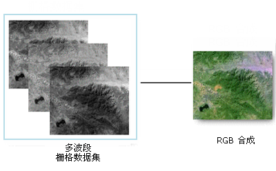

### 栅格数据基本概念

栅格数据结构是将一个平面空间进行行和列的规则划分，形成有规律的网格，即像元矩阵，像元是栅格数据最基本的信息存储单元，每个像元都有给定的属性值来表示地理实体或现实世界的某种现象。

  
---  
  
跟栅格数据相关的一些基本概念有以下几点：

  * **像元/像素** ：像元和像素都是指栅格数据中的最小组成单位。像素通常会作为像元的同义词使用，像素是图像元素的简称，通常用于描述影像数据，而像元则通常用于描述栅格数据。
  * **像元值** ：在栅格数据集中，每个像元（像素）都有一个值。一个像元具有一个属性值，而像元都具有一定的空间分辨率，即对应着地表的一定范围的区域，因而像元值代表的是像元所覆盖的区域的占主导的要素或现象。比如卫星影像和航空相片中的光谱值反映了光在某个波段的反射率；DEM栅格的高程值表示了平均海平面之上的地表高程，由DEM栅格生成的坡度图，坡向图和流域图的像元值分别代表了其坡度，坡向和流域属性；土地利用分类图中的类别值如耕地、林地、草地等；还可以表示降水量、污染物浓度、距离等数量值。另外，像元值可以是整数，也可以是浮点数。
  * **行和列** ：栅格在X轴方向上的一组像元构成了一行；同样的，Y轴方向上的一组像元构成了一列。栅格数据中每个像元都有唯一的行列坐标。
  * **分辨率** ：栅格数据中涉及多种分辨率，如遥感影像的空间分辨率、光谱分辨率、时间分辨率、辐射分辨率。 
  * 空间分辨率：空间分辨率也称为像元大小，是单个像元所表示的地面上覆盖的区域的尺寸，单位为米或千米。例如，美国QuickBird商业卫星影像一个像元相当于地面面积0.61m×0.61m，其空间分辨率为0.61m；Landsat/TM多波段影像一个像元约覆盖地面面积28.5m×28.5m，其空间分辨率28.5m。 

表示地表同样大小的面积时，高空间分辨率的影像要比低空间分辨率的影像所需的像元数要多，即像元大小比较小的栅格需要更多的行和列来表示，从而可以显示出地表的更多信息和细节。因而，空间分辨率越高，所存储的地表的细节越多，所需的存储空间也就越大，同时数据处理的时间更长；相反，空间分辨率越低，反映的地表信息越粗糙，但存储空间较小，而且处理速度很快。所以在选择像元大小，即空间分辨率时，要兼顾实际应用对信息详细程度的要求以及对存储和数据处理时的处理时间和速度的需求。

  * 光谱分辨率：是指成像的波段范围，分得愈细，波段愈多，光谱分辨率就愈高。一般来说，传感器的波段数越多，波段宽度越窄，地面物体的信息越容易区分和识别。
  * 时间分辨率：是指同一区域进行相邻的两次遥感观测的最小时间间隔。时间间隔大，时间分辨率就低；反之，时间间隔小，时间分辨率就高。
  * 辐射分辨：是指传感器能分辨的目标反射或辐射的电磁辐射强度的最小变化量。描述传感器在电磁光谱的同一部分中对所查看对象的分辨能力。 
  * **波段** ：是指具有确定波长的电磁波，在遥感技术中常用的波段有可见光波段、近红外波段、中红外波段、热红外波段、远红外波段。影像数据可分为单波段影像和多波段影像两种，单波段影像一般用黑白色的灰度图来描述，多波段多用 RGB 合成的彩色图来描述。可以使用多波段栅格数据集中的任意三个可用波段的组合来创建 RGB 合成图，如下图所示。数字高程模型 (DEM) 即是一个单波段栅格数据集的示例，还有一种有时被称为全色图像或灰度图像的单波段正射影像，多数卫星影像都具有多个波段，通常包含电磁光谱某个范围或波段内的值。    
    

  * **影像金字塔** ：为减小影像的传输数据量和优化显示性能，有时需要为影像建立影像金字塔。影像金字塔是按照一定规则生成的一系列分辨率由细到粗的图像的集合。影像金字塔技术通过影像重采样方法，建立一系列不同分辨率的影像图层，每个图层分割存储，并建立相应的空间索引机制，从而提高缩放浏览影像时的显示速度。如下图所示的影像金字塔，底部是影像的原始最高分辨率的表示，为512×512图像分辨率，越往上的影像的分辨率越小，分别为256×256，128×128，顶部是影像金字塔的最低分辨率的图像64×64，因此这个影像金字塔共有4层，即4个等级的分辨率。显然影像的图像分辨率越高，影像金字塔的等级越多。对于图像分辨率为2a×2b的（a>b）影像，SuperMap中将会为其建立（b-6）+1层的金字塔。    

    

建立了影像金字塔之后，以后每次浏览该影像时，系统都会获取其影像金字塔来显示数据，当用户将影像放大或缩小时，系统会自动基于用户的显示比例尺选择最合适的金字塔等级来显示该影像。

### 栅格数据的来源

栅格数据的来源通常有一下几种方式：

  * 遥感数据：通过遥感手段获得的数字图像，是遥感传感器在特定时间、特定区域的地面景象的辐射和反射能量的扫描抽样，并按照不同的光谱段分光并量化后，以数字形式记录下来的像元值序列。
  * 图片扫描：通过扫描仪对地图进行扫描，转化为栅格形式的数据。扫描得到的图像，将每个像元灰度值与属性表对应，得到像元值，再通过栅格编码，存储为栅格数据。
  * 矢量数据转换：通过矢量数据栅格化技术和插值分析，将矢量数据转换为栅格数据。
  * 手工方法获取：是指在专题图上均匀地划分网格，逐个确定网格的属性值，最终形成栅格数据文件。

SuperMap 中使用的栅格数据可以是数字航空相片、卫星影像、数字图片，以及扫描的图片；也可以是使用SuperMap
栅格分析的某些功能得到的分析结果，如距离图、山体阴影图等；另外，栅格数据还可以通过样点数据进行内插得到。

### 相关主题

 [影像数据](ImageData)

 [栅格像元](Pixel)

 [影像波段](Band)

 [栅格数据空间表达](SpaceExpression)

 [栅格数据压缩编码](Encode)

 [影像金字塔](Pyramid)

