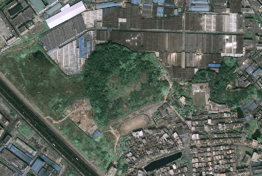

### 影像数据基本概念

影像数据是由卫星或飞机上的成像系统获得的影像，多为遥感影像数据。影像数据的每个像元都有一个值，表示传感器探测到像素对应地面面积上目标物的电磁辐射强度，也叫亮度值、灰度值。SuperMap
支持的影像数据格式有：*.img、*.tif、*.tiff、*.bmp、*.jpg、*.png、*.gif、*.raw、*.sid等。

计算机以二进制记录数据，所以其量化的等级以二进制来划分，即2n。若用n个比特（bit）来记录每个像元，则其灰度值范围可在0到2n-1之间，如8-bit的数据取28=256灰度级（其值0～255）；若规定用1比特来记录每个像元，其灰度值仅为0和1，即所谓的二值图像。若用彩色系统来记录图像，根据色度学原理，任何一种彩色均可由红（R）、绿（G）、蓝（B）三原色按适当比例合成，若用8比特的RGB彩色坐标系来记录像元，可记录224=1677216种不同的RGB组合。其中，若RGB的亮度值分别为0，0，0，则产生黑色像元；若RGB为255，255，255，则产生白色像元，若RGB的亮度值相等，则产生灰度效果。

  

### 遥感影像成像方式

遥感影像数据的成像方式主要有航空摄影、航空扫描、微波雷达三种：

  * **航空摄影** ：摄影成像是通过成像设备获取物体影像的技术。传统摄影成像是依靠光学镜头及放置在焦平面的感光胶片来记录物体影像。数字摄影则通过放置的焦平面的光敏元件，经光/电转换，以数字信号记录物体的影像。探测波段包括：近紫外波段、可见光波段、红外波段。
  * **航空扫描** ：扫描成像是依靠探测元件和扫描镜对目标物体以瞬时视场为单位进行的逐点、逐行取样，已得到目标物的电磁辐射特征信息，形成一定波段的图像。探测波段包括紫外、红外、可见光和微波波段。
  * **微波雷达** ：微博成像雷达的工作波长为1mm-1m的微波波段，由于微波雷达是一种自备能源的主动传感器，且微博具有穿透云雾的能力，所以微波雷达成像有全天时、全天候的特点。在城市遥感中，这种成像方式对于那些对微波敏感的目标物的识别，具有重要意义。同时，微波对冰、雪、森林、土壤具有一定的穿透能力，对海洋遥感也有特殊意义。探测波段包括微波波段、红外波段。

### 遥感航天平台

航天遥感影像卫星分为陆地卫星、海洋卫星、气象卫星三种系列，个类型的详细介绍如下：

  * **陆地卫星系列** ：以探测陆地资源为目的，这类卫星的特点是多波段扫描，地面分辨率为5-30m。目前，主要的陆地资源卫星有：美国陆地卫星（Landsat）、法国陆地观测卫星（SPOT）、印度遥感卫星（IRS）、中巴资源卫星（CBERS）、日本地球资源卫星（JERS）、美国（IKONOS）、美国（QuickBird）等。
  * **海洋卫星系列** ：世界海洋卫星包括海洋水色卫星、海洋地形卫星和海洋环境卫星，目前，主要的海洋卫星有：加拿大的 Radarsat卫星、欧洲 ERS 卫星、美国 Seasat 卫星等。
  * **气象卫星系列** ：气象卫星广泛应用于国民经济和军事领域，能连续、快速、大面积地探测全球大气变化情况。气象卫星的轨道分为低轨和高轨两种，短周期重复观测，实时性强。目前主要的气象卫星有：美国了NOAA卫星、日本的GMS气象卫星、中国的FY气象卫星等。

