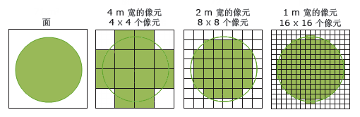

像元是是栅格数据的最小单位，也是反映影像特征的重要标志。在遥感数据采集时，如扫描成像，像元是传感器对地面景物进行扫描采样的最小单位。像元同时具有空间特征和波谱特征的数据元，空间特征是像元代表地面面积；物理意义是其波谱变量代表像元在某一特定波段中波谱响应的强度。统一像元内的地物，只有一个共同的像元值。

### 像元大小

像元大小决定了栅格数据的分辨率和信息量。像元小，则影像的空间分辨率高，才能获取地物的详细信息；像元大，则影像分辨率底，像元中包含的信息量少，可以提高计算机存储和分析的执行效率。例如：陆地卫星MSS影像像元为56×79平方米，单波段像元数为7581600；而TM影像像元大小为30×30平方米，单波段像元数为38023666，相当于MSS数据的5倍。

虽然在相同要素范围内像元越小，表示的物标特征和信息更详细，但并非像素越小越好，需根据用户需求和计算机性能来定。像元如果较小，则在表示同一范围内地物信息时栅格数据集较大，因而会需要更大的存储空间，对计算机性能要求就高，且数据处理和分析的时间也较长。

  
---  
  
### 像元值

在栅格数据集中，每个像元（像素）都具有一个属性值，而像元都具有一定的空间分辨率，即对应着地表的一定范围的区域，因而像元值代表的是像元所覆盖的区域的占主导的要素或现象。比如卫星影像和航空相片中的光谱值反映了光在某个波段的反射率；DEM栅格的高程值表示了平均海平面之上的地表高程，由DEM栅格生成的坡度图，坡向图和流域图的像元值分别代表了其坡度，坡向和流域属性；土地利用分类图中的类别值如耕地、林地、草地等；还可以表示降水量、温度、污染物浓度、距离等数量值。另外，像元值可以是整数，也可以是浮点数。

### 无值

某些像元值缺失或者为无意义的数据时，可以使用无值来作为像元的值。无值一般用一个不太常用、比较特殊的数值来标识，在 SuperMap
中，通常将无值的值指定为-9999。注意：无值数据并不等于 0，0 是一个有效值。

在栅格的分析功能中，对无值的处理一般有别于其他的像元值，通常有三种方式：忽略无值数据，此时无值不参与运算；无值区域计算结果仍为无值；对无值数据的值进行估计。通常不同的栅格分析操作中，对无值数据的处理也不尽相同。例如，在做栅格邻域统计时，要计算的栅格单元周围有无值数据，这时可以选择两种处理方式，可以忽略该无值数据，使用其它有效值来计算，也可以不忽略，输出结果为无值。当采取前一种方式时，计算结果不一定正确，因为被忽略的无值数据很可能就是该邻域内的最小值，或最大值。

### 分辨率

在栅格和影像数据中，常涉及到四种类型分辨率：空间分辨率、时间分辨率、光谱分辨率和辐射分辨率。

  * **空间分辨率** ：空间分辨率也称为像元大小，是单个像元所表示的地面上覆盖的区域的尺寸，单位为米或千米。例如，美国 QuickBird 商业卫星影像一个像元相当于地面面积0.61m×0.61m，其空间分辨率为0.61m；Landsat/TM 多波段影像一个像元约覆盖地面面积28.5m×28.5m，其空间分辨率28.5m。 

表示地表同样大小的面积时，高空间分辨率的影像要比低空间分辨率的影像所需的像元数要多，即像元大小比较小的栅格需要更多的行和列来表示，从而可以显示出地表的更多信息和细节。因而，空间分辨率越高，所存储的地表的细节越多，所需的存储空间也就越大，同时数据处理的时间更长；相反，空间分辨率越低，反映的地表信息越粗糙，但存储空间较小，而且处理速度很快。所以在选择像元大小，即空间分辨率时，要兼顾实际应用对信息详细程度的要求以及对存储和数据处理时的处理时间和速度的需求。

  * **时间分辨率** ：是指同一区域进行相邻的两次遥感观测的最小时间间隔。时间间隔大，时间分辨率就低；反之，时间间隔小，时间分辨率就高。
  * **光谱分辨率** ：是指成像的波段范围，分得愈细，波段愈多，光谱分辨率就愈高。一般来说，传感器的波段数越多，波段宽度越窄，地面物体的信息越容易区分和识别。
  * **辐射分辨** ：是指传感器能分辨的目标反射或辐射的电磁辐射强度的最小变化量。描述传感器在电磁光谱的同一部分中对所查看对象的分辨能力。 

