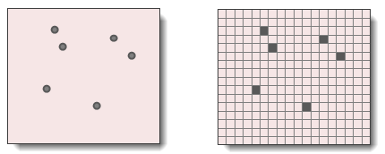
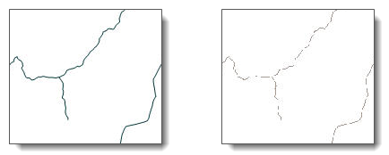
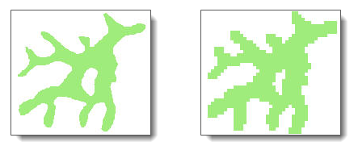

在栅格数据中，像元通常表示主导要素或像元覆盖区域的现象，而矢量数据则可精确描绘或识别各个要素。如何表达空间对象是栅格和矢量数据结构的最根本的区别。矢量结构使用点、线、面对现实世界中的地理要素进行表达，并以唯一的ID值标识要素，其位置由所在的坐标参考系统中的空间位置来确定；栅格结构使用具有相同属性值的连续的像元集合来表达地理要素，要素的地理位置由所在栅格行列号定义。对于要素的基本类型：点、线和面在栅格中都有其特定的表示方法。

### 点

点在栅格数据结构中由一个像元表示，其数值与邻近像元值明显不同，如下图所示。一个点是没有面积的，但像元代表着现实世界地表上一定区域的面积，当像元的空间分辨率越小时，所覆盖的面积越小，用像元表示的点也就越接近其实际尺寸和位置。在进行矢量点到栅格点数据的转换时，当多个点落在同一个像元范围内时，系统会从中随机选择一个点作为该像元的值，所以生成的点栅格数据的要素数量可能会减少，而且栅格的像元大小越大，损失的要素点数越多。

  

  
### 线

栅格中的线段由一串彼此相连的像元表示，各个像元的值相同，但与邻域的值差异较大，如下图所示。值得注意的是，对角的像元也是相连的像元，所以一个像元上下左右以及对角上只有一个相连像元时，标识要素的断开，该像元是线段的一端。当矢量线转化为栅格线时，若多个线段都经过同一个像元，系统将随机选择一条线段的值赋予该像元。另外，像元的大小代表着线段的宽度，例如，当用栅格表示道路时，像元的大小为30米，则道路的宽度即为30米，因此，线性要素转换为栅格时所选分辨率即像元的大小接近于数据集中最细线段的宽度为宜。

  

  
### 面

面要素在栅格数据结构中由聚集在一起的相互连接的像元组成，面内部的像元值相同，但与邻域网格的值差异较大，如下图所示。栅格表示多边形时的精度与像元的大小有关，像元的大小越小，描绘面所用的像元数越多，精度也就越高。在矢量多边形转换为栅格多边形的过程中，像元的值是取占据像元大部分面积的多边形要素的属性值。

  

  

