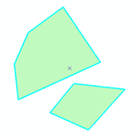

### 矢量数据

矢量数据结构是通过记录空间对象的坐标及空间关系，尽可能精确地表现点、线、多边形等地理实体的空间位置。在矢量数据结构中，点数据可直接用坐标值描述；线数据可用均匀或不均匀间隔的顺序坐标链来描述；面数据可由多个弧段组成的封闭多边形表达。

 |  |   
---|---|---  
图1：点 | 图2：线 | 图3：多边形  
  
矢量数据结构是利用欧几里得集合学中的点、线、面极其组合体来表示地理试题空间分布的一种数据组织方式。这种数据组织方式能最好的逼近地理实体的空间分布特征，数据精度高，数据存储的冗余度低，便于进行地理实体的网络分析，但对于多层空间数据的叠加分析比较困难。

矢量数据的获取方式主要来源于以下几种方式：

  * 外业测量：可利用测量仪器（全站仪、经纬仪、GPS等）自动记录测量成果，然后转到地理数据库中获得。
  * 地图数字化：是指将传统纸质或其他材料上的地图转换成计算机可识别图形数据，主要有跟踪数字化和扫描数字化两种。
  * 栅格数据转换：利用栅格数据矢量化的技术，将栅格数据转换为矢量数据。
  * 数据分析：可通过空间分析中的叠加、缓冲区分析等操作产生新的矢量数据。

矢量数据常应用于城市分区或详细规划、土地管理、公用事业管理等方面。

