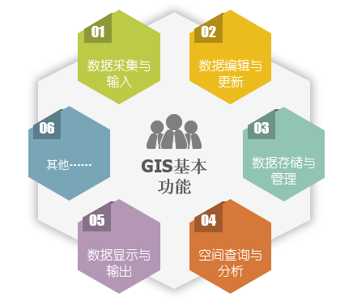
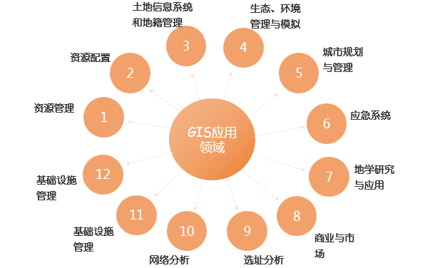

### 地理信息系统（GIS）的基本概念

地理信息系统即 GIS(Geographic Information
System)，是由计算机软件、硬件和不同方法组成的系统，该系统设计用来支持空间数据采集、管理、处理、分析、建模和显示，以便解决复杂的规划和管理问题。地理信息系统与其他信息的主要区别在于其存储和处理的信息是经过地理编码的，地理位置及与该位置有关的地物属性信息称为信息检索的重要部分。在地理信息系统中，现实世界被表达成一系列的地理要素和地理现象，这些地理特征至少由空间位置参考信息和非空间位置信息两个组成部分。

一个完整的 GIS 主要由计算机硬件系统、计算机软件系统、地理数据、系统管理操作人员四部分构成，其核心部分是计算机系统，空间数据反映 GIS
的地理内容，而管理人员和用户则决定系统的工作方式和信息表达方式。

### GIS 的基本功能

  * **数据采集与输入** : 在数据处理系统中将系统外部的原始数据传输给系统内部，并将这些数据从外部格式转换为系统便于处理的内部格式。
  * **数据编辑与更新** ： 数据编辑主要包括图形编辑和属性编辑。图形编辑主要包括拓扑关系建立、图形编辑、图形整饰、图幅拼接、图形变换、投影变换、误差校正等功能。属性编辑主要与数据库管理结合在一起完成。数据更新即以新的数据项或记录来替换数据文件或数据库中对应的数据项或记录，它是通过删除、修改、插入等一系列操作来实现的。
  * **数据存储与管理** ： 空间数据存储是GIS中最低层和最基本的技术，它直接影响到其他高层功能的实现效率，从而影响整个GIS的性能。属性数据管理一般既可利用GIS软件进行管理，也可直接利用商用数据库软件进行管理。空间数据管理是GIS数据管理的核心，各种图形或图像信息都以严密的逻辑结构存放在空间数据库中。
  * **空间查询与分析** ： 空间查询与分析是GIS的核心，主要包括数据操作运算、数据查询检索和数据综合分析三方面。通过GIS提供的空间分析功能，用户可以从已知的空间数据中得出隐含的重要结论，这对于许多应用领域是至关重要的。
  * **数据显示与输出** ： 将用户查询的结果或是数据分析的结果以合适的形式输出是GIS问题求解过程的最后一道工序。输出形式通常有两种：在计算机屏幕上显示或通过绘图仪输出。这方面的技术主要包括：编辑、图形整饰、符号制作、图景图例生成、出版印刷等。

  

### GIS 的应用领域

地理信息系统在近年内取得了很大的发展，主要应用于资源调查、环境评估、灾害预测、国土管理、城市规划、有点通讯、交通运输、军事公安、水里水电、公共设施管理、农林牧业、统计、商业金融等几乎所有领域。

  * **资源管理** ：主要应用于农业和林业领域，解决农业和林业领域各种资源（如土地、森林、草场、农作物等）分布、分级、统计、制图等问题。
  * **资源配置** ：在城市中各种公用设施、救灾减灾中的物资分配、全国范围内的能源保障、粮食供应等都是资源配置问题。GIS 在这类应用中的目标是保证资源最合理配置、发挥最大效益。例如，在城市建设规划中，如何保证学校、公共设施、运动场所、服务设施等能够有最大的服务面。
  * **城市规划和管理** ：空间规划是 GIS 的一个重要应用领域，城市规划和管理是其中的主要内容。例如，在大规模城市基础设施建设中，如何保证绿地的比例和合理分布。
  * **土地信息系统和地籍管理** ：土地和地籍管理涉及土地使用性质变化、地块轮廓变化、地籍权属关系变化等许 多内容，借助GIS技术可以高效、高质量地完成这些工作。
  * **生态、环境管理与模拟** ：区域生态规划、环境现状评价、环境影响评价、污染物削减分配的决策支持、环 境与区域可持续发展的决策支持、环保设施的管理、环境规划等。
  * **应急响应** ：解决在发生洪水、战争、核事故等重大自然或人为灾害时，如何安排最佳的人员 撤离路线、并配备相应的运输和保障设施的问题。
  * **地学研究与应用** ：地形分析、流域分析、土地利用研究、经济地理研究、空间决策支持、空间统计析、制图等都可以借助地理信息系统工具完成。ArcInfo系统就是一个很好的地学分析应用软件系统。
  * **商业与市场** ：商业设施的建立充分考虑其市场潜力。例如大型商场的建立如果不考虑其他商场的分布、待建区周围居民区的分布和人数，建成之后就可能无法达到预期的市场和服务面。有时甚至商场销售的品种和市场定位都必须与待建区的人口结构(年龄构成、性别构成、文化水平)、消费水平等结合起来考虑。地理信息系统的空间分析和数据库功能可以解决这些问题。 房地产开发和销售过程中也可以利用GIS功能进行决策和分析。
  * **基础设施管理** ：城市的地上地下基础设施(电信、自来水、道路交通、天然气管线、排污设施、电力设施等)广泛分布于城市的各个角落、且这些设施明显具有地理参照特征的。它们的管理、统计、汇总都可以借助GIS完成，而且可以大大提高工作效率。
  * **选址分析** ：根据区域地理环境的特点，综合考虑资源配置、市场潜力、交通条件、地形特征、环境影响等因素，在区域范围内选择最佳位置，是GIS的一个典型应用领域，充分体现了GIS的空间分析功能。
  * **网络分析** ：建立交通网络、地下管线网络等的计算机模型，研究交通流量、进行交通规则、处理地下管线突发事件(爆管、断路)等应急处理。警务和医疗救护的路径优选、车辆导航等也是GIS网络分析应用的实例。
  * **可视化应用** ：以数字地形模型为基础，建立城市、区域、或大型建筑工程、著名风景名胜区的三维可视化模型，实现多角度浏览，可广泛应用于宣传、城市和区域规划、大型工程管理和仿真、旅游等领域。
  * **分布式地理信息应用** ：随着网络和Internet技术的发展，运行于Intranet或Internet环境下的地理信息系统应用类型，其目标是实现地理信息的分布式存储和信息共享，以及远程空间导航等。

  

