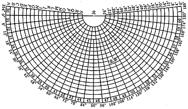
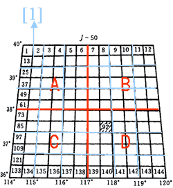
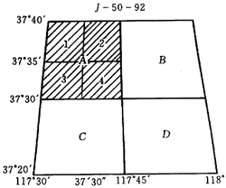
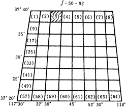
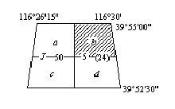
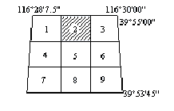
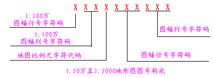

### 国家基本比例尺的梯形分幅与编号

**1\. 1:100万地形图的分幅编号**

1∶100万地形图分幅和编号是采用国际标准分幅的经差6°、纬差4°为一幅图。从赤道起向北或向南至纬度88°止，按纬差每4°划作22个横列，依次用A、B、……、V表示；从经度180°起向东按经差每6°划作一纵行，全球共划分为60纵行，依次用1、2、……、60表示。
每幅图的编号由该图幅所在的“列号――行号”组成。例如，北京某地的经度为116°26′08″、纬度为39°55′20″，所在1∶100万地形图的编号为J-50。

  

  
**2\. 1∶50万、1∶25万、1∶10万比例尺地形图的分幅和编号**

这三种例尺地形图都是在1∶100万地形图的基础上进行分幅编号的：

  * 1:50万地图：其分幅是按经差3°、纬差2°，将一幅1∶100万的图可划分为4幅，分别用 A、B、C、D 代号表示。将1∶100万图幅的编号加上代号，即为该代码图幅的编号，例1∶50万图幅的编号为J-50-A。
  * 1:25万地图：其分幅是按经差1°30'、纬差1°，将一幅1∶100万的图可划分为16幅1∶25万的图，分别用[1]、[2]、……、[16]代码表示。将1∶100万图幅的编号加上代码，即为该代码图幅的编号，例1∶25万图幅的编号为J-50-[1]。
  * 1:10万地图，其分幅是按经差30'、纬差20'，将一幅1∶100万的图，可划分出144幅1∶10万的图，分别用1、2、……、144代码表示。将1∶100万图幅的编号加上代码，即为该代码图幅的编号，例1∶10万图幅的编号为J-50-1。

  

  
**3\. 1:5万、1:2.5万、1:1万比例尺地形图的分幅和编号**

1:5万和1:1万地形图编号都在1:10万图幅号后加上自己的代号组成。即由一幅1:10万地形图按经差15'，纬差10'分割为4幅1:5万地形图，其代号是在1:10万的代号后分别A、B、C、D表示，如H-48-5-A、B、C、D；由一幅1:10万地形图按经差3'45''，纬差2'30''直接分割成8行、8列，共分64幅1:1万地形图，其编号是在1:10万地形图图幅编号后面用一短横线分别连接(1)、(2)、(3)、…、(64)，如H-48-5-(24)。

由一幅1:5万地形图按经差7'30''、纬差5'分割为4幅1:2.5万地形图，分别用1、2、3、4表示，1:2.5万地形图的编号在1:5万地形图图幅编号后面用一短横线分别连接1、2、3、4，如H-48-5-B-4。1:5万―1:1万地形图的编号均采用从左到右、从上到下的顺序编号，如下图所示。

 |   
---|---  
图：1:5万、1:2.5万的图幅和编号 | 图：1:1万的图幅和编号  
  
**4\. 大比例尺地形图的分幅和编号**

1:5000及1:2000比例尺的地形图是在1:1万地形图的基础上进行分幅编号。每幅1:1万地形图是以经差1'52.5''、纬差1'15''分成四幅1:5000地形图，其编号是在1:1万地形图的编号后加上小写拉丁字母a、b、c、d，如下图所示：

 |   
---|---  
图：1:5000的图幅和编号 | 图：1:2000的图幅和编号  
  
### 国家基本比例尺地形图的分幅与编号方法

我国1992年12月发布了《国家基本比例尺地形图新的分幅与编号GB/T13989－92》的国家标准，自1993年3月起实施。新测和更新的基本比例尺地形图，均须按照此标准进行分幅和编号。新的分幅编号对照以前有以下特点：

  * 1:5000地形图列入国家基本比例尺地形图系列，使基本比例尺地形图有1:100万、1:50万、1:25万、1:10万、1:5万、1:2.5万、1:1万及1:5000八种。
  * 分幅虽仍以1:100万地形图为基础，经纬差也没有改变，但划分的方法不同，即全部以1:100万地形图为基础加密划分而成；此外，过去的列（纬）、行（经）现在改称行、列。
  * 编号仍以1:100万地形图编号为基础，后接比例尺的代码，再接相应比例尺图幅的行（纬）、列（经）所对应的代码。因此，所有1:5000-1:50万地形图的图号均由五个元素10位代码组成。编码系列统一为一个根部，编码长度相同，计算机处理和识别十分方便。

1:100万地形图的分幅按照国际1:100万地形图分幅的标准进行，其他比例尺以1:100万为基础分幅，1幅1:100万的地形图分成其他比例尺的地形图的情况如表1
所示：

表1：梯形分幅与编号  
 比例尺 | 经差 | 纬差 | 行列数 | 图幅数 | 分幅代号 | 编号示例  
---|---|---|---|---|---|---  
1:100万 | 6° | 4° | 1×1 | 1 |纵行：1,2,3,...,60 横列：A,B,C,..,V| J-50  
1:50万 | 3° | 2° | 2×2 | 4 | A,B,C,D | J-50-A  
1:25万 | 1°30' | 1° | 4×4 | 16 | [1],[2],[3],...,[66] | J-50-[3]  
1:10万 | 30' | 20' | 12×12 | 144 | 1,2,3,...,144 | J-50-5  
1:5万 | 15' | 10' | 24×24 | 576 | A,B,C,D | J-50-5-B  
1:2.5万 | 7'30" | 5' | 48×48 | 2304 | 1,2,3,4 | J-50-A-2  
1:1万 | 3'45" | 2'30" | 96×96 | 9216 | (1),(2),(3),...,(64) | J-50-5-(15)  
1:5000 | 1'52.5" | 1'15" | 48×48 | 36864 | a,b,c,d | J-50-5-(15)-c  
  
**地形图编号**

1：100万地形图新的编号方法，除行号与列号改为连写外，没有任何变化，如北京所在的1：100万地形图的图号由J-50改写为J50。

我国基本比例尺代码：

表1：我国基本比例尺代码   
比例尺 | 1:50万 | 1:25万 | 1:10万 | 1:5万 | 1:2.5万 | 1:1万 | 1:5000  
---|---|---|---|---|---|---|---  
代码 | B | V | D | E | F | G | H  
  
1：50万至1：5000地形图的编号，均以1：100万地形图编号为基础，采用行列式编号法，将1：100万地形图按所含各种比例尺地形图的经纬差划分成相应的行和列，横行自上而下，纵列从左到右，按顺序均用阿拉伯数字编号，皆用3位数字表示，凡不足3位数的，则在其前补0。

各大中比例尺地形图的图号均由五个元素10位码构成。从左向右，第一元素1位码，为1：100万图幅行号字符码；第二元素2位码，为1：100万图幅列号数字码；第三元素1位码，为编号地形图相应比例尺的字符代码；第四元素3位码，为编号地形图图幅行号数字码；第五元素3位码，为编号地形图图幅列号数字码；各元素均连写（如图2-1）。比例尺代码见图2-2；

  

  

