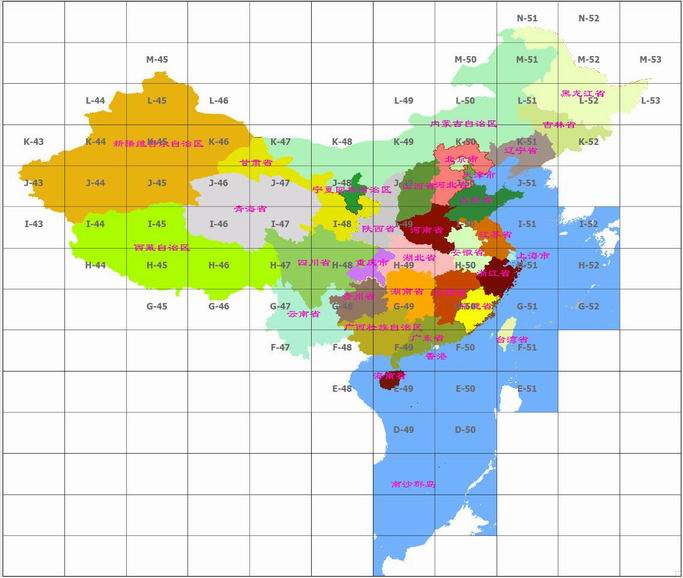

##  1\. 背景介绍

地图制图是一门专业学科，对符号、颜色配置要求较高，经过多年的积累已经形成了自己的符号、颜色配置体系。本文从地图类型、地图要素、地图分幅几个方面对地图制图的背景做了简单的介绍，并根据不同地图的颜色特点结合
SuperMap 的符号、颜色、注记功能，提出了初步地图符号、颜色配置方案和地图配图流程。

###  1.1 地图类型

地图一般分为普通地图和专题地图，根据功能的不同又从专题地图里划分了统计地图。不同地图类型在颜色配置方案、地图要素、地图符号、图廓整饰方面也有所不同。

  * **普通地图** 是以相对均衡的详细程度表示制图区域内各种自然和社会经济现象的地图。其内容包含全地图要素。这类地图的特点是着重描绘地区轮廓、地面起伏形态、自然状况和人类活动的成果，同时也是制作专题地图的地理底图。配色一般采用蓝、黑、棕、绿四种颜色。水系一般采用蓝色，道路一般采用黑色和棕色，植被一般采用绿色，注记一般采用黑色和蓝色。图廓整饰也根据比例尺的不同有相应的变化。
  * **专题地图** 是以普通地图为地理基础，着重表示制图区域内某一种或几种自然或社会经济现象的地图。这类地图的显著特点是，作为该图主题的专题要素予以详尽表示，其地理基础内容则视主题而异，有选择地表示某些相关要素，因此专题地图的内容是由地理基础和专题要素两部分构成。专题要素一般采用同色系的颜色，并考虑专题要素的含义区分冷色系还是暖色系。地理底图较为简单。
  * **统计地图** 一般采用行政区域作为底图，采用四色配图方案。并配有饼状、柱状等统计图信息。统计图颜色采用与底图颜色反差较大的颜色。行政区域底图外围边界一般会有衬色。

###  1.2 地图要素

普通地图要素一般分为9大类： **居民地、植被、地貌、境界、道路、水系、测量控制点、独立地物、管线和垣栅**
。前六项必须要有。每类下面都有一些小项，再加上注记。要素就比较多。在命名和分级上都有一定的规定。

**常用地图要素命名：**

地图要素 | 英文名 | 中文名 | 说明  
---|---|---|---  
测量控制点  |   |   | 三角点、埋石图根点、水准点、天文点  
独立地物 |   |   | 具有一定方位作用或经济意义的重要地物。如，发电厂、独立烟囱、水塔等  
居民地 | respt | 居民点 | 点状居民地  
respy | 居民地 | 乡、镇及乡、镇以上等级面状居民地  
植被 | landuse  | 土地利用 | 森林、草地、旱地、水田等  
地貌 | terlk | 等高线 | 计曲线、首曲线、间曲线等  
ternt | 沙漠、雪被边线等 | 沙漠、雪被边线等其他地貌  
境界 | bount | 境界 | 国界、省界、地区界、县界、乡界、村界等  
boupt | 国界界碑 | 点状界碑  
province | 省界 | 省界  
county | 县界 | 县界  
管线和垣栅 |   |   |  
道路 | roalk | 道路 | 高速公路、一级公路、国道、省道、县乡道、乡村路、小路、公路桥等  
railk | 铁路 | 铁路  
水系 | hydnt | 水系线、面 | 主要湖泊、河流、水库、渠道等  
hydlk  |  水系点  |  泉、井、不依比例尺水库、明礁、暗礁  
其他要素  |  othnt  |  自然保护区  |  自然保护区  
辅助要素  |  atnlk  |  山峰、岛屿等名称  |  山峰、岛屿等名称  
地理格网  |  ggdln  |  经纬线、公里网  |  经纬线、公里网  
数据质量  |  quapy  |  地形图编绘资料  |  地形图编绘资料情况  
  
##  2\. 符号、颜色配置方案

要配成一幅完整的地图，需要有相应的地图要素之外，还要经过地图符号配置、地图颜色配置、地图专题图配置、地图注记配置以及图廓整饰等工序。地图符号还根据地图要素的不同分为点状符号、线状符号和面状符号。根据比例尺的不同符号样式和大小也有区别。

###  2.1 1：250000、1：500000地形图符号

**常用点状符号配置**

名称 | ID | 大小 | 角度 | 颜色  
---|---|---|---|---  
山洞 | 250001 | 24 | 与图幅垂直 | RGB（0，0，0）  
发电厂  | 250002  | 45  | 与图幅垂直  | RGB（0，0，0）  
矿井  | 250003  | 48  | 与图幅垂直  | RGB（0，0，0）  
庙宇  | 250004  | 24  | 与图幅垂直  | RGB（0，0，0）  
塔  | 250005  | 24  | 与图幅垂直  | RGB（0，0，0）  
界碑 | 250008 | 40 | 与图幅垂直 | RGB（0，0，0）  
高程点 | 250007 | 12 | 与图幅垂直 | RGB（0，0，0）  
居民点 | 250010 | 40 | 与图幅垂直 | RGB（0，0，0）  
独立房屋 | 250006 | 32 | 与图幅垂直 | RGB（0，0，0）  
孤峰 | 250009 | 32 | 与图幅垂直 | RGB（173，113，0）  
  
**常用线状符号配置**

名称 | ID | 宽度 | 颜色  
---|---|---|---  
主要河流  | 0  | 2  | RGB（0，170，231）  
湖泊边线、海岸线  | 0  | 1  | RGB（0，170，231）  
计曲线  | 0  | 2  | RGB（173，113，0）  
首曲线  | 0  | 1  | RGB（173，113，0）  
陡坎  | 251001  | 1  | RGB（173，113，0）  
居民地边线  |  0  |  1  |  RGB（173，0，0）  
单线铁路  |  0  |  5  |  RGB（0，0，0）  
复线铁路  |  251002  |  5  |  RGB（0，0，0）  
高速公路  |  251003  |  外8内4，固定  |  外RGB（173，0，0），  
内RGB（255，125，123）  
等级公路  |  0  |  4  |  RGB（173，0，0）  
等外公路  |  0  |  2  |  RGB（173，0，0）  
大路  |  0  |  1  |  RGB（0，0，0）  
小路  |  251004  |  1  |  RGB（0，0，0）  
国界  |  251005  |  固定  |  RGB（0，0，0）  
省界  |  251006  |  3  |  RGB（0，0，0）  
地区界  |  251007  |  3  |  RGB（0，0，0）  
县界  |  251008  |  2  |  RGB（0，0，0）  
特殊地区界  |  251009  |  2  |  RGB（0，0，0）  
长城  |  251010  |  1  |  RGB（0，0，0）  
土地利用边界  |  5  |  1  |  无  
  
**常用面状符号配置**

名称 | ID> | 前景色 | 背景色  
---|---|---|---  
河流、湖泊、水库  | 0  | 深RGB（115，223，255），  
浅RGB（189，235，255）  | 深RGB（115，223，255），  
浅RGB（189，235，255）  
居民地  |  0  |  RGB（255，125，123）  |  RGB（255，125，123）  
沙地  |  14  |  RGB（173，113，0）  |  RGB（255，255，255）  
盐碱地  |  94  |  RGB（173，113，0）  |  RGB（255，255，255）  
森林  |  0  |  RGB（214，255，189）  |  RGB（214，255，189）  
经济林  |  73  |  RGB（82，255，0）  |  RGB（214，255，189）  
草地  |  84  |  RGB（82，255，0）  |  RGB（255，255，255）  
灌木林  |  79  |  RGB（82，255，0）  |  RGB（214，255，189）  
  
**常用注记符号配置**

名称 | 样例 | 大小 | 字体 | 角度 | 颜色  
---|---|---|---|---|---  
首都  | 北京市  | 高66宽0  | 黑体  | 0  | RGB（0，0，0）  
省、自治区、直辖市人民政府驻地  |  西安市  |  高54宽0  |  黑体  |  0  |  RGB（0，0，0）  
自治州人民政府驻地  |  延安市  |  高45宽0  |  黑体下划线  |  0  |  RGB（0，0，0）  
地级市人民政府驻地  |  淄博市  |  高45宽0  |  黑体  |  0  |  RGB（0，0，0）  
县级人民政府驻地  |  武昌县  |  高35宽0  |  黑体  |  0  |  RGB（0，0，0）  
镇级人民政府驻地  |  阳平镇  |  高28宽0  |  黑体  |  0  |  RGB（0，0，0）  
重要村庄  |  张家村  |  高28宽0  |  宋体  |  0  |  RGB（0，0，0）  
说明注记  |  西安站  |  高20宽0  |  黑体  |  0  |  RGB（0，0，0）  
七大洋  |  太平洋  |  高90宽0  |  @宋体斜体  |  290  |  RGB（0，170，231）  
海洋  |  东海  |  高72宽0  |  @宋体  |  290  |  RGB（0，170，231）  
河流  |  长 江  |  高54宽0  |  @黑体  |  290  |  RGB（0，170，231）  
湖泊  |  太湖  |  高48宽0  |  @宋体  |  290  |  RGB（0，170，231）  
水库  |  密云水库  |  高35宽0  |  @宋体  |  290  |  RGB（0，170，231）  
海峡  |  台湾海峡  |  高48宽0  |  @宋体  |  290  |  RGB（0，170，231）  
群岛  |  西沙群岛  |  高54宽36  |  黑体  |  0  |  RGB（0，0，0）  
岛屿  |  海南岛  |  高66宽44  |  宋体  |  0  |  RGB（0，0，0）  
山脉  |  昆仑山脉  |  高66宽0  |  黑体  |  20  |  RGB（0，0，0）  
山峰  |  将军山  |  高35宽0  |  黑体  |  0  |  RGB（0，0，0）  
高程点  |  1370  |  高16宽0  |  黑体  |  0  |  RGB（0，0，0）  
外国首都  |  平壤  |  高54宽0  |  黑体  |  0  |  RGB（0，0，0）  
外国一级行政中心  |  曼德勒  |  高45宽0  |  黑体  |  0  |  RGB（0，0，0）  
外国一般城市  |  比哈尔  |  高35宽0  |  黑体  |  0  |  RGB（0，0，0）  
  
###  2.2 1：25000、1：50000、1：100000地形图符号

**常用点状符号配置**

名称 | ID | 大小 | 角度 | 颜色  
---|---|---|---|---  
三角点  | 250011  | 32  | 与图幅垂直  | RGB（0，0，0）  
埋石图根点  |  250013  |  32  |  与图幅垂直  |  RGB（0，0，0）  
水准点  |  250015  |  32  |  与图幅垂直  |  RGB（0，0，0）  
天文点  |  250016  |  32  |  与图幅垂直  |  RGB（0，0，0）  
普通房屋  |  250006  |  24  |  与图幅垂直  |  RGB（0，0，0）  
窑洞  |  250017  |  24  |  与图幅垂直  |  RGB（0，0，0）  
发电厂  |  250019  |  40  |  与图幅垂直  |  RGB（0，0，0）  
变电室  |  250018  |  24  |  与图幅垂直  |  RGB（0，0，0）  
矿井  |  250003  |  48  |  与图幅垂直  |  RGB（0，0，0）  
烟囱  |  250020  |  32  |  与图幅垂直  |  RGB（0，0，0）  
水塔  |  250021  |  24  |  与图幅垂直  |  RGB（0，0，0）  
庙宇  |  250004  |  24  |  与图幅垂直  |  RGB（0，0，0）  
塔  |  250005  |  32  |  与图幅垂直  |  RGB（0，0，0）  
界碑  |  250008  |  40  |  与图幅垂直  |  RGB（0，0，0）  
高程点  |  250007  |  12  |  与图幅垂直  |  RGB（0，0，0）  
孤峰  |  250009  |  32  |  与图幅垂直  |  RGB（173，113，0）  
  
**常用线状符号配置**

名称 | ID | 宽度 | 颜色  
---|---|---|---  
主要河流  |  0  |  2  |  RGB（0，170，231）  
湖泊边线、海岸线  |  0  |  1  |  RGB（0，170，231）  
计曲线  |  0  |  2  |  RGB（173，113，0）  
首曲线  |  0  |  1  |  RGB（173，113，0）  
陡坎  |  251001  |  1  |  RGB（0，0，0）  
居民地边线  |  0  |  1  |  RGB（0，0，0）  
单线铁路  |  251011  |  固定  |  RGB（0，0，0）  
复线铁路  |  251012  |  固定  |  RGB（0，0，0）  
高速公路  |  251013  |  固定  |  固定  
等级公路  |  251014  |  固定  |  固定  
等外公路  |  251015  |  固定  |  固定  
乡村路  |  251016  |  1  |  RGB（0，0，0）  
小路  |  251017  |  1  |  RGB（0，0，0）  
国界  |  251005  |  固定  |  RGB（0，0，0）  
省界  |  251006  |  3  |  RGB（0，0，0）  
地区界  |  251007  |  3  |  RGB（0，0，0）  
县界  |  251008  |  2  |  RGB（0，0，0）  
特殊地区界  |  251009  |  2  |  RGB（0，0，0）  
长城  |  251018  |  1  |  RGB（0，0，0）  
土地利用边界  |  5  |  1  |  无  
  
**常用面状符号配置**

名称 | ID | 前景色 | 背景色  
---|---|---|---  
河流、湖泊、水库 | 0 | 深RGB（115，223，255），  
浅RGB（189，235，255） | 深RGB（115，223，255），  
浅RGB（189，235，255）  
居民地 | 0 | RGB（0，0，0） | RGB（255，255，255）  
沙地  |  14  |  RGB（173，113，0）  |  RGB（255，255，255）  
盐碱地  |  94  |  RGB（173，113，0）  |  RGB（255，255，255）  
森林  |  0  |  RGB（214，255，189）  |  RGB（214，255，189）  
经济林  |  73  |  RGB（82，255，0）  |  RGB（214，255，189）  
草地  |  84  |  RGB（82，255，0）  |  RGB（255，255，255）  
灌木林  |  79  |  RGB（82，255，0）  |  RGB（214，255，189）  
稻田  |  68  |  RGB（0，0，0）  |  RGB（255，255，255）  
旱地  |  71  |  RGB（0，0，0）  |  RGB（255，255，255）  
  
**常用注记符号配置**

名称 | 样例 | 大小 | 字体 | 角度 | 颜色  
---|---|---|---|---|---  
首都  | 北京市  | 高66宽0  | 黑体  | 0  | RGB（0，0，0）  
省、自治区、直辖市人民政府驻地  |  西安市  |  高54宽0  |  黑体  |  0  |  RGB（0，0，0）  
自治州人民政府驻地  |  延安市  |  高45宽0  |  黑体下划线  |  0  |  RGB（0，0，0）  
地级市人民政府驻地  |  淄博市  |  高45宽0  |  黑体  |  0  |  RGB（0，0，0）  
县级人民政府驻地  |  武昌县  |  高40宽0  |  黑体  |  0  |  RGB（0，0，0）  
镇级人民政府驻地  |  阳平镇  |  高35宽0  |  黑体  |  0  |  RGB（0，0，0）  
重要村庄  |  张家村  |  高30宽0  |  宋体  |  0  |  RGB（0，0，0）  
说明注记  |  西安站  |  高25宽0  |  黑体  |  0  |  RGB（0，0，0）  
海洋  |  东海  |  高90宽0  |  @宋体  |  290  |  RGB（0，170，231）  
河流  |  长 江  |  高72宽0  |  @宋体  |  290  |  RGB（0，170，231）  
湖泊  |  太湖  |  高66宽0  |  @宋体  |  290  |  RGB（0，170，231）  
水库  |  密云水库  |  高48宽0  |  @宋体  |  290  |  RGB（0，170，231）  
群岛  |  西沙群岛  |  高66宽44  |  黑体  |  0  |  RGB（0，0，0）  
列岛  |  嵊泗列岛  |  高54宽36  |  黑体  |  0  |  RGB（0，0，0）  
山脉  |  昆仑山脉  |  高66宽0  |  黑体  |  20  |  RGB（0，0，0）  
山峰  |  将军山  |  高35宽0  |  黑体  |  0  |  RGB（0，0，0）  
高程点  |  1370  |  高16宽0  |  黑体  |  0  |  RGB（0，0，0）  
  
##  3\. 配图注意事项

普通地图制图的每个地图要素和编绘顺序都是有严格规定的。比如居民地的分布特点和密度差别，道路的等级、通行情况、分布特点和密度差别，河系的结构特征及河网密度，测量控制点线差等等。并且要考虑各要素叠盖时，要做断开处理和合理性检查。但在计算机制图表现过程中通常在数据处理阶段就已经把不需要的数据过滤掉了，所以不需要考虑符号密度问题，并且由于压盖断开问题会影响数据的连续性，计算机制图中也一般不考虑压盖断开问题。这样就导致普通地图的编绘顺序跟计算机表现的地图图层顺序和配图流程会有一些差别。

计算机制图中，首先需要把数据加到地图中，按地图要素组织好地图图层的叠盖关系。然后配上各种符号，专题地图和统计地图还要配上相应的专题和统计信息。再配上注记信息，最后再加上图幅图框、领属注记等图廓整饰信息就可以完成一幅完整地图的配置。

###  3.1 图层组织

要想地图配起来美观，首先需要合理的图层组织方式。我们可以按照普通地图的九大要素对地图要素进行组织。图层的顺序从下到上应该为：植被（土地利用）、水系面、地貌（等高线等）、水系线、道路、境界、居民地、管线和垣栅、测量控制点、独立地物、注记。每个图层下面还可以根据属性信息把地图要素分成不同的等级。在此基础上专题地图和统计地图还需要一些专题和统计信息。最后再进行图廓整饰。

###  3.2 风格配置

在配置各个图层的风格之前，需要将地图比例尺设置为与所选图框一致的比例尺。

地图的符号风格配置除了上面提到的符号、颜色配置方案以外，还要考虑其他一些配色方案。比如说行政区域的四色配图，行政边界的衬色等等。

行政区域的配色一般采用色相相差较大，亮度很高的颜色。比如淡黄（255，255，223）、淡绿（223，255，223）、淡蓝（223，223，255）、淡粉（255，223，255）。

行政边界的衬色一般采用粉色（深（255，0，198）、浅（255，133，222））和棕红色（深（255，0，0）、浅（255，255，123））。而且由于计算机处理的问题，采用线型偏移的方式效果不是很好，我们一般采用两边等宽的线型或做缓冲区填充来作为衬色。然后通过行政区域面压盖住线型在行政区域内的部分，达到境界衬色的目的。

###  3.3 注记调整

地图制图数字化之后，一般会把注记存储在点状、面状、线状地图要素的属性当中，需要通过标签专题图的方式把属性作为注记表现到地图上。但自动标注的效果往往不是最理想的，这就需要对部分标注进行调整，所以在出图之前会把标签专题图通过图层专题图转换为CAD数据集的功能把标签转换成文本对象，然后再对文本对象进行位置调整，再输出成图。

###  3.4 图廓整饰

图廓整饰是配图的最后一道工序，普通地图、专题地图、统计地图的图廓整饰各不相同。

普通地图的图廓整饰，可以通过我们的标准图幅图框生成。再配上图例，图例一般放在地图的右侧，自动生成的图例还不能满足要求，需要把图例打散，然后把多余的图层信息删除，保留专题图和符号信息，再把符号和文字描述调一下顺序，把文字放到左边，符号放到右边。文字的字体为宋体高12宽0黑色。另外由于普通地图都是根据标准图幅生成的，图上都标有经纬度和磁偏角等信息，正北方向也是射线状的，不只是一个方向，所以千万不能加指北针。

专题地图的图廓整饰，一般需要有图名、图例、图框、比例尺、指北针、出版单位、领属注记等信息。专题地图的图例相对简单，只要表现专题信息的图例就可以了。但图名必须准确描述专题要素信息。图框也相对花哨，需要加一些纹理。这可以通过布局地图的复杂边框实现。有一些专题地图还可以把地理信息一致，但专题信息不一样的两幅地图放在一起，同时组成一幅布局。比如，1月份的降雨量和7月份的降雨量。

统计地图的图廓整饰跟专题地图类似。只是图例用统计图的方式表达，图框也不需要太复杂，并且一般会有表格等附属信息。

**百万图幅分幅与我国省级行政区界对照图：**

