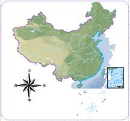
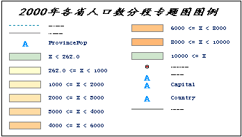

一幅完整的地图通常由地图、指北针、比例尺、图例、标题等地图要素组成。在布局中添加、排版和组织各种地图要素，设置各要素的属性、大小、位置后，即可将其输出为地图。

**地图对象**

布局的主要要素是地图对象，其它要素均围绕地图对象进行排版布置。在布局窗口中添加的地图对象，可以是矩形、圆角矩形、多边形、圆形、椭圆等形状。一个布局中可以添加多个地图几何对象，可将相关联的不同地图显示在一个布局中，同时，还可设置地图。
在布局窗口中，一个地图几何对象只能关联一个地图窗口中的地图，但是一个布局中可以绘制多个地图几何对象，并将关联的不同地图显示在布局中，同时，还可调整地图放置位置、大小、属性、边框等。

**指北针**

指北针用于指示地图方向，指北针与地图旋转角度联动显示，当地图角度发生改变时，指北针的指向也会随之旋转改变；反之，指北针的指向发生变化时，地图方向也会随之改变。

 |   
---|---  
图1：方向旋转前 | 图2：方向旋转后  
  
**比例尺**

地图是按照一定的数学法则运用符号系统经过制图概括，将空间上的有用信息按照一定比例进行的缩小表示。而比例尺指的就是地理信息被缩小的程度，即地图上线段长度与实地对应的线段的水平长度之比。地图内容的选取、概括程度、数据精度等都与比例尺密切相关。

比例尺对象同样与地图对象关联显示，随着地图的放大缩小、比例尺的刻度联动变化， 支持的比例尺类型如下表所示：

**图例**

地图采用各种符号、不同颜色和标注来表示空间地理信息，例如道路用不同颜色、不同宽度、不同图案的线来绘制，以表示不同类型和级别的道路；土地利用类型用不同的面填充来表示，例如水体用蓝色表示；用专用的符号来表示特殊的地物，例如地铁站、飞机场；使用文字标注来表示街道、建筑物等。而图例则是地图上所使用的全部地图符号的说明。

  

  
**地图标题**

地图标题主要用于描述地图的主要内容，在布局中可直接添加地图标题，可文本风格为普通文本艺术字体风格，并且支持设置为沿线标注，方便用户制作更加美观的地图。

  

  

