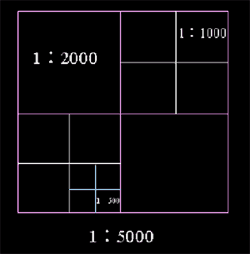
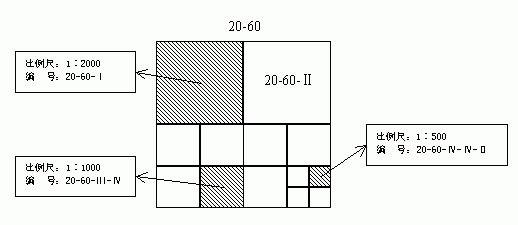

为了适应各种工程设计和施工的需要，对于大比例尺地形图，大多按纵横坐标格网线进行等间距分幅，即采用正方形分幅与编号方法。一般规定：

  * 1:5000比例尺采用纵、横各40cm，即实地2km的分幅。
  * 1:2000、1:1000、1:500比例采用纵、横各50cm分幅。
  * 若测区为狭长带状，为了减少图板和接图，可采用任意分幅。

  

  
图幅的编号一般采用坐标编号法。由图幅西南角纵坐标x和横坐标y组成编号，1∶5000坐标值取至km，1∶2000、1∶1000取至0.1km,1∶500取至0.01km。例如，某幅1∶1000地形图的西南角坐标为x=6230km、y=10km，则其编号为6230.0―10.0

也可以采用基本图号法编号，即以1∶5000地形图作为基础，较大比例尺图幅的编号是在它的编号后面加上罗马数字。例如，一幅1∶5000地形图的编号为20-60，则其它图的编号如下图所示：

  

  

