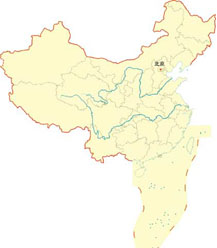
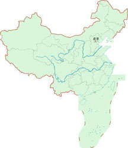
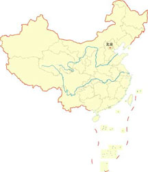
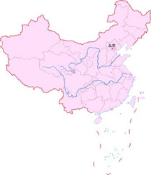
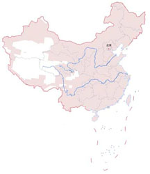
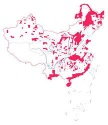
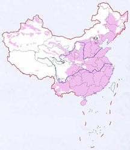
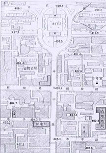
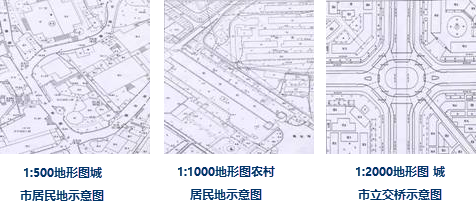

我国国家基本比例尺地形图有11种，主要包括：

1:100万、1:50万、1:25万、1:10万、1:5万、1:2.5万、1:1万、1:5000、1:2000、1:1000、1:500 。

普通地图按比例尺通常分为大中小三种：小于100万(小比例尺)，10万到100万(中比例尺)，大于10万(大比例尺)。

目前我国1：100万、1：50万、1：25万和1：10万地形图已覆盖全部陆地国土；1：5万和1：1万地形图分别覆盖陆地国土约85%和47%；1：5000和1：2000或更大比例尺地形图基本覆盖了全部城镇地区。

**1:100万地形图**  

 

1:100万地形图，综合反映了制图范围内的自然地理和社会经济概况，用于大范围内进行宏观评价和研究地理信息，是国家各部门共同需要的基本地理信息和地形要素的平台，可以作为各部门进行经济建设总体规划，经济布局、生产布局、国土资源开发利用的计划和管理用图或工作底图，也可作为国防建设用图，也可作为更小比例尺普通地图的基本资料和专题地图的地理底图。

1:100万地形图采用正轴等角圆锥投影，编绘方法成图。分幅、编号采用国际1:100万地图分幅标准，从赤道开始，纬度每4°为一列，依次用拉丁字母A、B、C……V表示（20世纪70年代曾一度用阿拉伯数字1、2、3……表示），列号前冠以N或S，以区别北半球和南半球（我国地处北半球，图号前的N全部省略）；从180°经线算起，自西向东6°为一纵行，将全球分为60纵行，依次用1、2、3……60表示，“列号―行号”相结合，即为该图的编号。如：J―50，10―50。  
  

  
**1:50万地形图**  
 

1:50万地形图，综合反映了制图范围内的自然地理和社会经济概况，用于较大范围内进行宏观评价和研究地理信息，是国家各部门共同需要的基本地理信息和地形要素的平台，可以作为各部门进行经济建设总体规划，省域经济布局、生产布局、国土资源开发利用的计划和管理用图或工作底图，也可作为国防建设用图，也可作为更小比例尺普通地图的基本资料和专题地图的地理底图。

1:50万地形图采用高斯―克吕格投影，6°分带，采用编绘方法成图。分幅、编号均以1:100万地形图为基础，将每幅1:100万地形图划分成2行2列，共4幅1:50万地形图，20世纪70年前用A、Б、В、Г或甲、乙、丙、丁表示，70年代起用拉丁字母A、B、C、D表示。在1:100万地形图编号后加上1:50万地形图的代号，即为1:50万地形图的编号，如J―50―Г，10―50―丁，J―50―D。20世纪90年代起：平面坐标系统采用1980年西安坐标系，高程系统采用1985国家高程基准；分幅、编号均以1:100万地图的分幅与编号为基础，划分出新分幅标准，在1:100万图幅编号后加上1:50万的代号和行列号，如:J47B001002。
一幅1:50万地形图的范围为经差3°，纬差2°。  
  

  
**1:25万地形图**  
 

1:25万地形图，比较全面和系统地反映了区域内自然地理条件和经济概况，主要供各部门在较大范围内作总体的区域规划、查勘计划、资源开发利用与自然地理调查，也可供国防建设使用，也可作为编制更小比例尺地形图或专题地图的基础资料。

1:25万地形图采用高斯―克吕格投影，6°分带，编绘方法成图。分幅、编号均以1:100万地形图为基础，将每幅1:100万地形图划分成4行4列，共16幅1:25万地形图，用[1]、[2]…[16]表示，在1:100万地形图编号后加上表示1:25万地形图的代号，即为1:25万地形图的编号。如J―50―[2]。新分幅标准在1:100万地形图编号后加上1:25万地形图的比例尺代字和行列号.如：J50C001004。每幅1:25万地形图的范围为经差1°30′，纬差1°。  
  
  
  
**1:10万地形图**  
 

1:10万地形图主要用于一定范围内较详细研究和评价地形，供工业、农业、林业、水利、铁路、公路、农垦、畜牧、石油、煤炭、地质、气象、地震、环保、文化、卫生、教育、体育、民航、医药、海关、税务、考古、土地等国民经济各部门勘察、规划、设计、科学研究、教学等使用；也是军队的战术用图，供军队现地勘察、训练、图上作业、编写兵要、国防工程的规划和设计等军事活动使用；同时也是编写更小比例尺地形图或专题图的基础资料。

1:10万地形图采用高斯―克吕格投影，6°分带，采用编绘方法成图。分幅、编号均以1:100万地图的分幅与编号为基础，将每个1:100万地形图划分成12行12列，共144幅1:10万地形图，用1～144表示，在1:100万地形图编号后加上1:10万地形图的代号，即为1:10万地形图的编号。如H―48―142、8―48―142。新分幅标准在1:100万地形图编号后加上1:10万地形图的比例尺代字和行列号.如：J50D012004。每幅1:10万地形图的范围为经差为30′，纬差20′。  
  

  
**1:5万地形图**  

1:5万地形图是我国国民经济各部门和国防建设的基本用图。这种比例尺地形图主要用于一定范围内较详细研究和评价地形，供工业、农业、林业、水利、铁路、公路、农垦、畜牧、石油、煤炭、地质、气象、地震、环保、文化、卫生、教育、体育、民航、医药、海关、税务、考古、土地等国民经济各部门勘察、规划、设计、科学研究、教学等使用；也是军队的战术用图，供军队现地勘察、训练、图上作业、编写兵要、国防工程的规划和设计等军事活动使用；同时也是编写更小比例尺地形图或专题图的基础资料。

1:5万地形图采用高斯―克吕格投影，6°分带，采用航空摄影测量方法成图。分幅、编号均以1:10万地形图为基础，将每幅1:10万地形图划分成2行2列，共4幅1:5万地形图，20世纪70年代前用A、Б、В、Г或甲、乙、丙、丁表示，20世纪70―80年代用A、B、C、D表示，在1:10万地形图编号后加上表示1:5万地形图的代号，即为1:5万地形图的编号。如：H―48―142―Г，8―48―142―J，H―48―142―D。新分幅标准将每幅1:100万地形图划分成24行24列，共576幅1:5万地形图，在1:100万地形图编号后加上其内1:5万地形图的比例尺代字、图幅行列号，即为1:5万地形图的编号。如：J50E017016。每幅1:5万地形图经差为15′，纬差10′。  
  

  
**1:2.5万地形图**  

1:2.5万地形图主要用于较小范围内详细研究和评价地形，城市、乡镇、农村、矿山建设的规划、设计，林斑调查，地籍调查，大比例尺的地质测量和普查，水电等工程的勘察、规划、设计，科学研究，国防建设的特殊需要，以及可作为编制更小比例尺地形图或专题地图的基础资料。

1:2.5万地形图采用高斯―克吕格投影，6°分带，航空摄影测量或编绘方法成图。分幅、编号均以1:5万地图为基础，将每幅1:5万地形图划分成2行2列，共4幅1:2.5万地形图，用a、б、в、г或1、2、3、4表示。在1:5万地形图编号后加上1:2.5万地形图的代号，即为1:2.5万地形图的编号。如：J―50―144―A―б，10―50―144―甲―2，J―50―144―A―2。新分幅标准以1:100万为基础，分为48行48列，共2304幅在1:100万地形图编号后加上1:2.5万地形图的比例尺代字和行列号，即为1:2.5万地形图的编号。如：J50F045004。
每幅1:2.5万地形图经差7′30″，纬差5′。  
  

  
**1:1万地形图**  

1:1万地形图主要用于小范围内详细研究和评价地形，城市、乡镇、农村、矿山建设的规划、设计，林斑调查，地籍调查，大比例尺的地质测量和普查，水电等工程的勘察、规划、设计，科学研究，国防建设的特殊需要，以及可作为编制更小比例尺地形图或专题地图的基础资料。

1:1万地形图采用高斯―克吕格投影，3°分带，航空摄影测量方法成图。分幅、编号：20世纪70年代前以1:2.5万地形图为基础，将每幅1:2.5万地形图划分成2行2列，共4幅1:1万地形图，用1、2、3、4表示，在1:2.5万地形图编号后加上表示1:1万地形图的代号，即为1:1万地形图的编号。如J―50―144―A―б―1。20世纪70―80年代以1:10万地形图为基础，将每幅1:10万地形图划分成8行8列，共64幅1:1万地形图，用（1）、（2）…（64）表示，在1:10万地形图编号后加上表示1:1万地形图的代号，即为1:1万地形图的编号。如J―50―144―（1）。20世纪90年代起以1:100万地形图为基础，将每幅1:100万地形图划分为96行96列，共9216幅1:1万地形图，在1:100万地形图编号后加上1:1万地形图的比例尺代字和行列号，即为1:1万地形图的编号。如：J50G093004。每幅1:1万地形图经差3′45″，纬差2′30″。  
  
  
**1:5000地形图**  
  

1:5000地形图主要用于小范围内详细研究和评价地形，可供各部门勘察、规划、设计，科研等使用，也可作为编制更小比例尺地形图或专题地图的基础资料。

1:5000地形图采用高斯―克吕格投影，3°分带，其分幅、编号是以1:1000000地形图为基础，将每幅1:1000000地形图划分成192行192列，共36864幅1:5000地形图，在1:1000000地形图编号后加上1:5000地形图的比例尺代字、行列号，即为1:5000地形图的编号。如J50H093093。每幅1:5000地形图的范围是经差1′52.5″、纬差1′15″。  
  
 

1:500、1:1000、1:2000地形图主要用于小范围内精确研究、评价地形，可供勘察、规划、设计和施工等工作使用。

平面控制采用高斯―克吕格投影，按3°分带计算平面直角坐标。当对控制网有特殊要求时，采用任意经线作为中央子午线的独立坐标系统，投影面亦为当地的高程参考面。

分幅编号：采用正方形或矩形，其规格为50cm×50cm或40cm×40cm。图号以图廓西南角坐标公里数为单位编号，X在前Y在后，中间用短线连接，如:1:2000，10．0―21．0；1:1000，10．5―21．5；1:500，10．50―21．75。带状或小面积测区的图幅，按测区统一顺序进行图幅编号。  
  
注：本文档资料整理于国家测绘局网站，仅作为用户学习参考之用。

