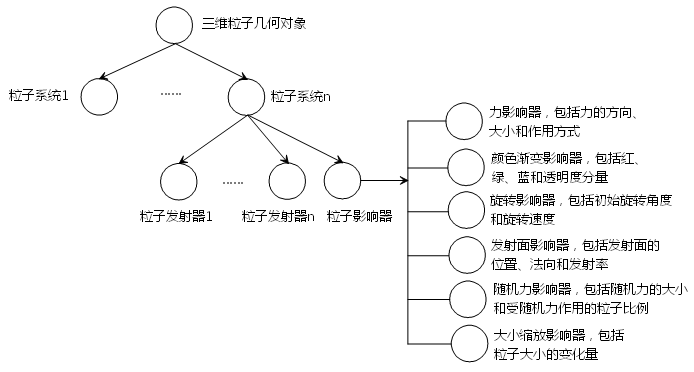

**SuperMap 粒子系统结构介绍**

产品对传统的粒子系统结构进行了调整，每个三维粒子几何对象均由一个或若干粒子系统对象的共同作用来表现，三维粒子几何对象的结构如下图所示：

  

  
从上图可知，三维粒子几何对象中包含若干粒子系统对象，每个粒子系统对象均包含：一个或若干粒子发射器和一个粒子影响器，其中粒子发射器用于控制发射出来粒子的速度、方向等；粒子影响器则按照一定规则对粒子的路径和生命周期进行影响，使粒子效果更为真实。

### 粒子特效实例

桌面应用程序中提供了" **粒子对象** "绘制功能。实现了三维场景中粒子特效展示的效果。

下边是 SuperMap 桌面系统中提供的几种粒子特效的实例，针对实例我们来简单了解下SuperMap 提供的粒子对象的结构、参数和效果展示。

 相关主题

 [粒子对象的创建](../../SceneOperation/GeoParticle/GeoParticleSetting)

