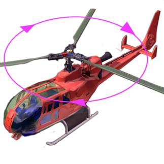

模型动画效果是目前三维技术的一个热点技术。三维游戏中虚拟人物的奔跑，坦克炮塔的旋转，都是模型动画的实际应用。模型动画技术的重要意义在于使得三维场景中的模型对象运动起来，人们可以通过动画获取对象的动态视觉效果。模型动画技术应用在GIS产品中，使得地理信息系统的视觉体验更加趋向于真实。通过对模型动画的观察，使用者能够获取模型各个部位的动作信息，而不再只是静态的图像。

SuperMap GIS 对模型动画技术的实现，主要体现在对第三方模型动画的支持上。通过将第三方的动画模型文件导入，用户可以控制动画的播放，从而实现在三维场景中展现出动态的对象。

  

  

