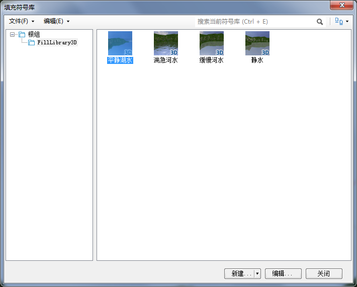
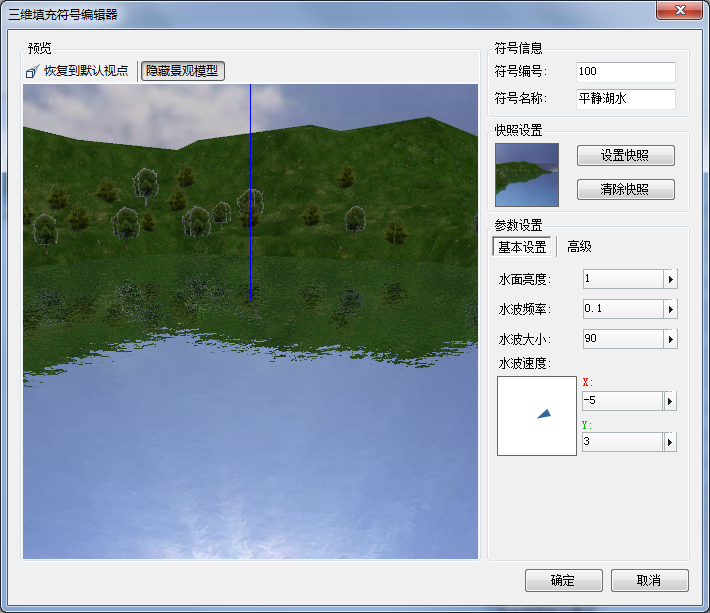

三维水面效果是三维场景仿真效果中比较绚丽的特效之一，通过设置水面效果，场景中的水体能够显示出反射和波动的效果，能够模拟出真实世界中水面的真实效果。这种水面效果在数字城市等行业的景观展示中有广泛的应用前景。

SuperMap 场景中的水面特效是指通过对场景中的矢量面数据集设置风格，将填充符号类型选择水面效果即可。同时，
提供了三维填充符号编辑功能，用户可以在编辑器中对水面效果实现参数化编辑，对水波的大小、频率和方向以及水面反射度进行设置。

### 设置水面效果步骤

  1. 在面填充符号库中导入或新建水面填充效果；
  2. 将须设置水面效果的矢量面数据集或 CAD 复合数据集添加到场景中；
  3. 将该图层设置为可编辑状态，在图层管理器中选中面图层，若是 CAD 图层则在场景中选中面对象，再通过风格设置将面对象填充风格设置为水面效果符号即可。

### 编辑水面效果

  1. 在“工作空间管理器”中，双击“资源”节点中的“填充符号”，打开“填充符号库”对话框。单击对话框中的“文件”下拉按钮，选中“导入”中的“导入填充符号库”选项，将“安装路目录\Templates\SymbolLibrary\”文件夹下的“FillLibrary3D.bru”三维符号库导入到系统填充符号库中。
  

  2. 查看 FillLibrary3D 库中的水面符号，选中某个符号单击“编辑”按钮来进行调节，或单击“新建”下拉按钮选中“新建三维填充...”，新建一个三维填充符号。
  
 
  3. 在三维填充符号编辑器中，可对水面的风格进行设置和调整，主要包括：三维填充符号的信息、符号的快照、水面参数、水波状态设置等。此外，
  4. 在三维填充符号编辑器中可以对符号进行多角度的预览。预览区域的空间上有三个坐标轴，红色轴为 X 方向，绿色轴为 Y 方向，蓝色轴为 Z 方向。这里提供了丰富的鼠标和键盘操作，从不同角度、不同方位对三维填充符号进行预览。此外，用户可以通过预览区顶部的“恢复到默认视点”按钮，恢复系统默认的视角状态。 为了方便预览所制作的水面填充风格应用到场景中的效果，预览区的场景中还提供了参照物，可以辅助用户判断所设置的参数是否符合实际应用需求。通过预览区顶部的“隐藏景观模型”/“显示景观模型”按钮，可以控制场景中的参照物景观是否显示。
  5. 在“符号信息”区域，可以修改符号编号和符号名称其中符号编号是改符号在当前符号库中的唯一标识。
  6. 在预览区调整好三维填充符号的效果后，可以单击“设置快照”按钮将其保存为快照，这样在填充符号库管理中该三维填充符号将以所保存的快照进行显示。如果对当前所设置的快照不满意，可以单击“清除快照”按钮，重新设置快照。
  7. 水面参数设置包括基本参数和高级参数两部分，其中，基本设置包括：水面亮度、水波频率、水波大小和水波速度；高级设置包括：水面颜色、反射比率下限、反射比率上限、反射比率指数。 

**基本设置**

  * 水面亮度：可直接输入数值或单击右侧按钮通过移动滑动条来调节水体的亮度，亮度值范围为：0 至 1 之间，数值精度为：0.01。
  * 水波频率：输入数值范围为：0.2 至 100 之间，数值精度为：0.01
  * 水波大小：输入值范围为：0 至 1 之间，数值精度为：0.01
  * 水波速度：用来设置水流动的方向和速度，首先在水波速度下白色区域中点击鼠标，确定水波方向，然后设置该方向X轴和Y轴上的速度，X轴和Y轴上的速度的范围都为 -100 至 100 之间。在设置水波速度时，处理可以输入数值，还可以使用数值框左侧的面板调整方向。

**高级设置**

  * 水面颜色：可单击右侧颜色按钮，在颜色板中设置水面颜色。
  * 反射比率下限：表示最终水面颜色中反射和折射成分比例的最小值，输入值范围为：-0.5 至 0.5 。
  * 反射比率上限：表示最终水面颜色中反射和折射成分比例的最大值，输入值范围为：0.5 至 1.5 。
  * 反射比率指数：用于表示水面颜色中反射色与折射色的比值随着视角的变化而变化的灵敏度。该值输入值范围为0至10，数值精度为0.1。该系数为0时，水面颜色不随视角的变化而变化；该系数越大，则因视角的变化所引起的水面颜色变化越明显。 
  8. 完成以上设置后，单击对话框中的“确定”按钮，即可完成符号的制作，此时，在填充符号库管理其中可以看到这个新建的三维填充符号。
  9. 将水面效果添加到场景之后，即可看到水面的显示效果

