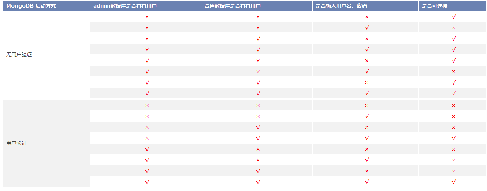

MongoDB
是一个基于分布式文件存储的数据库。是一个介于关系数据库和非关系数据库之间的产品，是非关系数据库当中功能最丰富，最像关系数据库的。它支持的数据结构非常松散，可以存储比较复杂的数据类型。MongoDB
最大的特点是它支持的查询语言非常强大，其语法类似于面向对象的查询语言，几乎可以实现类似关系数据库单表查询的绝大部分功能，而且还支持对数据建立索引。

目前  支持 MongoDB 2.4以上版本的数据库。MongoDB 2.0和 MongoDB
3.0版本在以验证模式和非验证模式启动服务时，启动方式相同；但在创建数据库时，方式有所不同，以下将做详细描述。

在使用 MongoDB 数据库时， 需先启动所要连接的 MongoDB 服务，以下基于mongodb-win32-i386-2.6.6 版本对
MongoDB 服务进行说明。

**启动 MongoDB 服务**

  1. 服务启动时默认是没有权限验证的，登陆后可以对数据库任意操作，若 mongod.exe 在“C:\MongoDB \bin ”文件夹中，则启动命令为：   
  ` mongod.exe --dbpath C:\MongoDB\data --logpath C:\MongoDB\log\log.txt。 `
  2. 服务启动时加上验证参数，则表示以用户验证方式启动数据库。若数据库创建了普通用户，并进行了普通用户验证，则只能对此库进行任意操作，不能对其他库进行操作；若对 admin 数据库进行了用户验证，则可对系统中所有库进行任意操作。启动命令为：  
   ` mongod.exe --dbpath C:\MongoDB\data --logpath C:\MongoDB\log\log.txt -auth。 `
  3. 只有以下两种情况才能对数据库添加或删除用户，第一种是：以非验证方式启动服务；第二种是：以用户验证方式启动，且对admin数据库添加了用户并进行了用户验证。
  4. 当启动服务报“Unclean shutdown detected”相关错误时，可能是由于非正常关闭服务引起的，可以进行修复再启动，相关命令如下：  
   `mongod.exe --repair --dbpath C:\MongoDB\data。`

MongoDB 的启动方式分为非用户验证和用户验证两种方式启动，通过不同的方式启动，数据库的连接信息参数设置有所不同。具体说明如下：

**创建数据库**

  * 当以非用户验证方式启动 MongoDB 服务时，“数据库名称”处输入的需创建的数据库名称，则用户名称、用户密码、确认密码需为空，才可创建成功；若设置了新建数据库的用户名和密码，则数据库会创建失败。
  * 当以用户验证方式启动 MongoDB 服务时，在“数据库名称”处输入数据库名称， **需提前通过命令创建了该数据库** ，若输入的用户名、密码不正确，或者数据库名不存在时，数据库连接失败。通过命令创建数据库用户有以下方式，以创建 test 数据库为例： 
    * 以非认证模式开启服务，在 mongo.exe 命令行执行 

` use test`

` db.addUser("map","map")`

  * 以验证方式重启 MongDB 服务：`mongod.exe --dbpath C:\MongoDB\data --logpath C:\MongoDB\log\log.txt -auth。`
  * 启动MongoDB 服务后，即可以用户 map 对数据库的 test 进行操作。
* **注意** ：以上为 MongoDB 2.0 创建数据库方法，而 MongDB 3.0版本以用户验证方式创建数据方式有所不同，以mongodb-win32-v3.4.0 版本为例： 
  * 以非认证模式开启服务，在 mongo.exe 命令行执行： 

`use admin`

`db.createUser({user:'admin',pwd:'admin',roles:[{role:"userAdminAnyDatabase",
db:"admin"}]}) `

`db.system.version.update({'_id':'authSchema'},{$set:{'currentVersion':3}}) `

`db.system.version.find()`

`use test `

`db.createUser({user:'map',pwd:'map',roles:[{role:"dbOwner",db:"test"}]});`

  * 以验证方式重启 MongDB 服务：`mongod.exe --setParameter authenticationMechanisms=MONGODB-CR --auth `
  * 以上即创建完成了 test 数据库，并为该数据库创建了一个 map 用户，密码为 map。

综上，若在认证模式下使用MongDB 数据库，则数据库连接信息中数据库名称即为 test，用户名和密码分别为 map；map。

**打开数据库**

以用户验证和非用户验证方式启动服务后，打开数据源的连接设置参数不一致，具体情况如下表所示：

