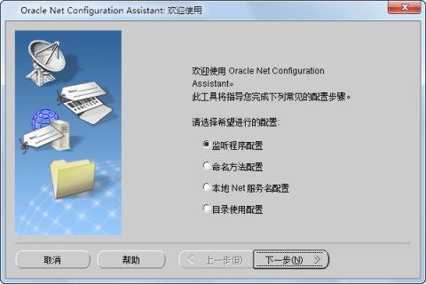
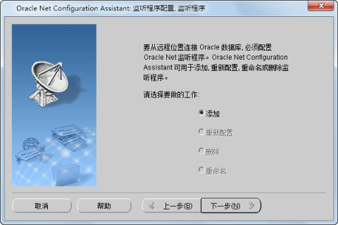
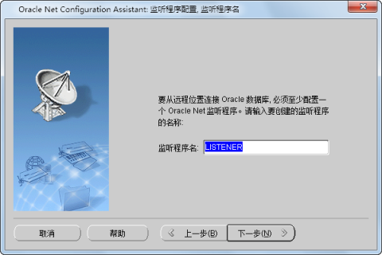
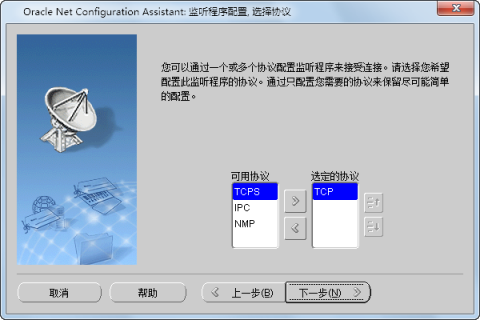
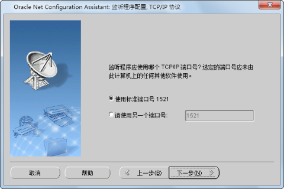
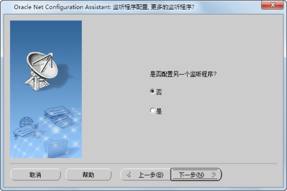

Oracle 配置完成后，下面将进行监听程序的配置。

监听程序是一个代表客户机应用程序接收连接请求的进程。监听程序用于监听在监听程序文件中指定的协议地址上的客户机请求。

运行 Net Configuration Assistant：“开始 > 所有程序 > Oracle > 配置和移植工具 > Net
Configuration Assistant”，弹出“Oracle Net Configuration Assistant
欢迎使用”窗口，选择“监听程序配置”，如下图所示。然后单击“下一步”按钮，进入“监听程序配置”页面。

  

  
  1. 添加监听程序 

选择“添加”项，单击“下一步”按钮，进入步骤2。

  

  2. 设置监听程序名 

在监听程序名文本框中，输入标识当前未使用的监听程序的名称。该名称不能超过 138 个字符，然后单击“下一步”按钮，进入步骤3。

  

  3. 选择协议 

选择一个或多个协议配置监听程序来接受连接，然后单击“下一步”进入步骤4。

  

  4. 选择端口号 

TCP/IP 通过端口号标识监听程序的协议地址。选择要使用的端口号，这里选择使用默认端口号1521。选择结束后单击“下一步”按钮，进入步骤5。

  

  5. 是否配置其他监听程序 

如果还想继续配置其他监听程序，则选择“是”，否则选择“否”，单击“下一步”按钮，将完成监听程序配置。完成监听程序的配置后，单击界面右下方的“完成”按钮，退出配置向导。

  
 

 相关主题

 [安装 Oracle](OracleInstall)

 [配置 Oracle](OracleConfig)

 [配置本地 Net 服务](ConfigNetServer)

