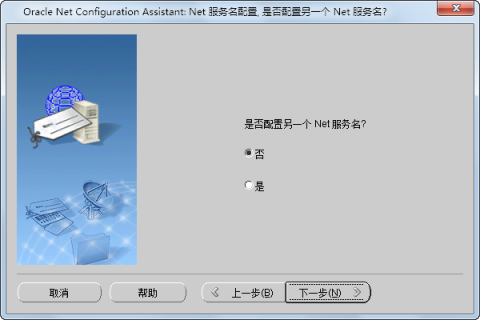

监听程序配置完成后，还需进行本地 Net 服务名配置。

运行 Net Configuration Assistant：“开始 > 所有程序 > Oracle > 配置和移植工具 > Net
Configuration Assistant”。在“Oracle Net Configuration Assistant 欢迎使用”窗口中，选择“本地
Net 服务名配置”项，如下图所示，然后单击“下一步”按钮，进入“服务名配置”界面。

  

  1. 添加 Net 服务名 

选择“添加”项，添加一个新的服务。然后单击“下一步”按钮，进入步骤2。

  
 
  2. 服务器命名 

在“服务名”对话框中输入标识数据库服务的名称，然后单击“下一步”按钮，进入步骤3。

  

  3. 选择协议 

选择适用于将访问的数据库的协议，然后单击“下一步”，进入步骤4 。

  

  4. TCP/IP 协议 

TCP/IP 通过端口号标识监听程序的协议地址，端口号与监听程序的端口号要一致。主机名为监听程序所在的计算机的主机名。单击“下一步”按钮，进入步骤5。

  
 
  5. 连接测试 

通过执行连接测试，检验是否可以连接到 Oracle
数据库。如果不需要测试，选择“不，不进行测试”；如果需要测试，则选择“是，进行测试”，如下图所示。然后单击“下一步”，进入步骤6。

  

  6. 建立连接 

在此步中，对网络服务名信息进行测试。在测试期间，Oracle Net Configuration Assistant
尝试联系远程数据库服务，建立连接，然后结束联系。如果出现“用户名/口令无效，登录被拒绝，测试未成功”的信息，则单击“更改登录”按钮，在弹出的“更改登录”对话框中，输入您设置的口令。单击“确定”按钮，即可连接成功，并提示测试成功。

  

  
 
  
测试成功后，单击“下一步”按钮，进入步骤7。

  7. Net 服务名 

在“Net 服务名”对话框中，输入服务名，默认采用前面输入的服务名，然后单击“下一步”进入步骤8。

  

  8. 是否配置另一个 Net 服务名 

如果需要配置另一个 Net 服务名，则选择“是”，否则选择“否”，如下图所示。然后单击“下一步”，完成 Net 服务名配置。

  
 
  

 相关主题

 [安装 Oracle](OracleInstall)

 [配置 Oracle](OracleConfig)

 [配置监听程序](ConfigMoniProgram)

