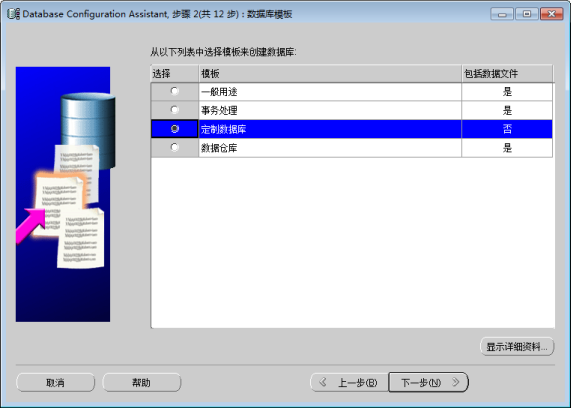
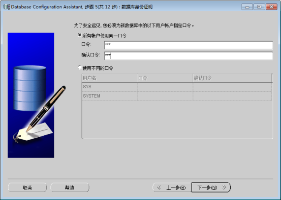
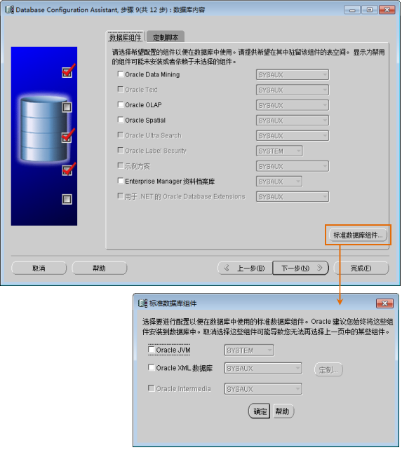
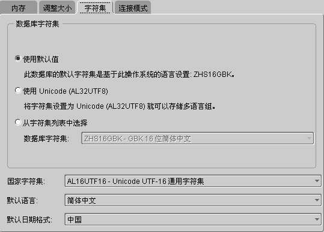

Oracle 数据库软件安装完成后，从开始菜单运行 Database Configuration Assistant （DBCA）用于配置 Oracle
数据库。

Database Configuration Assistant 位于“开始 > 所有程序 > Oracle > 配置和移植工具 > Database
Configuration Assistant”，界面如下图所示。

单击“下一步”按钮，进入 Oracle 数据库的配置，共包含12个步骤。

  

  
  1. 创建数据库 

选择“创建数据库”操作，单击“下一步”按钮，进入步骤2。

  
 
  2. 选择数据库模板 

选择“定制数据库”项。我们要打造适合 SuperMap SDX+ 的 Oracle 数据库，因此这里要选择“定制数据库”。单击“下一步”按钮，进入步骤3。

  

  3. 数据库标识 

为全局数据库命名并确定 Oracle 数据库唯一标识，如下图所示。单击“下一步”按钮进入步骤4。

  

  4. 管理选项 

将“使用 Enterprise Manager 配置数据库”复选框设置为非选中状态，如下图所示。单击“下一步”按钮，进入步骤5。

  
 
  5. 数据库身份证明 

在“口令”的文本框中，输入数据库帐户的密码。在这里可以根据自己的需要，选择“所有用户使用同一口令”或者“使用不同的口令”，如下图所示。单击“下一步”按钮，进入步骤6。

  

  6. 存储选项 

产品共提供三种数据库存储机制，用户可根据实际需求进行选择，其中“自动存储管理（ASM）”和“裸设备”适合于高级服务器，对于普通 PC
机，选择“文件系统”即可。三种数据库的存储机制介绍如下：

  * **文件系统** ：在当前文件系统的目录中保存和维护单实例数据库文件。
  * **自动存储管理(ASM)** ：用 ASM 只需管理少量的磁盘组而无需管理众多的数据库文件，选用此项必须指定一组磁盘组以创建一个 ASM 磁盘组或者指定一个现有的 ASM 磁盘组。
  * **裸设备** ：不受文件系统管理的磁盘或磁盘分区。只有当您的站点至少拥有与 Oracle 数据文件一样多的裸磁盘分区时，才能使用此选项。

设置 “存储选项”后，单击“下一步”按钮，进入步骤7。

  
 
  7. 数据库文件所在位置 

该步骤用于指定存储数据库文件的位置和方式，详细介绍请参照 Oracle
帮助文档。在此，我们按照默认设置，即“使用模板中的数据库文件位置”项。单击“下一步”，进入步骤8。

  

  8. 恢复配置 

在此步骤中指定快速恢复区并启用归档，以便系统发生故障时恢复您的数据。

若勾选“指定快速恢复区”选项，能保证数据的安全，但会影响 Oracle
的性能，用户可根据实际需求进行选择，恢复配置界面如下图所示。单击“下一步”按钮，进入步骤9。

  

  9. 数据库内容 

在这一步中，将“Oracle Data Mining”、“Oracle Spatial”和“Enterprise Manager
资料档案库”这三个复选框设置为非选中状态。然后单击“标准数据库组件...”按钮，弹出“标准数据库组件”对话框，将“Oracle JVM”、“Oracle XML 数据库”复选框设置为非选中状态，单击“确定”按钮。最后单击“下一步"”按钮，进入步骤10。

  

  10. 初始化参数 

初始化参数为 Oracle 配置的步骤10，此步骤中参数的设置对 Oracle 数据库性能的高低影响极大，需要注意以下5个方面的参数配置。

   * 所有初始化参数 

在弹出的初始化参数界面，单击“所有初始化参数”按钮，弹出“所有初始化参数”界面，然后单击“显示高级参数”按钮，如下图所示。大部分初始化参数均可进行优化调整以提高数据库性能，建议修改参数
cpu_count 和 db_file_multiblock_read_count。

cpu_count 为分配给 Oracle 数据库的 CPU 个数，默认为 1，如果您的机器是多核 CPU 则可以把此值增大，例如双核 CPU
的机器，cpu_count 的值可以设为2，这样可以提高 Oracle 运行的速度。

db_file_multiblock_read_count 影响 Oracle 在执行全表扫描时一次读取 Block 的数量，默认为 16，Oracle 支持的最大值不能超过 128。可以根据自己的系统环境进行更改。这个值受系统 I/O 最大能力的影响：
Max（db_file_multiblock_read_count）=Max（系统 I/O）/db_block_size，一般可以改成 32，甚至更大。

  
 
  * 内存 

分配给 Oracle 的内存总量，直接影响到 Oracle
的性能，根据机器的系统环境来分配，内存并非越大越好，当内存值达到某个上限，继续提高内存量性能不会明显提高。一般服务器 1G~2G 就可以。对于 1G
内存，建议分给 Oracle 的内存不超过60%。

SGA：系统全局区

PGA：程序全局区

  
 
  * 调整大小 

块大小：采用默认值。Oracle 数据库数据存储在这些块中。一个数据块对应磁盘上特定字节数的物理数据库空间。

进程：指定可以同时连接到 Oracle 的最大操作系统用户进程数。如果并发用户特别多，这个值可以设置地适当大些。

  

  * 字符集 

对字符集选择"使用默认值"即可。

  

  * 连接模式 

Oracle 数据库配置提供了两种连接模式，专用服务器模式和共享服务器模式。

**专用服务器模式** ：该模式下的 Oracle 数据库要求每个用户进程拥有一个专用服务器进程，每个客户机拥有一个服务器进程。Oracle Net
把现有服务器进程地址发回客户机。然后，客户机将连接请求重新发送到提供的服务器地址。

下列情况建议选择专用服务器模式：

    (1) 在数据仓库环境中使用数据库。

    (2) 只有少数客户机连接到您的数据库。

    (3) 数据库客户机将对数据库发出持久的、长时间运行的请求。

**共享服务器模式** ：也称为多线程服务器模式，该模式下的 Oracle 数据库配置允许多个用户进程共享非常少的服务器进程，因此可支持更多的用户数。

以下情况建议选择共享服务器模式：

    (1) 在联机事务处理 (OLTP) 环境中使用数据库，通过使用共享服务器可使联机事务处理应用程序大大受益。

    (2) 大量用户需要连接到数据库并有效地使用可用的系统资源。

    (3) 存在内存限制。与专用服务器相比，当用户数量增加时共享服务器内存的使用相对较少。在共享服务器模式中，内存的使用基本与用户的数量成正比。共享服务器可以调整和优化整体的系统性能，因此如果很有必要高度控制对数据库的优化，那么可选择使用共享服务器。

    (4) 希望使用 Oracle Net 的功能，如连接共享、连接集中和负载均衡。

    (5) 要求高效地管理和使用系统资源。

    (6) 连接是可预测的，并且速度较快，例如对 Web 应用程序。

  

  
上述参数都设置完后，单击“下一步”按钮，进入步骤11。

  11. 数据库存储 

该界面可以指定数据库的存储参数，建议使用默认参数，如下图所示。直接单击“下一步”按钮，进入步骤12。

  

  12. 创建选项 

鼠标单击“完成”按钮后，将弹出参数详细信息确认窗口，单击“确认”后，进入数据库创建。

  
  

### 注意事项

  * 不建议在同一台服务器上安装多个 Oracle 实例（即数据库），这将降低数据库的性能。
  * Oracle 数据库创建完毕之后将占用一定的进程和内存，建议用户将 Oracle 相关的两个服务改成手动启动，方法如下：在“开始 > 控制面板 > 性能维护 > 管理维护 > 服务”，在服务窗口中，找到如下图所示的两个服务，启动方式改成“手动”即可。
  

 相关主题

 [安装 Oracle](OracleInstall)

 [配置监听程序](ConfigMoniProgram)

 [配置本地 Net 服务](ConfigNetServer)

