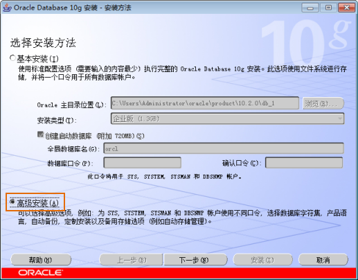
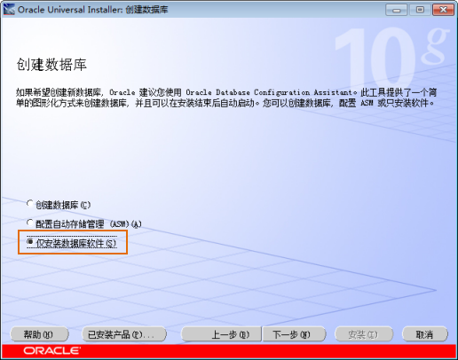

  1. 选择使用的安装方法 

双击安装包里面的“setup.exe”程序，出现如下图所示的安装首页，选择“高级安装”。然后，单击“下一步”按钮。

  
 
  2. 选择安装类型 

选择“定制”，如下图所示，根据自己的实际需求来安装 Oracle 的组件，并进行参数设置，这样可以节省磁盘空间并且提高 Oracle
的效率。然后，单击“下一步”按钮。

  

  3. 指定主目录详细信息 

对主目录的设置，如下图所示，建议路径按照 Oracle 的默认设置，因为 Oracle
会自动检测您的系统，选择最大的磁盘来进行安装。安装目录的名称是可以更改的。然后，单击“下一步”按钮。

  

  4. 选择产品组件 

该步骤需要特别注意，在这一步，可以根据自己的实际需要来选择单个组件进行安装。可用产品组件的选择界面辅助安装，如下图所示。

  
  
  
以下为建议安装的组件列表：

  1. Oracle DataBase 10g是 Oracle 的基本组件，必须安装。
  2. Oracle Enterprise Manager Console DB 是 Oracle 的基本组件，建议安装。
  3. 在 Enterprise Edition Options 选项中： 
    * Oracle Partitioning 便于在小的分区中管理表，建议安装。
    * Oracle Advanced Security：进行网络安全的保障，一般的 GIS 应用不需要安装。
    * Oracle Spatial：若您需要使用 Oracle Spatial，则进行安装。
    * Oracle OLAP：若您的并发用户特别多，则需要安装。
  4. Oracle Net Sevices 选项中，Oracle Net Listener 必须安装。
  5. Oracle Call Interface（OCI），必须安装。
  6. Oracle Programmer 建议安装。
  7. Oracle XML Development Kit 建议安装。
  8. Oracle Windows Interfaces 选项中： 
    * Oracle ODBC Driver，建议安装。
    * Oracle Provider for OLE DB，建议安装。

组件选择完后，单击“下一步”按钮。

  5. 创建数据库 

在安装数据库软件的过程中，Oracle
安装程序会自动检查您的系统环境是否符合所选安装产品的最低要求，即产品特定的先决条件检查，在检查验证成功后将出现创建数据库界面。根据默认“创建数据库”选项创建的数据库可能不完全符合我们的要求，因此，我们选择“仅安装数据库软件”，单击“下一步”按钮，进入安装界面，进行数据库软件的安装，安装结束后，再手动创建数据库。

  

  

  
Oracle 数据库软件安装完成后，单击“退出”按钮，结束安装。

 相关主题

 [配置 Oracle](OracleConfig)

 [配置监听程序](ConfigMoniProgram)

 [配置本地 Net 服务](ConfigNetServer)

