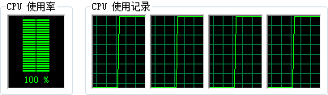

并行计算是将一个任务分解成若干个小任务并协同执行以完成求解的过程，是增强复杂问题解决能力和提升性能的有效途径。多核计算机的出现，改变了并行计算只服务于巨型机和计算机集群的局面。如今，多核微处理器的发展更是使得非常普及的个人
PC 也具备了并行计算能力。

并行计算可以通过多种途径实现，包括多进程、多线程以及其他多种方式。针对多核计算机，本文主要讨论多线程并行计算（或称多核并行计算）。并行计算技术可将一项任务分解为多个线程，这些线程可由多颗
CPU 内核并行运行，从而能够充分和更加高效地利用多核计算资源，从而降低单个问题的求解时间，节省成本，也能够满足更大规模或更高精度要求的问题求解需求。

下图对比了串行与并行。当一个任务被划分为 A、B、C 三个子任务时，串行需要依次执行三个子任务，而多线程并行则可以通过三个线程同时执行三个子任务 。

  
---  
  
地理空间分析具有算法逻辑复杂、数据规模大等普遍特点，是一种计算密集、数据密集型功能，通过并行计算可以充分利用多核计算资源，从而大大降低分析时间，提高性能。目前，SuperMap
对包括栅格分析、水文分析、网络分析、拓扑预处理在内的诸多分析功能提供并行计算能力。在本文的其余部分，将着重介绍如何设置并行计算的线程数目，以及支持并行计算的接口。

下图是在并行计算支持下，一台普通的四核个人计算机上某次执行“提取等值线”分析时 CPU 的使用情况。当使用 1 个线程分析时，CPU 利用率较低，只有一个
CPU 参与运算，当设置并行线程数为 4 时，所有四颗 CPU 核心都参与运算，CPU 利用率最高可达 100%。

  
---  
  
###  备注

  1. 不同的分析功能，性能提升情况不尽相同。不同平台和硬件配置在性能提升程度上也存在差异。
  2. 并行计算支持 Windows 32 位和 64 位平台。
  3. 由于数据库引擎数据读写时间相对较长，因此整体性能提升效果没有文件型引擎显著。

###  相关内容

  [设置线程数目](OMPNumThreads)

  [支持并行计算的功能](ParallelFunction)

