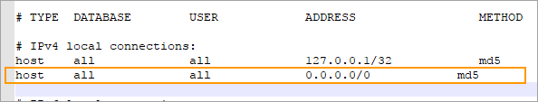
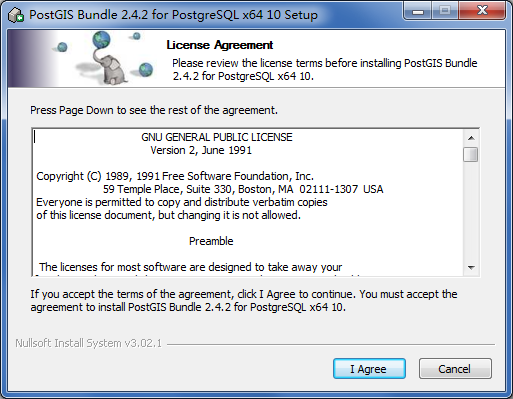
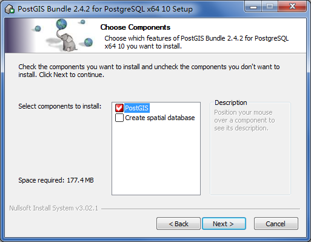
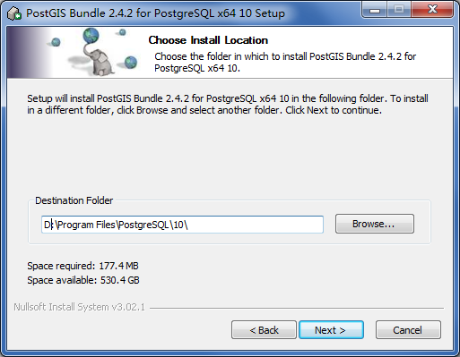
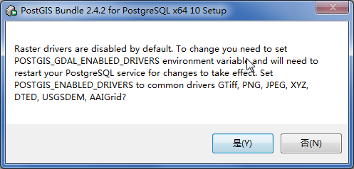
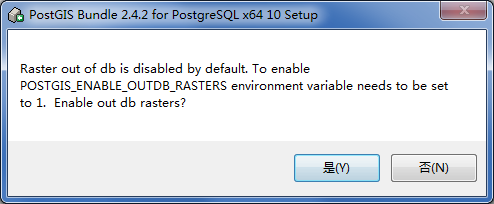
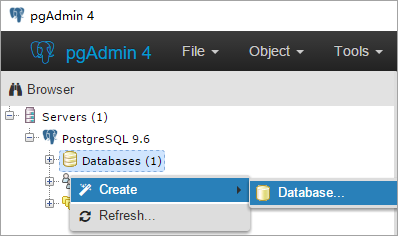
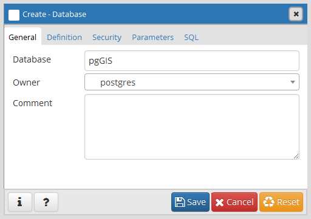
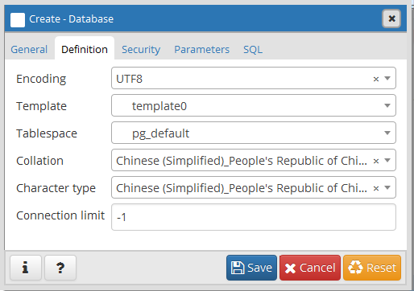
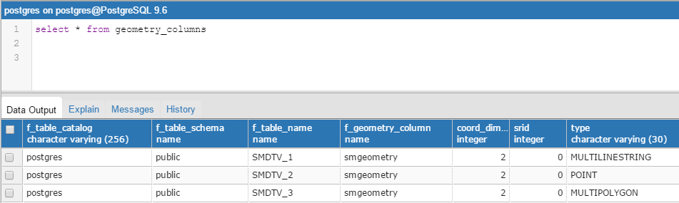

PostGIS 是 PostgreSQL 关系数据库的空间操作扩展。它为 PostgreSQL 提供了存储、查询和修改空间关系的能力。

PostgreSQL 是开源空间数据库，构建在其上的空间对象扩展模块PostGIS使其成为一个真正的大型空间数据库。SuperMap 新增 SDX+ for
PostGIS 引擎，可以直接访问 PostgreSQL
空间数据库，充分利用空间信息服务数据库的能力，如空间对象、空间索引、空间操作函数和空间操作符等，实现高效地管理和访问空间数据。

下文将从以下几方面对 PostGIS 进行说明：

  部署 PostGIS 空间数据库环境

  PostGIS 数据库的创建

  SDX+ for PostGIS

  PostGIS 数据源的创建

  PostGIS 空间数据编辑

  PostGIS 空间数据显示

###  部署 PostGIS 空间数据库环境

包含安装与配置 PostgreSQL 数据库和安装与配置 PostGIS 两部分。

  * **第一步** ：安装与配置 PostgreSQL 数据库，有关 PostgreSQL 安装的详细步骤请参看“[安装 PostgreSQL](../PostgreSQLUseGuide/PostgreSQLInstall)”。 

按照“安装 PostgreSQL” 安装完成后找到数据库数据存储目录，例如（D:\Program
Files\PostgreSQL\9.6\data）下的pg_hba.conf文件，编辑该文件，在如下图所示的位置出，添加图中框选的内容，使得PostgreSQL数据库服务可以通过IP地址访问。

  

  * **第二步** ：安装与配置PostGIS 
    1. 启动安装程序：postgis-bundle-pg96x64-setup-2.4.2-1.exe。
|   

    2. 这里可以选择创建空间数据库，那么在安装完成后，就可以根据向导对话框完成数据库创建；也可以安装完成后通过 pgAdmin 工具创建。
  
---  
    3. 指定程序的安装路径，执行安装。
  
---  
    4. 安装完成后，会弹出对话框询问关于栅格功能的配置，根据需要进行选择，这里单击“是”，最终完成所有安装步骤。
  
---  
  
---  

###  PostGIS 数据库的创建

首先，确保 PostgreSQL 数据库服务已经启动。通过 pgAdmin 创建一个 PostgreSQL 数据库用来管理 PostGIS
空间数据，具体操作如下。

  1. 运行 pgAdmin， 右键“Databases”，选择菜单中的Create>Database。
  
---  
  2. 指定数据库的名称（Database）、管理用户（Owner）、编码方式（Encoding）等参数。
  
---  
  
---  
  3. 单击“Save”，完成数据库创建。

###  SDX+ for PostGIS

通过 SDX+ for PostGIS 引擎在 PostgreSQL 数据库中管理 PostGIS 空间数据。使用 SuperMap 桌面进行 PostGIS 空间数据的管理，简单方便，所有 PostgreSQL 数据库中相关表的维护工作都由 SDX+ for PostGIS 引擎完成。

PostGIS 空间数据的管理一般包括：创建数据库、创建/删除数据源、创建/删除数据集、添加/删除记录（几何对象）、数据集中添加/删除字段、更新字段值以及查询数据等。

  * **PostGIS 数据源的创建**
    * 通过 SuperMap 桌面创建 PostGIS 数据库型数据源时，既可以指定一个现有的 PostgreSQL 数据库名称，创建数据源；也可以指定一个新的数据库名称，创建数据源时，将先创建对应的 PostgreSQL 数据库，再创建数据源。一个 PostgreSQL 数据库只能创建一个 PostGIS 数据库型数据源。
    * 同时在创建 PostGIS 数据库型数据源后 ，在 PostgreSQL 数据库中会增加一系列用于数据源管理的系统表。 
下图为Geomet;y_columns系统表用于记录哪些表具有空间信息
  
下图为 spatial_ref_sys系统表存储OGDC标准的空间坐标系统信息      
  

  * 在 PostGIS 数据库型数据源中可以创建数据集，或者导入其他来源的数据。SDX+ for PostGIS 引擎支持的数据集类型包括：点、线、面、文本、CAD、属性表、三维点/线/面/模型、EPS复合点/线/面/文本、栅格、影像、镶嵌数据集。另外，若指定的数据库中已有符合 PostGIS 空间数据结构的第三方空间数据，那么创建 PostGIS 数据库型数据源后，这些数据也将被数据源读取并管理。

  * **PostGIS 空间数据编辑**

SDX+ for PostGIS 支持几何对象的各种编辑操作：

  * 添加/删除几何对象：可以添加多种类型的几何对象：点、线、面、文本。
  * 编辑几何对象：支持编辑几何对象的节点、分割几何对象、岛洞多边形处理等。
  * 几何对象的运算：支持合并、求交等几何对象的基本运算。

  * **PostGIS 空间数据显示**
    * SDX+ for PostGIS 支持 PostGIS 空间数据的可视化，可以基于 PostGIS 空间数据配置风格、制作各种专题图等操作。
    * SDX+ for PostGIS 引擎支持的 PostGIS 空间数据的操作，都是通过对接 PostGIS 函数实现的，PostGIS 提供了大量的空间数据操作函数，既包括几何对象操作，也包括栅格数据操作，目前 SDX+ for PostGIS 引擎所对接的 PostGIS 函数能够满足地图制图以及基本空间分析操作，若用户的应用需求超出这个范围，请参见PostGIS参考手册：<https://postgis.net/docs/manual-2.4/>

