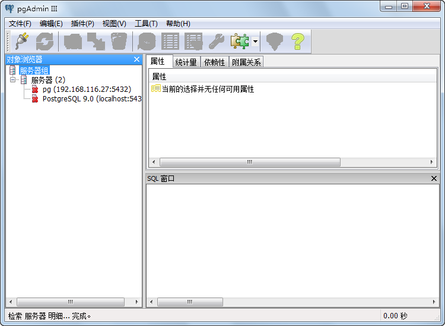
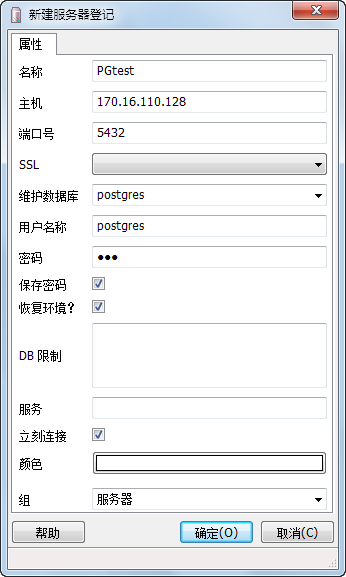

  1. 在“开始”菜单所有程序列表中，找到并打开 PostgreSQL 的“pgAdminIII”工具，如下图所示。    
    

  2. 单击“文件”菜单下的“添加服务器”菜单，或者单击添加按钮，出现“新建服务器登记”对话框，在对话框中填写相应的参数，单击“确定”完成服务器的添加。   
     

主要参数描述如下：

  * **名称** ：服务器名称。
  * **主机** ：服务器所在 IP 地址。
  * **端口号** ：默认为安装 PostgreSQL 时设置的端口号，用户也可以根据需要自行修改。
  * **用户名称** ：用于登录该服务器的用户名。
  * **密码** ：用于登录该服务器的密码，若此处为空，则登录该服务器的密码为安装 PostgreSQL 时设置的数据库超级用户的密码。

此外，若将本机设为服务器，则可以通过修改认证配置文件中的 CIDR-ADDRESS 项来配置 PostgreSQL 服务器。登录本机服务器时，输入
CIDR-ADDRESS 项设置的地址即可访问。

 相关主题

 [修改配置文件](setPGconf)

