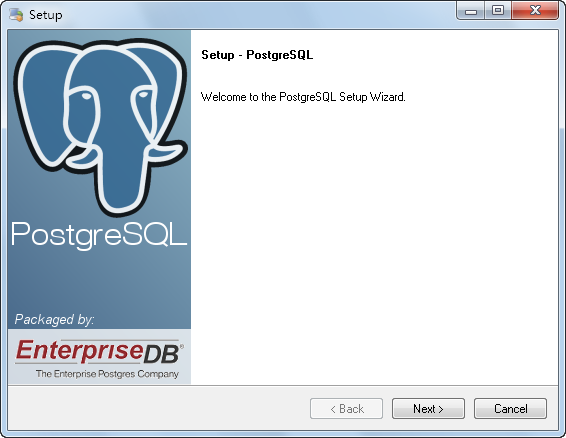
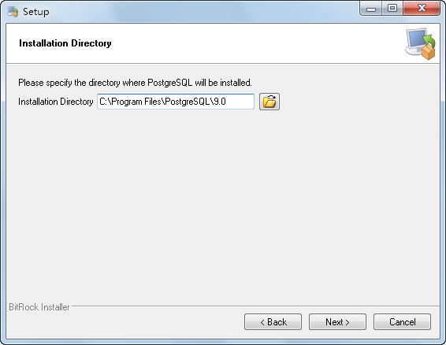
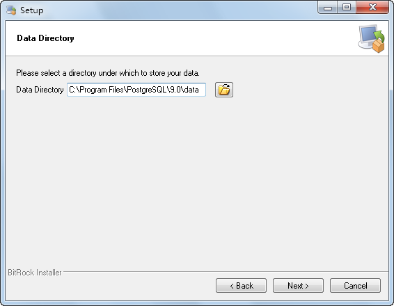
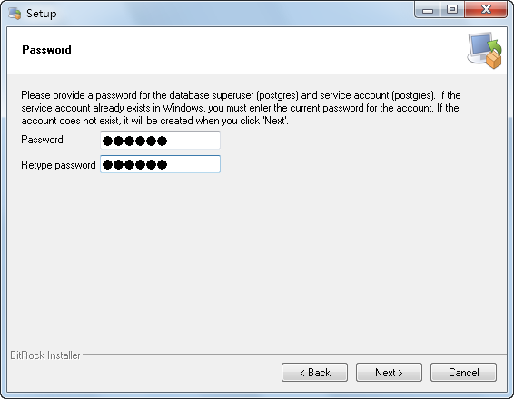
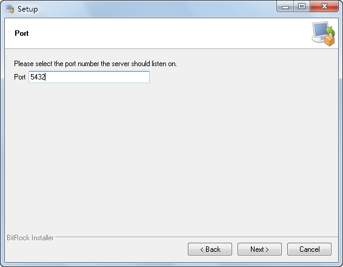
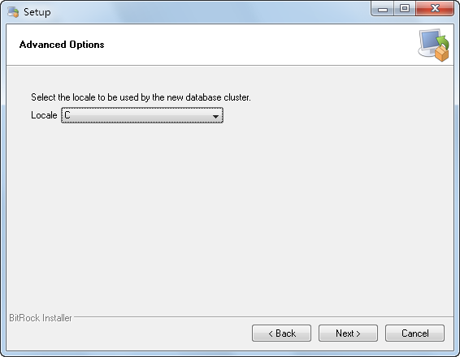
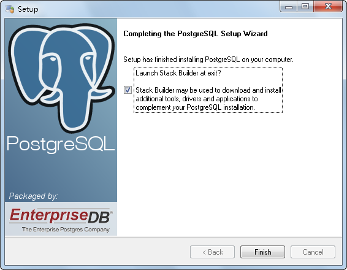

该部分介绍 PostgreSQL 程序的安装过程。基于 SuperMap 的 SDX+ for PostgreSQL 对 PostgreSQL
8.2版本不支持，建议安装 PostgreSQL 8.3 及以上版本。

  1. 安装首页 

打开 PostgreSQL 产品的安装目录后，双击“postgresql-9.0.2-1-windows.exe”程序，出现如下图所示的
PostgreSQL 安装首页，单击“Next”按钮继续安装。

  

  2. 指定安装目录 

如下图所示，指定 PostgreSQL 的安装目录。然后，单击“Next”按钮继续安装。

  

  
安装 PostgreSQL 的分区最好是 NTFS 格式的。PostgreSQL 首要任务是要保证数据的完整性，而 FAT 和 FAT32
文件系统不能提供这样的可靠性保障，而且 FAT 文件系统缺乏安全性保障，无法保证原始数据在未经授权的情况下被更改。此外，PostgreSQL
所使用的"多分点"功能完成表空间的这一特征在FAT文件系统下无法实现。

然而，在某些系统中，只有一种 FAT 分区，这种情况下，可以正常安装 PostgreSQL，但不要进行数据库的初始化工作。安装完成后，在 FAT
分区上手动执行 initdb.exe 程序即可，但不能保证其安全性和可靠性，并且建立表空间也会失败。

  3. 指定数据存储目录 

如下图所示，为数据库存储区域指定安装区域。然后，单击“Next”按钮继续安装。

  

  4. 设置数据库超级用户和服务账户的密码 

数据库超级用户是一个非管理员账户，这是为了减少黑客利用在 PostgreSQL
发现的缺陷对系统造成损害，因此需要对数据库超级用户设置密码，如下图所示，安装程序自动建立的服务用户的用户名默认为
postgres。然后，单击“Next”按钮继续安装。

  

  5. 设置服务监听端口 

如下图所示，指定数据库服务器的端口，默认是“5432”，用户可根据自己端口的使用情况进行设置。然后，单击“Next”按钮继续安装。

  

  6. 选择运行时语言环境 

如下图所示，选择数据库存储区域的运行时语言环境。然后，单击“Next”按钮，进入安装进度页面，等待 PostgreSQL 安装完毕。

注意，在选择语言环境时，若选择"default locale"会导致安装不正确；同时，PostgreSQL 不支持 GBK 和 GB18030
作为字符集，如果选择其它四个中文字符集：中文繁体 香港（Chinese[Traditional], Hong Kong S.A.R.）、中文简体
新加坡（Chinese[Simplified], Singapore）、中文繁体 台湾（Chinese[Traditional], Taiwan）和中文繁体
澳门（Chinese[Traditional], Marco S.A.R.），会导致查询结果和排序效果不正确。建议选择"C"，即不使用区域。

  

  7. 结束安装 

上面的安装步骤执行完成后，会弹出如下图所示的完成对话框。这里可以选择安装完成后是否运行 Stack Builder 向导来安装附加软件，以完善 PostgreSQL 的安装。该操作必须在联网状态下执行。

  

