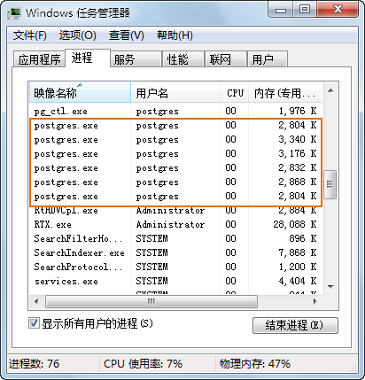

  * 使用“pgAdminIII”客户端连接服务器时，如果出现“服务器未监听”的对话框，表示连接失败。出现这种连接失败的原因很多，常见的错误是数据库服务器未启动，具体的启动方法请参见[创建数据库](creatPGDatabase)的“启动数据库服务器”部分内容；或者是连接的服务器未配置成允许 TCP/IP 联接，配置方法请参见[修改配置文件](setPGconf)。
  * 只启动一次服务，但却发现有很多 postgres.exe 进程。这是正常情况，因为 PostgreSQL 使用多进程体系结构，在一个无用户连接的空系统中会有 2 至 5 个进程，一旦用户开始连接，就会产生更多的 postgres.exe 进程，如下图所示。   
     

  * 若使用 SuperMap 产品创建和打开 PostgreSQL 数据源失败，而“pgAdminIII”客户端连接服务器正常时，其原因可能是未设置 PostgreSQL 的环境变量，设置方法如下： 

“开始>控制面板>系统>高级系统设置>环境变量”，在系统变量中，找到“Path”变量并对其进行编辑，添加 PostgreSQL
安装目录下的“bin”路径，如： C:\Program Files\PostgreSQL\9.0\bin。

  * 在安装 PostgreSQL 的过程中，安装程序会自动注册一个 postgresql 的服务，该服务与本地连接（localhost 或 127.0.0.1）绑定，如下图所示。   
     

