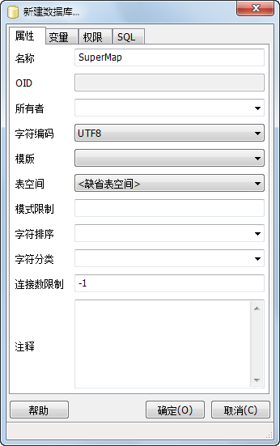
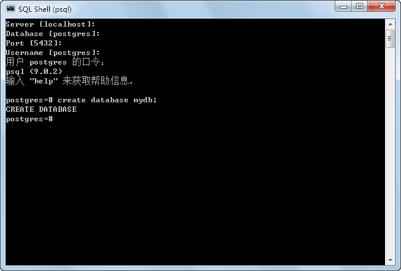

PostgreSQL 数据库的创建可概括为以下三个步骤：初始化数据库存储区域、启动数据库服务器和创建数据库。

### 初始化数据库存储区域

PostgreSQL 中数据库存储区域称为 database cluster，是用来存放运行数据库需要的文件的区域。

对于在安装过程中指定了数据存储目录的情况，PostgreSQL
在完成安装后一并完成了数据库存储区域的初始化工作。对于在安装过程中可能出现的数据库存储区域初始化失败的情况，会导致指定目录内没有任何内容，这时需要手动处理，方法如下所示。

  1. 新建数据存储目录“data”，该目录放在 PostgreSQL 的安装路径下（如：C:\Program Files\PostgreSQL\9.0），且该目录不能为安装过程中指定的数据存储目录。
  2. 用命令行进入 PostgreSQL 安装目录下的“bin”目录。 

`cd "C:\Program Files\PostgreSQL\9.0\bin"`

  3. 初始化数据库，在命令行输入： 

`initdb -D "C:\Program Files\PostgreSQL\9.0\data" --no-locale -U postgres`
    
    

解释：

* **-D** ：用于指定数据库存储路径。
* **\--no-locale** ： --no-locale==-locale=C，即运行时语言环境设置为：不使用区域。
* **-U** ：用户指定超级用户的名称，前面的安装过程中安装程序自动建立该超级用户――postgres。

### 启动数据库服务器

  1. 在 PostgreSQL 的安装目录下新建名为"log"的文件夹，并在该文件夹下新建名为"pgsql.log"的日志文件。
  2. 命令启动数据库服务器。 
           
 ``   	pg_ctl -D "C:\Program Files\PostgreSQL\9.0\data" -| "C:\Program Files\PostgreSQL\9.0\log\pgsql.log" start
``
解释：

  * **-D** ：用于指定数据库存储路径。
  * **-|** ：日志路径。
  * start（启动）/stop（停止）/restart（重启）/status（查看状态）。

### 创建数据库

PostgreSQL 数据库的创建有如下三种方式：

  * 使用 PostgreSQL 提供的客户端（pgAdminIII）启动数据库服务，并创建数据库。
  * 利用 PostgreSQL 提供的 SQL Shell，使用 SQL 语句创建数据库。
  * 利用 PostgreSQL 的 createdb 命令。

无论使用哪种方式创建数据库，数据库创建成功后，都可以进入数据库进行各种 SQL 操作。

  1. 如下图所示，在已启动的数据库服务器的“数据库”组上单击鼠标右键，单击“新建数据库...”项菜单，弹出“新建数据库”页面窗口，即可创建一个新名为“SuperMap”的数据库。 

关于如何在“pgAdminIII”工具中配置服务器，请参见[修改配置文件](setPGconf)。

  

  2. SQL Shell创建数据库 

启动 PostgreSQL 的 SQL Shell 工具，如下图所示。登录成功后即可键入创建数据库的 SQL 语句。

  
 
  
SQL 语句如下：  

`    	create database mydb;`
    
3. createdb 命令 

进入 PostgreSQL 的安装目录下的 bin 目录，使用 createdb 命令。
            
`  create smdb;`
    
    

