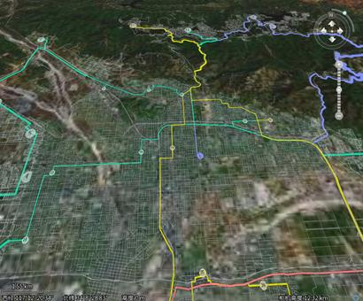

在三维场景中，支持二三维数据进行面积量算、SQL属性查询、空间查询、数据分析等操作。

### 表面量算

三维场景支持三维数据量算，同时支持用于多种目的的更精准的二维数据量算。量算包括表面距离量算、表面面积量算、高度量算三种。

  * **距离量算** ：是计算在表面模型中任意两点或多点之间的表面距离。当不加载地形通过距离量算的计算结果为球面上的弧线距离，距离单位是米；当加载地形时，通过距离量算的结果为依地形的折线长度，距离单位是米。
  * **面积量算** ：面积量算包括表面面积量算和依地面积量算两种，表面面积量算得到的面积是指在场景中通过量算点击的点构成的若干三角面的计算面积，依地面积量算是指根据地形起伏量算绘制区域面积，单位是平方米。
  * **高度量算** ：是指计算两点之间的高程距离，该功能方便用户量算三维场景中的楼层或者山体的高度。

### SQL 属性查询

空间数据的查询和分析在 GIS 工程项目中处于核心地位，在使用 GIS 数据时，我们经常需要从已有的数据中查询出部分满足特定条件的数据。在 SuperMap
三维 GIS 中，提供了 SQL 属性查询功能，输入属性查询条件即可进行查询。查询结果显示在属性窗口中，并可以通过属性定位到三维场景中的相应对象。SQL
查询是指查询的条件只与空间地物的属性相关，而与地物的地理位置无关的查询。

### 空间查询

空间查询是通过几何对象之间的空间位置关系来构建过滤条件的一种查询方式。相对于完全由属性过滤条件构建的基于属性的查询，基于空间位置关系且同时可以应用属性过滤条件的称为空间查询。

支持二维空间查询的9种基本算子和自定义算子，查询结果显示在属性窗口中，并可以通过属性定位到三维场景中相应的对象。空间查询涉及三个要素，分别是：搜索对象、被搜索图层及结果记录集。

### 数据分析

三维场景继承了二维的强大分析功能，包括缓冲区分析、最佳路径分析、设施分析等功能。

  

  

