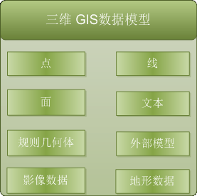
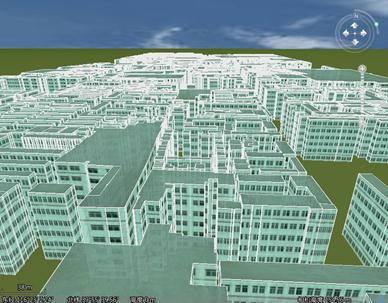

二三维数据一体化是指二维三维空间数据一体化地存储和管理。二维与三维数据在数据模型和数据结构上保持一体化，三维 GIS
数据不仅兼容二维数据结构，二维数据也做了适当调整，实现了所有的二维数据无需任何转换处理直接高性能地在三维场景中可视化。

SuperMap 三维 GIS 基于 OGDC 标准（Open Geo-DataBase
Connectivity，开放式空间数据库连接标准），实现了无差别访问多种数据来源，将不同平台的不同格式数据加载到同一个场景中展示。三维场景对各类型数据的支持情况如下：

  * 支持将二维数据进行三维显示，即将各种二维的几何对象或二维的矢量图层添加到三维场景中；
  * 支持对二维数据进行三维处理，如将二维对象拉伸为三维面和三维体以及对拉伸后的对象进行三维纹理贴图等三维渲染；
  * 支持将三维数据集、三维几何对象、三维模型导入或添加到三维场景中；
  * 支持加载影像数据和地形数据到三维场景中；
  * 支持加载地图缓存、矢量缓存、影像缓存、模型缓存等数据到场景中；
  * 支持将 KML 文件作为三维图层添加到三维场景；
  * 支持加载屏幕贴图到场景中，等等。

  

  
三维场景中的三维数据的组织形式是三维图层，即向三维场景中的添加三维数据实际是向三维场景中相应类型的图层中添加数据，三维场景中的三维图层可以分为普通图层、屏幕图层、地形图层、三维跟踪图层，其中，三维场景中可以包含有多个类型的图层，并且这些图层由三维图层集合管理，地形图层也可以有多个，相应地由地形图层集合管理，而三维场景中仅包含一个屏幕图层和三维跟踪图层。

**注意** ：普通三维图层分为五种：三维数据集图层、三维地图图层、KML 图层、影像文件图层和模型缓存图层。

  

  

