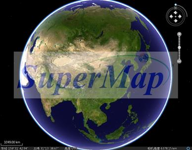

在三维场景中，数据加载到球上显示，三维场景与二维地图一样，也是以图层的形式展示和管理其中的数据。场景中的图层可分为三类：普通图层、屏幕图层和地形图层。

  1. **普通图层**

普通图层是用来加载数据显示的，三维场景中，可以有多个普通图层。普通图层可以设置风格保存在三维场景中，在下次打开这个三维场景时，图层会被自动以上次保存的风格加载到场景中。普通图层中的对象位置相对于球体是固定的，在场景中，会随着球的操作联动变化，例如对球进行漫游时，图层中的对象会跟着球一起运动。

普通图层分为五种：数据集类型三维图层、地图类型三维图层、KML 类型三维图层、影像文件类型三维图层和模型缓存类型三维图层。各类型的具体介绍如下：

  * 数据集类型的三维图层：将二维世界中的数据集添加到三维场景后所产生的三维图层，这里统称为数据集类型的三维图层。 其中包括矢量数据集、栅格数据集、影像数据集； 
  * 地图类型三维图层：将二维地图动态投影到三维场景中所产生的三维图层，这里统称为地图类型的三维图层； 
  * 影像文件类型三维图层：将海量影像数据，即影像缓存文件 （*.SCI3D 或 *.SIT）加载到三维场景后所对应的三维图层，这里称为影像文件类型三维图层； 
  * KML 类型三维图层：将 KML 数据，即 *.KML 或 *.KMZ 格式的文件加载到三维场景后所对应的三维图层，这里称为 KML 类型三维图层； 
  * 模型缓存类型三维图层：将三维模型数据，即三维模型缓存文件（*.SCM）加载到三维场景后所对应的三维图层，这里称为三维模型图层。
  2. **屏幕图层**

屏幕图层是一个特殊的图层，不同于上述的三维图层、地形图层、影像图层和跟踪图层，屏幕图层中的对象并不是依据对象的坐标信息将其放到三维场景中的地球上，而是放在屏幕上（三维窗口表面），因此，屏幕图层上的几何对象不随三维场景中球体的旋转、倾斜等操作而变化，而是可以随着三维窗口的改变而变化，如随着三维窗口的放大、缩小而改变相应的位置，可以说屏幕图层上的对象是相对与三维窗口静止的，这样，可以通过屏幕图层，放置诸如
Logo、说明性的文字等需要静止显示在三维窗口中的内容。

一个三维场景有且只有一个屏幕图层，可以向屏幕图层添加任何三维几何对象，可以设置几何对象的显示位置、大小，也可以删除不需要的几何对象。

  

  3. **地形图层**

添加到三维场景中的地形数据都作为地形图层来管理，作为地形图层的地形数据即为地形缓存文件数据，格式为*.SCT。在三维场景中，通过地形图层集合管理地形图层，可以实现图层的添加、删除、顺序调整功能。

SuperMap 具备强大的二三维制图能力，包括单值专题图、统计专题图、复杂标签专题图、分段专题图、点密度专题图、等级符号专题图等在内的专题图功能，包括所见即所得的自由表达功能，包括丰富的点符号库、线型和面填充风格等，并且积累了大量美观的二维电子地图。同时，三维场景可直接将二维地图动态投影到三维场景中的功能，在美观的同时，更加直观地展现显示世界。

