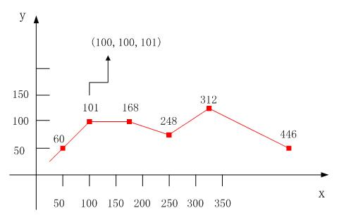

数据模型是现实世界的一种抽象描述，使用这些模型可以将现实世界模型化到计算机中，并进行地图显示、查询、编辑和分析。

SuperMap SDX + 提供了全面的数据模型的支持，并创造性地提出和实现了四个一体化，可称之为整体数据模型。如下：

  1. 栅格数据和矢量数据一体化

由于栅格数据和矢量数据在数据结构上的差异，早期的GIS软件，往往把矢量数据和栅格数据分开存储、管理和显示，而SuperMap
GIS开始的设计理念就是要实现栅格矢量一体化，采用复合文档技术和数据库技术，将栅格数据和矢量数据存储在同一个数据源中，并实现对矢量数据和栅格数据的一体化管理、显示和分析。

  2. 面向对象和面向拓扑一体化

早期的GIS软件，通过“结点-
弧段-面”这样面向拓扑的数据结构来存储空间数据；随着面向对象概念的发展，GIS开始倾向于使用面向对象的数据结构来存储空间数据，但这样就缺失了空间对象之间的拓扑关系。SuperMap
SDX + 开创性地把面向对象的点、线、面、文本数据模型与面向拓扑的网络数据模型存储在同一个数据源中，并提供了两者之间的相互转化，以便根据实际应用来进行选择。

  3. GIS和CAD一体化

传统的GIS一般通过图层风格和专题图来设置地图的显示风格，且每层数据都是单一的对象类型，如线图层只有线对象、面图层只有面对象等，也不提供例如圆弧、圆角矩形等参数化形式的空间对象；CAD软件为了工程制图的方便，大量采用参数化的几何对象，且一个图层内可以存放不同类型的对象。传统GIS的方式便于进行空间分析和计算，而CAD方式则更有利于制图表达和减少存储空间，提高大比例尺下地物的绘制精度；SuperMap
SDX +
则综合两者之长，在同一个数据源中，既可以通过点、线、面、文本等数据模型存储单一类型的对象，又可以通过复合数据模型存储多种类型的几何对象（包括参数化对象），且每个对象可带有自己的显示风格。通过SuperMap
SDX + 的复合数据模型可以直接访问包括AutoCAD的DXF/DWG、MicroStation
的DGN在内的CAD数据并且保存原有数据的属性和风格，还可以方便地增加自定义属性，完美地实现了从CAD软件到现代GIS软件的更替。

SuperMap SDX +
中，还提出了复合对象（GeoCompound）的概念，它可以聚合各种类型的几何对象，而且还可以聚合其它的复合对象，这样就可以实现任意复杂对象的绘制和管理，同时也能很好的支持AutoCAD中的Block和MicroStation中的Cell。

  4. 不同存储介质一体化

早期的GIS软件一般采用文件来存储空间数据，随着数据库技术的发展，在中大型GIS工程应用中，越来越多应用采用空间数据库，而近年来服务端的发展和SOA的出现，OGC标准的网络服务（WFS、WMS和WCS）也应用日益增多。通过SuperMap
SDX +
可以同时管理和编辑上述不同来源的数据（分别为：文件型数据源、数据库数据源和Web数据源），在SuperMap的地图中，可以同时存在不同数据源的数据，并可以统一保存在工作空间中。

SuperMap SDX + 支持的数据模型如下图所示：

  
---  
SuperMap SDX +支持的数据模型  
  
我们在进行现实世界模拟的时候，会根据研究背景的不同，选择不同的数据模型来进行描述。例如河流，我们知道河流是人类社会和自然界中的重要元素，人类可以使用河流进行交通运输或者作为行政分界线，而自然界的动物也经常会把河流作为栖息地或者栖息地的边界等。在GIS中，针对不同的应用场景可以对河流有不同的建模方式，如下：

  * 在进行城市水网的研究中，河流作为组成城市水网的线要素，需要使用网络数据模型（Network）来进行描述，每条线都拥有长度、水流方向、容量等属性。在现实生活中，可以通过网络分析中的设施网络分析来查找河流的源头、查找几条支流的共同上游或共同下游、从污染水域追踪污染源等支流。
  

  * 当分析中只是关注河流长度、流向而不用考虑河流的面积和宽度时，河流可以使用线数据模型来进行描述。例如黄河中的一段作为陕西和山西的行政区边界，如图所示。
  

  * 在大比例尺中，河流一般都使用面数据模型来表达，具备宽度、深度、载重等属性信息。例如我们要研究河上建桥就要考虑河流的宽度，再如我们要研究河心岛就要考虑河流的面积。
  

通过河流的例子说明，像河流这样的简单要素都有多种数据模型来进行描述，因此，在进行现实世界抽象描述的时候，最好的通用数据模型是不存在的，数据模型的选择应该决定于具体的应用场景，需要解决什么问题。针对不同问题，选取不同的模型来进行现实世界的模拟。

下面我们详细介绍一下SuperMap SDX+ 支持的各种数据模型：

### 1.点数据模型

点数据模型（Point）：点是零维形状的，存储为单个的带有属性值的x, y 坐标对。用来表达在某种比例尺下很小但不能描述为线或面对象的地理要素。

  

  
任何物体都是有大小、形状的，点数据模型主要是表达物体的空间位置信息，不关心它的形状、大小等。例如，我们只想知道喜马拉雅山的位置，则在世界地图上喜马拉雅山就会用点数据模型来进行描述。在SuperMap GIS中，提供了不同的符号来表达不同意义的点。

  
 
  
### 2.线数据模型

线数据模型（Line）：线是一维形状的，存储为一系列有序的带有属性值的x，y坐标对。线数据模型允许有线复杂对象。线的形状可以是直线、折线、圆、椭圆、或旋转线等，其中圆、椭圆、圆弧等是转化为折线存储的。线数据模型用来表达在某种比例尺下不能够描述为面的线状地理要素。当我们只关注这些地理要素的走向、长度等一维信息而不考虑其宽度和面积时，都可以用线数据模型来描述，例如作为省界的河流、小比例尺的城市道路等。

简单几何对象与复杂几何对象的区别：简单几何对象一般为单一对象，而复杂对象由多个简单对象组成或经过一定的空间运算之后产生。例如在绘制黄河的流域时有很多条简单线段表示干流、支流等，当需要把黄河干流以及支流作为一个整体来看时，就需要把这些支流和干流合并成一个复杂线对象来表示黄河的整个流域。

  

  
### 3.面数据模型

面数据模型（Region）：面是二维形状的，存储为一系列有序的带有属性值的x，y坐标对，最后一个点的x，y坐标必须与第一个点的x，y坐标相同。用来描述由一系列线段围绕而成的一个封闭的具有一定面积的地理要素。例如行政图中的省就会用面数据模型来表示，或者河流在大比例尺中也会用面数据模型来表示。

  
 
  
面数据模型有面复杂对象，这在地理要素描述时是非常必要的，例如整个上海市是由上海市区、崇明岛、长兴岛、横沙岛四个面组成的，因为这四个面是一个整体，因此就不能用简单对象进行正确的描述，这时就需要复杂面对象。

### 4.文本数据模型

文本（TEXT）：存储为两部分，第一部分为带有属性值的x，y坐标对（称为文本的定位点，及文本最小外接矩形的左上角点）；第二部分为文本属性，包括内容、字体、字号、字高、字宽是否粗体、旋转角度，字体颜色、背景透明，固定大小等，如下图
所示。

关于文本的背景透明和固定大小。背景透明：选中文本（待添加的文本）的背景透明，否则显示设置的背景色。系统默认为背景透明；固定大小：即文本的大小不随着图层的缩放而缩放。如果文本表示的是地图信息，需要随着地图的缩放而缩放，则不用固定大小，若文本只是表示地名等跟尺度无关的信息，则需要采用固定大小。需要注意的是，设置固定大小时，文本的字体高度不能超过255个逻辑单位（此处0.1mm）。如果超过255，则系统自动将其固定大小设置为255。

文本大部分情况下，都是用来作为地图标注或者辅助说明的。在进行地图标注时，可以直接使用由文本对象组成的文本图层，也可以采用标签专题图。

标签专题图中的标签内容，可以由字段表达式构建，可以表示多种形式的标签，如分数形式、多个字段内容的组合等，还可以设置自动避让和流动显示等属性。一个标签专题图层中的文本风格是统一的。而文本数据集上的每个文本对象都可以设置独立的显示风格。

总之，一般情况下使用标签专题图进行标注更加灵活，调整方便，当需要固定位置、拥有单独的显示风格或者导入其他数据的时候可以选择使用文本数据集。为了使二者的优势发挥到最大，SuperMap
GIS提供了将标签专题图“保存为文本数据集”的功能，可以先做出标签专题图，然后再另存为文本数据集，最后根据需要对特定的文本分别进行调整。

  

  
### 5.CAD（复合）数据模型

CAD （复合）数据模型：是指可以存储多种类型几何对象的数据模型，如下图
所示。早期的GIS工程应用大多采用CAD软件（如AutoCAD、MicroStation等）制图，很多单位积累有大量的CAD数据。CAD数据具有图形美观、存储空间小的特点。因此在GIS发展初期，CAD数据为地图数字化贡献很大，但CAD数据不便于扩展属性且缺乏GIS分析功能。因此，随着GIS应用的发展，必然要求从CAD软件过渡到GIS软件。这就要求能够把CAD的数据导入到GIS软件中，甚至要求GIS软件可以直接读取CAD的数据。为了兼容这些实际应用的需要，SuperMap
GIS推出了复合数据模型，专门存储和管理类似CAD数据结构的数据或者类似CAD用途的空间数据。通过SuperMap GIS
的复合数据模型可以直接访问包括AutoCAD的DXF/DWG、MicroStation
的DGN在内的CAD数据并且保存原有数据的属性和风格，还可以方便增加自定义属性等。

  

  
复合数据模型可以存储点、线、面、文本等不同类型的几何对象，而且所有的对象都可以拥有自己的风格。目前，在CAD中支持的对象为圆弧对象、B样条线对象、Cardinal样条对象、圆对象、复合对象、Curve曲线对象、椭圆对象、椭圆弧对象、线对象、路由对象、扇面对象、点对象、矩形对象、圆角矩形对象、面对象和文本对象。
  

CAD 数据模型与简单数据模型（点、线、面数据模型）的区别如下：

  1. CAD 数据模型中可以存储多种类型的数据，如点、线、面、文本等；而简单数据集中只能存储一种类型的数据。如点数据模型中只能存储点而不能存储线或面。
  2. CAD 数据集中不同的对象可以设置不同的风格；而简单数据集中所有的对象具有同一种风格，需要通过图层风格统一设置或者专题图根据属性信息设置不同的风格。
  3. CAD 数据集中几个对象可以组合生成一个复合对象。组合后，复合对象的属性记录被添加到属性表的尾部，系统字段由系统赋值，非系统字段保留组合对象中SMID值最小的对象的相应属性值。源对象及相应属性记录则被删除掉。复合对象可以跟其他复合对象或者简单对象再组合生成新的复合对象。复合对象在CAD制图的时候非常有用。例如，我们在画园林规划设计图的时候，需要用到很多符号，这些符号是用点、线、面、文本等组合而成的，这时我们把这些点、线、面、文本组合生成一个复杂对象，会给我们的绘图带来很大的方便。例如残疾人标志，我们在绘制的时候用到的是一个圆面、一段圆弧、几条折线来表示的，我们把它组合成一个复合对象，就可以在以后的绘制中作为一个整体来移动和粘贴，如下图所示：

组合与合并的区别：

  4. 合并适用于点、线、面、文本及CAD 数据模型，组合只适用于复合数据模型；
  5. 对于相交的面对象，合并操作可以将它们的相邻边界或相交部分去掉而融合成一个简单的对象；而组合只是将它们单个对象组合到一起而不进行融合。
  6. 合并只能对同一类型的对象进行操作，而组合可以对不同类型的对象进行操作而生成复合对象；CAD 对象可以同其他对象进行组合生成新的复合对象。  

  
 
  7. CAD 数据集中的椭圆、圆是参数化存储的，如存储了圆心的x，y坐标和半径长度；而简单数据集里面存储的是一系列有序的点的x，y坐标对。如下图所示。

 |  

  
### 6.路由数据模型

交通部门一般用线性参考系来确定沿线道路、河流和管线等运输路径的事件（如事故、限速）和设施（如桥梁、交叉口）。线性参照系从已知点（如路径的起点、里程碑标记或道路交叉口）用距离测量来确定事件的位置。例如事故位置的地址包括路名和离开里程碑标志的距离。

SuperMap GIS 提供了路由数据模型（Route）来描述交通部门中的线性参考系下的线，如下图所示。

  

  
路由数据模型（Route）：存储为一系列有序的带有属性值与M值的x，y坐标对，其中M值为该结点的距离属性（到已知点的距离），如下图所示。路由数据模型实际就是带M值的线性数据模型。最常见的路由数据模型，如高速公路上的里程碑，交通管制部门经常使用高速公路上的里程碑来标注并管理高速公路的路况、车辆的行驶限速和高速事故点等。基于路由数据模型，可以利用动态分段功能进行动态事件定位，即根据指定条件来定位点事件（如事故点、桥梁等）或者线事件（如限速路段、路况等）。

  

  
### 7.网络数据模型

网络数据模型（Network）：用于存储具有网络拓扑关系的数据模型。网络数据模型包含了网络线数据集和网络结点数据集，还包含了两种对象之间的空间拓扑关系。在网络数据集中，网络结点存储为子数据集。网络数据模型及物理存储如下图所示：

  

  
基于网络数据模型，可以进行路径分析、服务区分析、最近设施查找、资源分配、选址分区以及邻接点、通达点分析等多种网络分析中，多用于政府和商业决策等。

### 8.GRID 数据模型

GRID数据模型：是栅格数据模型的一种，将一个平面空间进行行和列的规则划分，形成有规律的网格，每个网格称为一个单元格（或像元），栅格数据模型实际就是单元格的矩阵，一般每个单元格都有确定的值来表示地理实体或地理现象，如土壤类型、土地利用类型、岩层深度等，对于数据缺失的单元格，通常用
NoData 或者一个固定的特殊值来表示，比如-9999等。下图所示为土地利用类型图像：

  

  
基于GRID数据模型可以进行栅格数据统计、代数运算等以数学分析和图形处理为主的计算，应用最广的栅格分析为物理意义很明显的空间分析，如针对栅格地形表面的分析、基于地形表面的水文分析、地形特征线的提取、地形表面建模等在科学研究工作常用的分析计算。

GRID数据在存储的时候可以先进行编码，目前主要采用的的编码方式为SGL（SuperMap GRID
LZW），它是一种无损压缩。SGL是SuperMap自定义的一种编码格式，是改进的LZW（Lempel_Zir_Welch）编码方式，该编码方式不仅可以对重复数据起到压缩作用，还可以对不重复数据进行压缩操作。目前，SuperMap
GIS对GRID数据集和DEM数据集采用的就是SGL的编码方式。

### 9.影像数据模型

影像数据模型（Image）：是由卫星或飞机上的成像系统获得的栅格数据模型，每个网格的值为光在某个波段的反射率。根据地球表面的影像数据可以分析地球表面的土地利用、植被生长情况，也可以进行矿产分布分析，或者根据地球大气层的云图来分析气象情况等。

影像根据波段的多少可以分为单波段影像和多波段影像两种，单波段影像一般用黑白色的灰度图来描述，多波段多用RGB合成的彩色图来描述。

 

  
影像数据一般比较大，SuperMap在进行数据导入的时候，建议先进行压缩。SuperMap GIS影像压缩通常采用DCT（Discrete Cosine
Transform）编码。DCT为离散余弦编码，是一种广泛应用于图像压缩中的变换编码方法，该方法有很高的压缩率和性能，但编码是有失真的。由于影像数据集一般不用来进行精确的分析，所以推荐采用DCT编码方式。

如果为影像数据创建影像金字塔的话，可以大大提高数据的浏览速度。影像金字塔是栅格数据集一系列简化分辨率图像的集合，通过影像重采样方法，建立一系列不同分辨率的影像图层，每个图层分割存储，并建立相应的空间索引机制，从而提高缩放浏览影像时的显示速度。如图所示的影像金字塔的一个例子，这个影像金字塔共有4层，即4个等级的分辨率，对于图像分辨率为2a×2b的（a>b）影像，SuperMap中将会为其建立（b-6）+1层的金字塔。

  
---  
  
为影像建立了影像金字塔之后，以后每次浏览该影像时，系统都会获取其影像金字塔来显示数据，当您将影像放大或缩小时，系统会自动基于用户的显示比例尺选择最合适的金字塔等级来显示该影像，大大提高了显示速率。

SuperMap GIS还提供了一种全新的影像文件存储格式：SIT（SuperMap Image
Tower），它集成了影像压缩及高效影像金字塔技术，不仅能大幅度压缩影像数据，并能够以极快的速度读取显示，很好地解决超大型影像数据的快速浏览显示速度慢的问题。

SuperMap SIT
采用了64位编码，可以支持超大的文件，理论上最高可达263字节大小（约合8000TB），完全能够把一般应用中所有的影像数据合并为一个文件，实际应用中仅受硬盘分区大小和分区的文件系统限制。

SuperMap SIT 提供了密码保护的功能，允许对SIT文件进行加密，以保护数据的安全。

SuperMap SDX+ 提供自定义影像插件引擎（ImagePlugins），支持 BMP、JPG、TIF、SCI、RAW 和 SIT
的直接打开。您也可以根据我们提供的头文件信息自定义影像格式，用 SuperMap SDX+ 直接打开。

