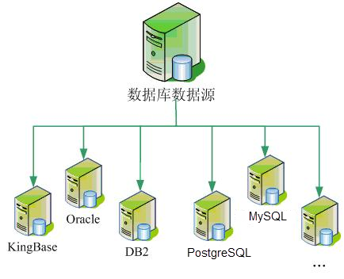
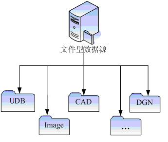
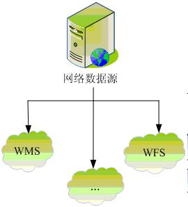

引擎是 SuperMap 的数据泵，提供并维护一套完整的数据模型。SuperMap SDX+ 除了支持传统的数据库引擎，文件引擎之外，在最新版本中对
SDX+ 进行了扩展，增加了 Web 引擎，访问基于 OGC 的网络数据服务。SuperMap SDX+
支持的数据引擎类型如下图所示。通过引擎的不断扩展，可以使业界流行的空间信息存储平台尽可能地与 SuperMap 融合在一起，从而降低最终用户使用的复杂度，提高 GIS 综合应用的完整性与灵活性。

  

  
### 1.数据库引擎

进入21世纪以来，GIS应用发展的主流是使用关系型数据库来一体化管理数据，包括空间数据和业务数据。与传统文件方式相比，空间数据库技术在很多方面有着明显的技术优势，包括海量数据管理能力、图形和属性数据一体化存储、多用户并发访问（读取和写入）、完善的访问权限控制和数据安全机制等。

数据库引擎目前包括基于ODBC数据访问协议的O系列和采用OCI（数据库厂商提供的API）开发的Oracle系列。O系列以 SQLPlus 引擎为主要代表，并且包括 PostgreSQL 引擎，DM（达梦）引擎，KingBase（金仓）引擎，DB2 引擎等。基于 OCI 开发的 OraclePlus 引擎和 Oracle Spatial 引擎（3.0前还有 Oracle 引擎，目前已废弃），共两种。从长远来看，许多数据库引擎的开发都必然要采用数据库厂商自己的 API 开发的方式，这样才可以更好地利用各个数据库的特性，最大地发挥其性能。

目前，空间数据库技术正在逐步取代传统文件，成为越来越多的大中型GIS应用系统的空间数据存储和应用的解决方案。

数据库引擎主要针对 Oracle、SQLPlus、DB2、Kingbase等关系型数据库管理系统；空间数据库是指存储、管理空间数据的数据库。SuperMap空间数据库以大型关系型数据库为存储容器，通过SuperMap
SDX+进行管理和操作，将空间数据和属性数据一体化存储到大型关系型数据库中，如Oracle、SQL Server、Sybase和DM3等。

SQL Server引擎是一个基于大型数据库SQL Server 的纯关系数据库空间引擎。SuperMap Objects 中采用微软提供的开发工具DB Library 实现。与UDB、MDB 引擎一样，本引擎采用SuperMap Objects自定义的数据结构。SQL Server 引擎适合建立大型空间数据应用。

由于Oracle Spatial 对拓扑关系，三维数据，栅格数据，参数化对象等方面的支持难以达到SuperMap Objects 的要求，性能上也不高，SuperMap Objects 开发了直接基于Oracle RDBMS 的空间数据库引擎。Oracle
引擎适合建立大型空间数据应用。

  

### 2.文件引擎

文件引擎包含有四类：SuperMap 自定义的 UDB 引擎（可读写）、UDBX 引擎（可读写）、影像插件引擎（直接访问一些影像数据）和矢量文件引擎。

  * **UDB 引擎** ，是SuperMap Objects 自定义格式中唯一的文件型空间数据引擎。这种引擎采用传统的文件+数据库混合存储方式。UDB 引擎的一个数据工程包括两个文件，扩展名为 UDB 的文件存储空间数据，采用 OLE 复合文档技术；扩展名为 UDD 的文件为属性数据库，采用 Access 的 MDB 数据库格式。由于 UDB 文件采用了复合文档技术，因此提供了在一个 UDB 工程中存储多个数据集的能力。这一点与Arc/Info Coverage、MapInfo Table 文件等技术不同。UDB 主要面向中、小型系统和桌面应用，目的在于提高效率，弥补纯数据库引擎在这方面的不足。
  * **UDBX 引擎** ，可以读写以及管理 Spatialite 空间数据。Spatialite 是一个用来扩展 SQLite 的内核的开源库，提供了一个完整而强大的空间数据库管理系统，具有跨平台和轻量级的特点，而且支持完全成熟的空间 SQL 功能。此外，Spatialite 使用 R-Tree 作为空间索引，实现高效检索空间数据。SuperMap 新增的 UDBX 文件引擎，充分利用 Spatialite 对空间数据高效管理的能力以及轻量级数据库的特点。
    * 使用 UDBX 文件引擎无需安装和部署数据库系统，由于 Spatialite 数据库简单地对应单个文件，文件大小没有限制，所以使用 UDBX 文件引擎创建数据源时，将创建一个 UDBX 文件型数据源（*.udbx），其实质是一个数据库文件，它比已有的 UDB 文件型数据源具有更加开放、数据操作更加安全稳定的特点。
    * 在 UDBX 文件型数据源中可以创建数据集，或者导入其他来源的数据。UDBX 文件型数据源支持的数据集类型包括：点、线、面、文本、CAD、属性表、三维点/线/面、EPS复合点/线/面/文本、栅格、影像、镶嵌数据集。
    * 此外，UDBX 文件引擎具有更加开放的特点，支持直接操作第三方导入到 Spatialite 空间数据数据库中的空间数据，如显示，数据编辑。应用时，只需将 Spatialite 空间数据库文件（*.sqlite）作为文件型数据源加载到 iDesktop 即可。
  * **影像插件引擎** ，支持栅格类型的数据在 SuperMap 中只读显示，目前支持格式为 BMP，JPEG，RAW，TIFF，SCI，SIT 和 ERDAS IMAGINE 的栅格数据类型（BMP，JPEG 为通用的栅格数据类型，RAW，TIFF 为遥感影像数据类型，SCI 为 SuperMap 定义的地图预缓存图片文件，SIT 为 SuperMap 定义的栅格数据类型）。故插件引擎共有以下7 种类型：BMP 只读引擎，JPEG 只读引擎，RAW 只读引擎，TIFF 只读引擎，SCI 只读引擎，SIT 只读引擎和ERDAS IMAGINE只读引擎。
  * **矢量文件引擎** ，针对通用矢量格式如 shp，tab，Acad 等，支持矢量文件的编辑和保存。

  

### 3.Web引擎

WFS、WMS、WCS是按照OGC标准制定的执行规范，其中WFS（Web Feature Service）为矢量地图的执行规范，WMS（Web Map
Service）为栅格地图的执行规范、WCS（Web Coverage Service）为Image图层的执行规范。

Web引擎可以直接访问WFS、WMS、WCS等所提供的Web服务，这类引擎就是把网络上符合OGC标准的Web服务器，作为SuperMap的数据源来处理，通过它可以把网络发布的地图和数据与SuperMap的地图和数据完全结合，将WFS和WMS的应用融入到SuperMap的技术体系，拓展了SuperMap数据引擎的应用领域。Web引擎为只读引擎。

  

  

