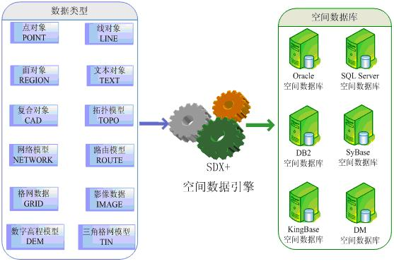

SuperMap SDX+ 是SuperMap
GIS平台中的空间数据引擎模块，为平台中的其他模块(可视化模块、空间分析模块等)提供数据支持，通过它来提供数据的存储、读取、索引和更改的功能。下图以空间数据库为例描述了空间数据引擎的工作机制。

数据是GIS的灵魂，数据的存储和访问性能影响着整个GIS应用的性能，因此，空间数据引擎的功能完整性和性能的高低会直接影响到GIS应用的功能完整性和运行效率的高低。SuperMap
SDX+空间数据引擎运行稳定、功能成熟、性能卓越，能够把GIS的空间几何对象数据和属性数据一体化存储到多种数据引擎中，包括各种大型的关系型数据库、文件型数据源等，能够高效地对数据进行索引维护、追加、更新、删除等操作，能够按属性条件或空间位置条件来对数据进行属性查询和空间查询，还能够提供长事务、版本、时序和拓扑关系维护等高级功能。

SuperMap SDX+提供了全面的空间对象类型的支持，既支持传统的点、线、面类型的空间对象，也支持文本对象（TEXT）、复合对象（CAD）、网络模型（Network）、路由模型（Route）、三角格网模型（TIN）、数字高程模型（DEM）、格网数据（GRID）和影像数据（Image）等复杂数据模型。

SuperMap SDX+ 空间数据引擎支持目前流行的多种商用数据库平台，如Oracle、SQL
Server、Sybase、DB2等，这些数据库可以运行在多种操作系统平台上，既可以搭建同类型数据库之间的多节点集群，也可以搭建异构数据库和异构操作系统的分布式集群。

  

  

