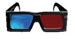
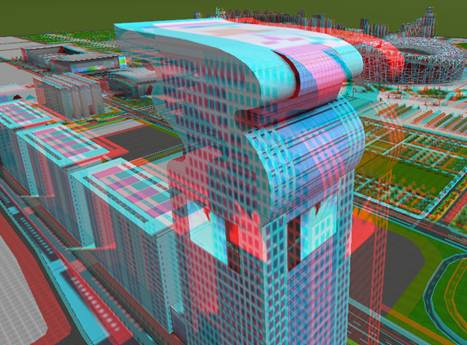
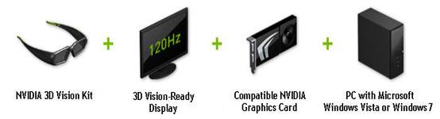

为了让用户通过  产品就有身临其境的3D立体感受，结合当前的硬件条件，给出以下两种的解决方案。

### 方案一：互补色立体显示方案

由于互补色立体显示对硬件要求较低，NVIDIA（英伟达）公司针对此提供了一款低成本的硬件解决方案――3D Vision Discover，同时通过
产品简单的设置，就能开启沉浸式Stereoscopic 3D体验。

互补色立体方案在硬件上由PC机、显示器、显卡和双色立体眼镜构成，因为其低廉的成本，应用较为广泛。下面将详细介绍该方案对其构成的一些要求。

**PC机最低系统要求** ：

  * Microsoft® Windows® Vista 32位/64位或Windows 7 32/64位
  * Intel® Core™2 Duo或AMD Athlon™ X2 或更高型号CPU 
  * 1GB系统内存（推荐2GB）
  * 100 MB剩余硬盘空间 

**显示器** ：普通CRT以及LCD显示器。

**显卡** :NVIDIA DX10显卡（推荐）。

**双色立体眼镜** ：定制设计的专用双色立体（红/青色）眼镜。

  
---  
  
该方案只需用户在  中将场景的立体模式设置成“互补色立体”，然后适当调整场景的深度或者视角，立体效果就完整的呈现在眼前。

  
---  
  
下图为盘古大楼在互补色立体模式下的效果图，佩戴双色眼镜，立体效果跃然于纸上。

  
---  
  
### 方案二：主动立体显示方案

对于主动立体显示的方案，用户可根据自己的预算来自行选择，这种方式所呈现的3D显示效果几近完美，是我们所推荐的方案。

NVIDIA（英伟达）所提供的针对主动立体显示的硬件解决方法有3D Vision和3D Vision Surround 两种，分别针对中端和高端用户。

NVIDIA（英伟达）提供的这两套方案由于对显示器和眼镜的要求比较高，在硬件上成本较高，均由3D立体幻境套装、3D Vision-Ready显示器、显卡和PC机构成，如下图所示。但3D Vision Surround需要2台及以上120Hz以上的显示器或者投影仪，所呈现出来的的3D立体效果是环绕式的，因此在成本上高于3D Vision。

  

  
**PC机最低系统要求** ：

  * Microsoft® Windows® Vista 32位/64位或Windows 7 32/64位
  * Intel® Core™2 Duo或AMD Athlon™ X2 或更高型号CPU 
  * 1GB系统内存（推荐2GB）
  * 100 MB 剩余硬盘空间 

**3D Vision-Ready显示器**

由于主动立体显示需要刷新率超过120Hz的屏幕来解决图像闪烁的问题，因此要求显示器的刷新率为120Hz以上的显示器。下面列举几种常用于该方案的显示器，根据分辨率有以下几种分类，用户可根据自己的预算和要求选择您所需要的显示器。

（1）1920x1080分辨率显示器

  * ACER GD245HQbd 120 Hz LCD显示器 报价：3279
  * ACER HS344HQ 120 Hz LCD显示器 报价：3699

（2）1680x1050分辨率显示器

  * Samsung® SyncMaster 2233RZ 120 Hz LCD显示器 报价：1490
  * ViewSonic® FuHzion™ VX2268wm 120 Hz LCD显示器 报价：2199
  * 100 Hz 和更高的CRT显示器 

**显卡** ：NVIDIA Quadro FX 580（推荐）报价：1300

**3D立体幻境套装** ：3D立体环境套装包括一个无线红外眼镜和一个红外发射器，报价：1500。

用户在体验身临其境的3D 立体效果之前，需要做以下设置。

  1. 3D立体环境的设置:对3D立体幻境套装的设置可参考其用户手册。
  2. NVIDIA（英伟达）控制面板的设置：右击桌面，选择“NVIDIA（英伟达）控制面”，在打开的对话框中进行3D立体视觉设置和3D设置。 
    * 3D立体视觉设置：打开“NVIDIA（英伟达）控制面板”后，选择“3D立体视觉”选项，在该面板中启用Stereoscopic 3D模式和选择支持3D立体幻境的显示。
    * 3D设置：选择“3D设置”中的“管理3D设置”选项，设置立体显示模式，在下拉列表中选择“通用立体活动格式（配备NVIDIA红外线发射器）”。 **注意** ：NVIDIA红外发射器需与PC机连接。
  3. 的设置：将  中的场景属性的立体模式设置成“四缓存式模式，如下图所示。  
      
此时，戴上眼镜，拖动鼠标，就能在Deskpro的三维场景中体验逼真的立体效果了。

