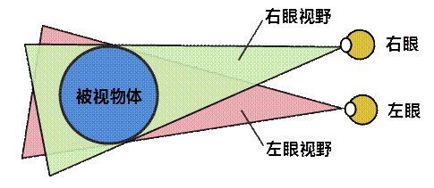
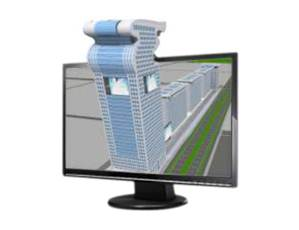

立体显示是按照人的双眼成像规律，使用一定的算法分别渲染与左右眼对应的、有差别的两幅画面，再根据一定的显示输出方法，使左右眼分别看到对应的图像，从而使用户产生立体深度视觉的功能。这种技术加强了三维场景的显示效果，进一步提升了三维产品的用户体验。目前电影技术中最流行的3D
电影技术，就是立体显示的实际应用。

  
---  
  
### 立体模式

目前较流行的立体显示技术有三种，分别是互补色立体、主动式立体和被动立体。下面分别介绍这三种模式的实现原理及优缺点。

  * **互补色立体技术**

显示器通过组合红、绿、蓝这三种颜色来显示上亿种颜色，其中蓝色和绿色的混合色是青色，是红色互补，互补色立体就是就是通过将左眼画面中的蓝色、绿色过滤掉，右眼画面中的红色过滤掉，观看者使用一个双色眼镜，使得左眼只能看到左眼图像，右眼只能看到右眼图像，两只眼睛看到的不同影像在大脑中重叠呈现出3D立体效果。

这种立体技术的优点是对计算机硬件没有特殊要求，特别是红-
青式眼镜（即滤光镜片）用户可自行制造，制作成本低廉。缺点是这种模式会造成颜色信息的丢失，可能会造成观察者的不适。

  * **主动立体技术**

在主动式立体模式下，驱动程序将交替的渲染左右眼的图像，例如第一帧为左眼的图像，那么下一帧就为右眼的图像，在下一帧再渲染左眼的图像，依次交替渲染。观看者配戴一副快门眼镜，这种快门不同于照相机的机械快门，它是通过液晶技术来切换画面，因此这种眼镜也称为液晶快门眼镜。快门眼镜通过有线或无线的方式与显卡和显示器同步，当显示器上显示左眼图像时，眼镜打开左镜片的快门同时关闭右镜片的快门，当显示器上显示右眼图像时，眼镜打开右镜片的快门同时关闭左镜片的快门，这样看不见的某只眼的图像将由大脑根据视觉暂存效应保留为刚才画面的影像，只要在无线信号的覆盖范围内的任何人戴上快门式立体眼镜都能观看到立体影像。

主动立体要求立体快门眼镜的左右镜片必须与对应的投影图像信号保持同步，同时必须有较高的立体显示刷新率才会取得满意的立体效果。这种立体技术的优点是成本较低、立体沉浸感好，可实现平面图像与立体图像的无缝切换，其缺点是立体亮度低，眼睛容易疲劳。但通过硬件可以来弥补这些缺点，如采用亮度高的投影机做主动立体显示可以克服图像亮度低的缺点；同时眼睛疲劳是由图像存在闪烁造成的，采用刷新率超过120Hz的屏幕就能让人眼欣赏到连贯而不闪烁的3D画面。因此主动快门式立体技术也是现在应用广泛，受到很多厂商推崇和采用的技术。

  * **被动立体技术**

被动立体，又叫偏振立体。这种模式主要利用光偏振原理，由于光的传播方向是任意角度的，偏振技术就是利用偏振片干涉光的传播方向，使光按照一定规律按一定角度传播，观看者须佩戴相应的偏振式眼镜，每只眼只接受相应角度和方向的光波图像，从而产生左右眼分离看到不同图像的效果产生立体。这种模式一般是电影院放映3D电影所采用的模式。

被动立体技术的优点是图像不闪烁，观看者不会产生疲劳，并且视域宽广。缺点是需要使用特殊的幕布，光学调教过程比较复杂，还需要防止散光等等，成本非常高。

### 视差模式

目前，SuperMap
Realspace支持的视差模式有负视差和正视差两种。在负视差模式下，场景中的物体在显示屏前成像，给观看者的感受为场景在屏幕外显示，给观看者强烈的立体感受。

  
---  
  
在正视差模式下，场景中的物体在显示屏后成像，给观看者的感受为场景在屏幕里边，能感觉到明显的景深效果。

